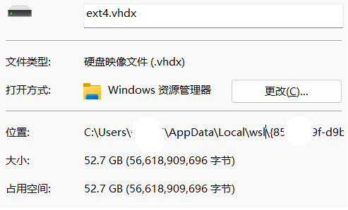
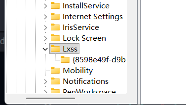
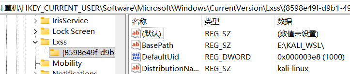

# 手动迁移wsl到其他的路径
在使用wsl时发现，wsl默认是要安装在c盘的，并且没法通过改参数来安装到其他硬盘

就导致本就不多的c盘空间雪上加霜，，

并且我还是装的kail-everything，总共有50多g

我了解到了一种可以手动移文件且不需要恢复默认用户且不需要输什么命令的办法

首先在cmd里面输入

```powershell
wsl --shutdown
```

然后前往

```powershell
C:\Users\[你的用户名]\AppData\Local\wsl\
```

找到一个名字是一串随机数的文件夹，打开后里面的.vmdk文件就是

你的wsl硬盘文件



.ico就是图标

~~😭😭😭整整50个g啊......~~

把它俩移动到其他的盘的某个位置

(比如E:\KALI_WSL)

:::note[注意]
接下来还需要改注册表
:::

win + r 输入 regedit

地址栏输入

```powershell
计算机\HKEY_CURRENT_USER\Software\Microsoft\Windows\CurrentVersion\Lxss
```

回车后

注意注册表窗口左下角



点击那个{随机数}的那一项



BasePath那一项右键点击，修改成你把.vhdk文件和.ico文件移动到的路径

(比如我的就是E:\KALI_WSL，已修改)

修改好后cmd输入wsl来验证发现进入linux终端。

移动完毕，linux子系统内所有都保持原样。

(但是注意windows开始菜单的的移动后的Linux发行版的子系统快捷方式的图标会失效)

手动让快捷方式的图标地址指向移动后的ico文件即可。
